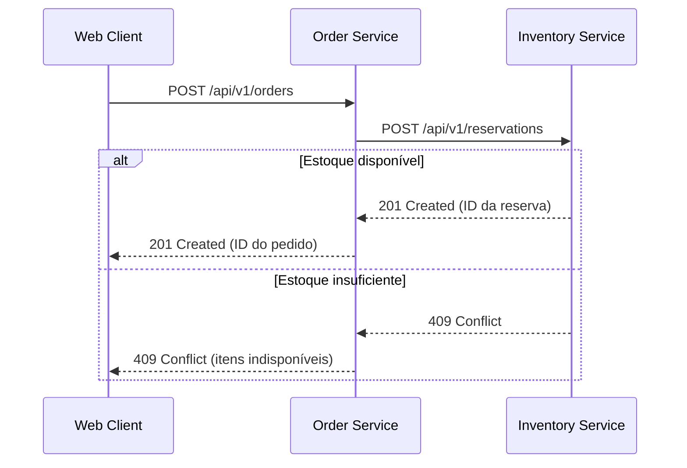
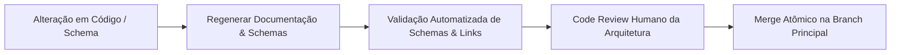

Mesmo o prompt mais bem formulado falhará se o agente de programação consultar um contrato de API desatualizado ou editar o microsserviço errado. Enquanto **prompt engineering** foca em redigir boas instruções, **context engineering** é a prática de selecionar, recuperar e estruturar exatamente as informações técnicas de que o agente precisa para trabalhar com precisão.

Esse contexto abrange instruções de repositório, código-fonte, schemas de dados, contratos de API, variáveis de ambiente, saídas de ferramentas e histórico de execução. Um documento interno só agrega valor se o agente conseguir encontrá-lo, lê-lo e interpretá-lo corretamente. Como a Anthropic destaca em [Effective context engineering for AI agents](https://www.anthropic.com/engineering/effective-context-engineering-for-ai-agents), fornecer um contexto de alto sinal é o fator mais determinante para a autonomia e assertividade dos agentes.

Dando continuidade aos artigos anteriores de [Prompt Engineering](/posts/prompt-engineering/) e [AI Gateways e roteamento de modelos](/posts/ai-gateway-routing/), este guia demonstra como estruturar uma arquitetura de contexto sólida para agentes de programação.

---

## Recupere os fatos certos, não apenas mais arquivos

Em uma arquitetura moderna distribuída, uma funcionalidade raramente fica restrita a um único arquivo. Um agente trabalhando no `order-service` frequentemente precisa do contrato de estoque da API de inventário, schemas de eventos de pagamento e histórico de migrations do banco de dados. Olhar apenas para o código local oculta dependências vitais de integração.

Monte sempre um conjunto de trabalho (working set) enxuto e de alta relevância:

1. **O componente responsável:** O arquivo exato que receberá a alteração e uma implementação existente no repositório para servir de modelo de padrão e estilo.
2. **Contratos autoritativos:** Especificações OpenAPI versionadas, JSON schemas ou arquivos protobuf das integrações afetadas.
3. **Instruções do repositório:** Arquivos como `AGENTS.md` ou `README.md` definindo comandos de build, linters e suítes de teste.
4. **Evidência observável:** A falha de teste concreta, o stack trace de erro ou o critério de aceite que motivou a demanda.

Expanda esse conjunto somente quando a análise do código revelar dependências adicionais. Mantenha os caminhos dos arquivos e as revisões de commit registrados para que a equipe possa auditar o raciocínio do modelo no code review.

---

## Exemplo prático: o serviço correto, mas o contrato errado

Retomemos nosso exemplo de desconto no checkout. O agente localiza corretamente o serviço `commerce-pricing`. No entanto, ele encontra um documento antigo em Markdown afirmando que o navegador web deve enviar a porcentagem de desconto no payload. Na realidade, a API de produção atual recebe um código de cupom e retorna um objeto formal de cotação.

O agente encontrou o serviço certo, mas como o contexto recuperado estava defasado, a implementação gerada ficou totalmente errada:

| Fonte Recuperada | Verificação Necessária | Ação Requerida |
| :--- | :--- | :--- |
| **Guia legado de integração** | Qual versão da API e release este documento descreve? | Manter apenas como histórico; sinalizar a inconsistência |
| **OpenAPI schema atual** | O schema define campos para cupom, cotação e erros? | Ler os endpoints oficiais e exemplos de request/response |
| **Testes de contrato do consumidor** | Qual versão do contrato o `order-service` consome em produção? | Validar a compatibilidade antes de assumir qualquer migração |

Avalie a etapa de recuperação de contexto separadamente da geração de código. Meça se o agente encontrou as fontes necessárias e se realmente seguiu as diretrizes delas. Não encontrar um contrato é um problema de busca (retrieval); ignorar um contrato já carregado na janela de contexto é uma falha de aderência do modelo.

---

## Preservando o significado do negócio e a atualização dos dados

No artigo [Making Your Data Ready for Agentic AI](https://martinfowler.com/articles/making-data-ready-for-agentic-ai.html), Pramod Sadalage e Prem Chandrasekaran mostram que dados para agentes de IA precisam de qualidade técnica, significado de negócio e controle de acesso.

No fluxo de checkout, valide esses atributos antes de autorizar a escrita de código:

| Dado | Significado de Negócio Essencial | Verificação Prévia |
| :--- | :--- | :--- |
| **Valor da Cotação** | Moeda (BRL/USD), unidade (centavos vs. decimais), inclusão de frete e impostos | Confrontar com o schema OpenAPI e com a convenção de valores da empresa |
| **Regra de Desconto** | Desconto percentual vs. valor fixo; itens elegíveis e exceções | Confirmar a versão ativa da política de pricing |
| **Data de Expiração** | Fuso horário (UTC vs. America/Sao_Paulo) e limites inclusivos ou exclusivos | Validar contra o relógio oficial do servidor e as regras de negócio |
| **Política Recuperada** | Hash de commit do arquivo original vs. timestamp de indexação no banco vetorial | Garantir que o índice de busca não esteja defasado em relação ao repositório |

Caso o significado ou os timestamps de atualização não estejam claros, o agente deve relatar a dúvida para a equipe em vez de assumir suposições arriscadas.

---

## Uma janela de contexto maior ajuda, mas não basta

Os modelos de fronteira atuais contam com context windows de centenas de milhares ou até milhões de tokens. Embora isso permita carregar arquivos extensos, volume de dados não garante capacidade de raciocínio.

O estudo *Lost in the Middle* comprovou que os LLMs recuperam e processam informações muito melhor quando elas estão posicionadas no início ou no fim do prompt, perdendo acurácia quando os dados estão no meio (veja o [estudo original](https://arxiv.org/abs/2307.03172)). Carregar repositórios inteiros na janela de contexto degrada a atenção do modelo, introduz padrões conflitantes e eleva custos e latência de forma desnecessária.

Prefira uma estratégia baseada em índices: forneça ao agente um mapa de alto nível dos serviços e deixe-o buscar apenas os arquivos necessários sob demanda. Para entender melhor padrões de RAG (Retrieval-Augmented Generation) para agentes, consulte o [Capítulo 6, "RAG and Agents"](https://www.oreilly.com/library/view/ai-engineering/9781098166298/ch06.html) em *AI Engineering* de Chip Huyen.

Para times de frontend, disponibilize tokens do design system, guias de componentes e exemplos visuais. Projetos que utilizam IA para prototipação podem adotar o [OpenDesign](https://github.com/nexu-io/open-design) para manter uma especificação `DESIGN.md` viva no repositório.

---

## Cobertura de idiomas, base de treino e orçamento de tokens {#language-coverage-training-data-and-token-budgets}

A proporção de idiomas na base de treino varia por modelo. No [Common Crawl](https://commoncrawl.github.io/cc-crawl-statistics/plots/languages) (amostra CC-MAIN-2026-39), o inglês corresponde a **41,86%** das páginas coletadas, enquanto o português representa **2,49%**. Essas proporções do crawl não medem a composição do treino nem a capacidade de qualquer modelo nos dois idiomas.

Além da distribuição de treino, a tokenização impacta o custo diário. Os tokenizers fragmentam o texto em tokens, e textos em português geralmente exigem mais tokens para representar a mesma mensagem:

| Idioma | Exemplo de Frase | Tokens no tokenizer `o200k_base` da OpenAI |
| :--- | :--- | ---: |
| **Inglês** | "Please explain how the number of input tokens affects the context window and API cost." | 16 |
| **Português brasileiro** | "Explique como a quantidade de tokens de entrada afeta a janela de contexto e o custo da API." | 21 |

Nesse exemplo, a frase em português consumiu **31% mais tokens**. A contagem de tokens, por si só, não mede compreensão, mas afeta o uso da janela de contexto e os custos em pipelines de alta frequência. Você pode monitorar esse consumo com o `tiktoken` ou com a [API de contagem de tokens da Anthropic](https://platform.claude.com/docs/en/build-with-claude/token-counting).

---

## Use a documentação como porta de entrada para agentes

Utilize arquivos Markdown estruturados no repositório para orientar os agentes:
* `README.md`: Explica a arquitetura, pré-requisitos e visão geral para desenvolvedores humanos.
* `AGENTS.md`: Fornece instruções diretas para agentes de IA, incluindo scripts de build, regras de lint e estrutura de diretórios (veja a [especificação do AGENTS.md](https://agents.md/)).

Exemplo de documentação para o diretório de um `order-service`:

```markdown
# Order service

Responsável pela criação de pedidos, orquestração de checkout e transições de estado.

## Contratos
- HTTP API: contracts/orders.openapi.yaml
- Inventory API: ../inventory/contracts/inventory.openapi.yaml
- Evento de pagamento: contracts/payment.processed.schema.json
- Migrations do banco: migrations/

## Integrações
- Consulta estoque: GET /api/v1/stock/{sku}
- Reserva estoque: POST /api/v1/reservations
- Consome payment.processed da exchange RabbitMQ payment-events via fila order-payments.
```

---

## Mapeie interações e caminhos de erro com diagramas

Diagramas de sequência em Mermaid são ideais para context engineering porque utilizam sintaxe de texto versionável via Git, facilmente interpretável por agentes de IA:



Ao representar graficamente o fluxo alternativo do erro `409 Conflict`, o diagrama instrui o agente a implementar o tratamento de falhas em vez de presumir apenas o caminho de sucesso.

---

## Torne a propriedade dos serviços descobrível

Em arquiteturas de microsserviços, um catálogo enxuto em `SERVICES.md` permite que o agente localize fronteiras de domínio sem precisar clonar centenas de repositórios:

| Contrato / Capacidade | Service ID | Repositório | Schema Autoritativo |
| :--- | :--- | :--- | :--- |
| `POST /api/v1/orders` | `commerce-orders` | `acme/orders` | `contracts/orders.openapi.yaml` |
| `POST /api/v1/reservations` | `commerce-inventory` | `acme/inventory` | `contracts/inventory.openapi.yaml` |
| Evento `payment.processed` | `commerce-payments` | `acme/payments` | `contracts/payment.processed.schema.json` |

Plataformas como o [catálogo de software do Backstage](https://backstage.io/docs/features/software-catalog/system-model/) permitem manter esse inventário sincronizado automaticamente em grandes engenharias de software.

---

## Mantenha o contexto sempre atualizado via automação

Evite depender de revisões manuais para manter a documentação alinhada ao código. Automatize as validações no pipeline de CI/CD:
* Gere tabelas e documentação de API automaticamente a partir dos schemas OpenAPI.
* Valide exemplos de payloads JSON contra seus JSON schemas oficiais.
* Quebre o build no CI caso a documentação gerada e versionada discorde dos schemas atuais do código.



---

## Contexto entre múltiplos repositórios: mapa de impacto {#when-one-feature-spans-several-repositories}

Quando uma funcionalidade abrange múltiplos repositórios (como nossa feature de desconto de checkout entre web, orders e pricing), mapeie as fronteiras afetadas antes de iniciar a edição:

| Repositório | Responsabilidade no Sistema | Alteração Proposta | Método de Validação |
| :--- | :--- | :--- | :--- |
| `acme/web` | Coletar cupom e exibir a cotação | Campo de input, mensagens de erro e totais | Testes de UI via Cypress / Playwright |
| `acme/orders` | Coordenar checkout e persistir cotação aceita | Repassar cupom para pricing; gravar quote ID | Testes de integração e contratos |
| `acme/pricing` | Validar regras de cupom e calcular desconto | Calcular desconto e retornar cotação oficial | Testes unitários e suíte de contratos |

Documente esse alinhamento em um arquivo de feature compartilhado (por exemplo, `changes/checkout-discounts.md`). Configure mappings locais de workspace ou ferramentas de CLI para que o agente possa interagir com os serviços necessários e verificar o funcionamento ponta a ponta com testes de contrato.

---

## Conclusão e próximos passos

Uma estratégia robusta de context engineering assegura que o agente de programação trabalhe com base em evidências técnicas e contratos atualizados:

* Forneça um **working set enxuto e qualificado** de código, schemas e diretrizes, em vez de sobrecarregar a janela de contexto.
* Valide a **atualização dos dados e regras de negócio** antes de iniciar o desenvolvimento.
* Adote **`AGENTS.md` e diagramas em Mermaid** para documentar arquitetura e caminhos de erro.
* Integre a atualização de documentação ao seu fluxo de **CI/CD** para evitar desvios.

Agora que o agente dispõe de instruções precisas e do contexto correto, como capacitá-lo a executar alterações e testes com segurança? No próximo artigo, [Harness Engineering: criando ferramentas seguras e confiáveis para IA](/posts/harness-engineering/), exploramos o design de sandboxes, ferramentas seguras e integração com o Model Context Protocol (MCP).
