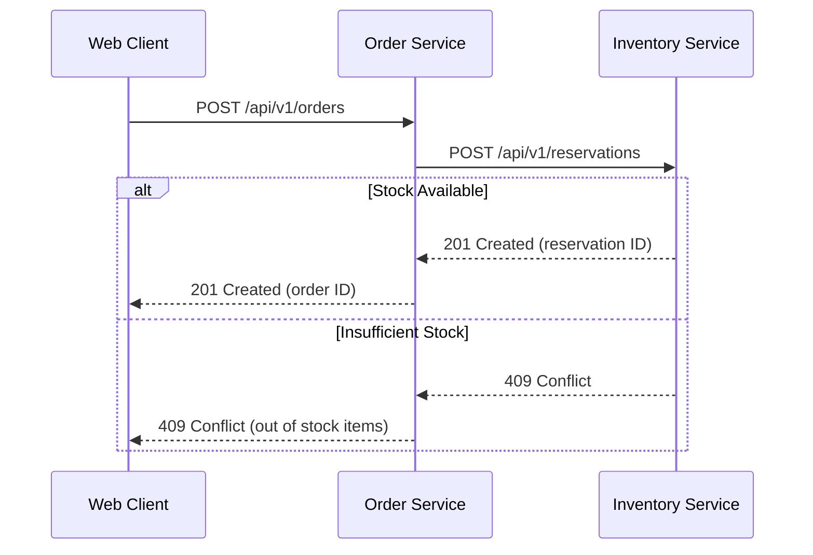
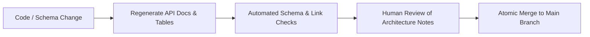

Even the clearest prompt will fail if an AI coding agent references an outdated API contract or edits the wrong microservice. While **prompt engineering** focuses on formulating clear instructions, **context engineering** is the discipline of selecting, retrieving, and structuring the exact knowledge an agent needs during execution.

That context includes repository guidelines, source code, data schemas, API contracts, environment variables, tool outputs, and execution history. An internal file only helps if the agent can discover, read, and understand it. As Anthropic notes in [Effective context engineering for AI agents](https://www.anthropic.com/engineering/effective-context-engineering-for-ai-agents), supplying high-signal context is the single most effective way to improve agent autonomy and accuracy.

Building on our previous guides on [Prompt Engineering]() and [AI Gateways and Model Routing](), this article explains how to build a robust context architecture for coding agents.

---

## Retrieve the right facts, not just more files

In a modern distributed architecture, a feature rarely lives inside a single file. An agent modifying an `order-service` often needs the inventory API schema, payment event contracts, and database migration history. Looking only at local application code hides critical integration rules.

Always start by assembling a minimal, high-signal working set:

1. **The behavior owner:** The exact source file requiring modification and a working reference implementation to copy conventions from.
2. **Authoritative contracts:** Versioned OpenAPI specs, JSON schemas, or protobuf files for affected integrations.
3. **Repository instructions:** The local `AGENTS.md` or `README.md` defining setup scripts, linting rules, and test commands.
4. **Observable evidence:** The specific failing test output, error stack trace, or acceptance criterion motivating the task.

Expand this set only when code analysis reveals an uninspected dependency. Document source file paths and commit revisions so human reviewers can trace the agent's reasoning.

---

## Example: the right service, but the wrong contract

Consider our running checkout discount example. The agent correctly locates the `commerce-pricing` service. However, it retrieves an outdated onboarding markdown document stating that the web browser should calculate discounts as percentages. In reality, the production pricing API accepts a discount code and returns an authoritative quote object.

The agent found the correct service, but because its context was outdated, it wrote the wrong implementation:

| Retrieved Source | Verification Check | Required Action |
| :--- | :--- | :--- |
| **Old integration markdown** | Which API version and release tag does this describe? | Mark as legacy documentation; flag the contradiction |
| **Current OpenAPI schema** | Does it define code inputs, quote structures, and error states? | Read the authoritative operations and request/response examples |
| **Orders consumer contract tests** | Which contract version is currently consumed in production? | Validate compatibility before assuming a migration has occurred |

Always evaluate context retrieval separately from code generation. Measure how many required sources the agent retrieved and whether it followed them. Missing a contract and ignoring an already-loaded contract are two completely different failure modes that require different fixes.

---

## Preserve business meaning and data freshness

In [Making Your Data Ready for Agentic AI](https://martinfowler.com/articles/making-data-ready-for-agentic-ai.html), Pramod Sadalage and Prem Chandrasekaran emphasize that AI systems require data quality, business context, and access control.

In our checkout scenario, verify these attributes before allowing an agent to write code:

| Data Item | Essential Business Meaning | Pre-Implementation Check |
| :--- | :--- | :--- |
| **Quote Amount** | Currency codes, decimal units (cents vs. dollars), tax and shipping inclusions | Match the OpenAPI schema and agreed monetary representation |
| **Discount Rule** | Percentage vs. fixed value; eligible items vs. exclusions | Confirm against current pricing policy revisions |
| **Expiration Date** | Time zone (UTC vs. local) and inclusive vs. exclusive boundaries | Validate against the authoritative server clock and business logic |
| **Retrieved Policy** | Source commit hash vs. vector database indexing timestamp | Ensure the search index has ingested recent policy changes |

If required business meaning or freshness timestamps are missing, the agent should pause and ask for clarification rather than invent assumptions.

---

## A larger context window is useful, but not sufficient

Some current models offer context windows reaching hundreds of thousands or millions of tokens. While larger windows allow analyzing extensive files, capacity is not the same as effective reasoning.

The landmark *Lost in the Middle* study demonstrated that language models retrieve and reason over facts placed at the beginning or end of prompts much more effectively than facts buried in the middle (see the [original paper](https://arxiv.org/abs/2307.03172)). Stuffing entire repositories into a prompt also dilutes attention, introduces conflicting conventions, and significantly increases API latency and cost.

Prefer an index-first approach: give the agent a high-level index of services and files, and let it retrieve only relevant files on demand. For more on Retrieval-Augmented Generation (RAG) and agent memory, see Chip Huyen's *AI Engineering* ([Chapter 6, "RAG and Agents"](https://www.oreilly.com/library/view/ai-engineering/9781098166298/ch06.html)).

For frontend projects, include design system tokens, component guidelines, and visual specifications. Teams exploring AI-driven UI design can leverage [OpenDesign](https://github.com/nexu-io/open-design) to generate and maintain a `DESIGN.md` specification from brand assets.

---

## Language coverage, training data, and token budgets {#language-coverage-training-data-and-token-budgets}

Training data composition varies across model families. For example, [Common Crawl statistics](https://commoncrawl.github.io/cc-crawl-statistics/plots/languages) (crawl CC-MAIN-2026-39) show that English represents **41.86%** of crawled web pages, while Portuguese represents **2.49%**. Those crawl shares are not a measure of any model's training mix or its ability in either language.

Beyond training distribution, tokenization creates practical cost differences. Tokenizers break text into numerical tokens, and non-English text generally splits into more tokens for the same semantic meaning:

| Language | Example Sentence | Tokens (OpenAI `o200k_base`) |
| :--- | :--- | ---: |
| **English** | "Please explain how the number of input tokens affects the context window and API cost." | 16 |
| **Brazilian Portuguese** | "Explique como a quantidade de tokens de entrada afeta a janela de contexto e o custo da API." | 21 |

In this example, the Portuguese phrasing requires **31% more tokens**. Token count alone does not measure comprehension, but it influences context window usage and billing on high-volume pipelines. Monitor token counts with tools like `tiktoken` or the [Anthropic token counting API](https://platform.claude.com/docs/en/build-with-claude/token-counting).

---

## Use documentation as an entry point for agents

Use structured Markdown files to orient agents in your repository:
* `README.md`: Explains system architecture, prerequisites, and high-level workflows for human engineers.
* `AGENTS.md`: Outlines machine-readable instructions, verified build commands, linting rules, and directory conventions (see [AGENTS.md specification](https://agents.md/)).

For example, an `order-service` directory might contain:

```markdown
# Order service

Owns order creation, checkout coordination, and state transitions.

## Contracts
- HTTP API: contracts/orders.openapi.yaml
- Inventory API: ../inventory/contracts/inventory.openapi.yaml
- Payment event: contracts/payment.processed.schema.json
- Database migrations: migrations/

## Integration summary
- Reads stock: GET /api/v1/stock/{sku}
- Reserves stock: POST /api/v1/reservations
- Consumes payment.processed from the payment-events RabbitMQ exchange through the order-payments queue.
```

---

## Visualize interactions, including failure states

Mermaid sequence diagrams are ideal for context engineering because they are text-based, easily versioned in git, and directly readable by text-only and multimodal models:



By explicitly visualizing the `409 Conflict` error branch, the diagram forces the agent to implement error handling rather than assuming the happy path.

---

## Make service ownership discoverable

In microservice environments, a lightweight `SERVICES.md` catalog allows agents to locate system boundaries without scanning thousands of repositories:

| Contract / Capability | Service ID | Repository | Authoritative Schema |
| :--- | :--- | :--- | :--- |
| `POST /api/v1/orders` | `commerce-orders` | `acme/orders` | `contracts/orders.openapi.yaml` |
| `POST /api/v1/reservations` | `commerce-inventory` | `acme/inventory` | `contracts/inventory.openapi.yaml` |
| `payment.processed` event | `commerce-payments` | `acme/payments` | `contracts/payment.processed.schema.json` |

Tools like [Backstage's software catalog](https://backstage.io/docs/features/software-catalog/system-model/) can automate this mapping across large engineering organizations.

---

## Keep context current and automated

Do not rely on humans to manually update documentation. Automate context validation in your CI/CD pipeline:
* Generate API documentation tables directly from OpenAPI schemas.
* Validate JSON event examples against versioned JSON schemas.
* Fail the build if committed documentation drifts from generated schemas.



---

## Multi-repository context: impact mapping {#when-one-feature-spans-several-repositories}

When a single feature spans multiple repositories (like our checkout discount spanning web, orders, and pricing), map the affected boundaries before editing code:

| Repository | System Responsibility | Planned Change | Verification Method |
| :--- | :--- | :--- | :--- |
| `acme/web` | Collect discount code and display quote | Add input field, error states, and totals | Cypress/Playwright UI tests |
| `acme/orders` | Coordinate checkout and persist accepted quote | Forward optional code to pricing; persist quote ID | Integration and contract tests |
| `acme/pricing` | Validate discount rules and calculate quote | Evaluate code eligibility and return quote | Unit rules and contract tests |

Record this cross-service plan in a shared feature document (e.g., `changes/checkout-discounts.md`). Provide the agent with local workspace mappings or CLI tools to query service endpoints, and verify changes across service boundaries using contract tests.

---

## Summary and next steps

Context engineering ensures that an AI coding agent acts on authoritative, up-to-date facts:

* Provide a **targeted working set** of code, schemas, and guidelines rather than dumping whole repositories into the prompt.
* Verify **data freshness and business definitions** before implementation begins.
* Use **`AGENTS.md` and Mermaid diagrams** to make architecture and error paths discoverable.
* Automate documentation freshness checks in CI to eliminate drift.

Now that our agent has clear instructions and accurate context, how do we give it the tools to execute changes safely? In our next guide, [Harness Engineering: Building Safe and Reliable Tooling for AI](), we examine sandboxes, MCP tool calling, and automated execution controls.
