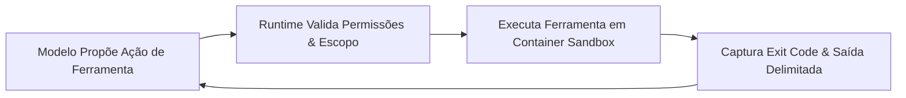

Um modelo de linguagem pode sugerir trechos de código. Mas um **agente de programação** autônomo precisa da capacidade de inspecionar arquivos, realizar edições, rodar compiladores, executar testes e interpretar os resultados. O ecossistema de ferramentas, sandboxes de execução, permissões e canais de feedback que envolve o modelo é chamado de **harness**.

**Harness engineering** é a disciplina de projetar esse ambiente de runtime. Um harness bem estruturado capacita o agente a resolver demandas complexas com eficiência, ao mesmo tempo em que aplica limites rígidos de segurança para impedir operações destrutivas ou vazamento de dados.

Dando continuidade aos artigos anteriores de [Prompt Engineering](/posts/prompt-engineering/), [AI Gateways](/posts/ai-gateway-routing/) e [Context Engineering](/posts/context-engineering/), este artigo mostra como construir um ferramental seguro, observável e determinístico para agentes de IA.

---

## Separe o runtime da plataforma das diretrizes do projeto

Um harness robusto distingue com clareza a infraestrutura de segurança das instruções de desenvolvimento do projeto:

| Camada | Responsabilidades Principais | Exemplos Práticos |
| :--- | :--- | :--- |
| **Runtime da Plataforma** | Executa chamadas de ferramentas, gerencia sessões, aplica sandboxes e limites de recursos | Containers isolados, permissões de sistema de arquivos, timeouts de processos e regras de rede |
| **Ambiente do Projeto** | Define fluxos reproduzíveis de build, comandos de teste e padrões arquiteturais locais | Scripts de automação, dependências fixadas, fixtures de teste e instruções no `AGENTS.md` |

Escrever no prompt algo como *"Nunca execute comandos destrutivos no banco de produção"* é apenas uma orientação contextual para o modelo; a IA pode cometer erros ou alucinar. A proteção real vem de limites de rede (egress filtering), credenciais com privilégios mínimos e runtimes em sandbox isolado.



---

## Combine cada regra arquitetural com um sensor observável

Em [Harness engineering for coding agent users](https://martinfowler.com/articles/harness-engineering.html), Birgitta Böckeler estabelece uma distinção essencial:
* **Guias (guides):** Instruções que orientam o raciocínio do agente *antes* da ação (prompts, exemplos e guias de estilo).
* **Sensores (sensors):** Verificações automatizadas que inspecionam o código *depois* da execução (linters, type checkers e suítes de teste).

No nosso exemplo de código de desconto no checkout, associe cada regra arquitetural a um sensor automatizado:

| Regra Arquitetural | Sensor Automatizado de Feedback | Validação Humana em Code Review |
| :--- | :--- | :--- |
| **Pricing service centraliza regras de desconto** | Linter de dependências quebra o build se `web` importar `pricing/internal` | Avaliar se fórmulas de cálculo não foram duplicadas na UI |
| **Persistir o valor oficial da cotação** | Testes de contrato confrontam payload da API, valor exibido na UI e banco | Garantir que as asserções correspondam às regras de negócio |
| **Preservar as fronteiras de módulos** | Analisador estrutural detecta dependências circulares ou vazamento de camadas | Verificar se as fronteiras de serviços continuam adequadas para as próximas features |

Execute verificações rápidas (type checking, linters e testes unitários) durante o ciclo de edição. Deixe testes integrados end-to-end mais pesados para o pipeline de CI antes do merge do pull request.

---

## Torne o feedback de manutenibilidade acionável

Em [Maintainability sensors for coding agents](https://martinfowler.com/articles/sensors-for-coding-agents.html), Böckeler analisa como linters, testes de mutação e analisadores de acoplamento orientam agentes. O aprendizado central é que retornar apenas uma nota numérica ou uma mensagem críptica de erro deixa o modelo sem direção.

Retorne mensagens diagnósticas que apontem o erro e indiquem a correção esperada:

```text
VIOLAÇÃO: apps/web/checkout importa services/pricing/internal/discountRules.
REGRA: O frontend web deve consumir o contrato oficial publicado da API de pricing.
CORREÇÃO: Importe o PricingClient oficial de @acme/pricing-client e use a operação requestQuote().
NOTA: Caso esta fronteira arquitetural precise ser alterada, documente a justificativa no pull request.
```

Monitore como o agente responde a esses avisos. Um agente pode tentar contornar a regra adicionando um `// eslint-disable-next-line` ou removendo asserções para forçar o build a passar. Exija sempre que qualquer alteração em regras de linter ou testes fique visível no diff do pull request para aprovação humana. Para entender mais sobre governança automatizada de arquitetura, confira *Building Evolutionary Architectures* ([Capítulo 2, "Fitness Functions"](https://www.oreilly.com/library/view/building-evolutionary-architectures/9781492097532/ch02.html) e [Capítulo 4, "Automating Architectural Governance"](https://www.oreilly.com/library/view/building-evolutionary-architectures/9781492097532/ch04.html)).

---

## Garanta comandos reproduzíveis em qualquer ambiente

Um comando que roda perfeitamente no terminal local do desenvolvedor pode falhar quando executado por um agente autônomo. Sessões não interativas de shell não carregam arquivos de perfil como `~/.bashrc` ou `~/.zshrc` por padrão, e tentar forçar shells interativos (`bash -i -c`) pode importar aliases locais ou variáveis conflitantes (consulte [GNU Bash Startup Files](https://www.gnu.org/software/bash/manual/html_node/Bash-Startup-Files.html)).

Padronize todos os comandos do agente no arquivo `AGENTS.md` com scripts herméticos:

```markdown
# AGENTS.md

## Configuração do Ambiente
- Execute todos os comandos a partir da raiz do repositório.
- Utilize a versão de Node.js fixada em `.node-version`.
- Instale dependências com `npm ci` (nunca use `npm install`).
- Testes unitários rodam contra fixtures locais e não exigem serviços externos.

## Comandos de Verificação
- Type check: `npm run typecheck`
- Testes unitários: `npm run test:unit`
- Linter: `npm run lint`
- Build de produção: `npm run build`

## Convenções de Desenvolvimento
- Mantenha as alterações estritamente no escopo solicitado.
- Ao alterar arquivos gerados em `src/generated/`, rode `npm run generate`.
- Sempre reporte os comandos executados, os testes validados e premissas pendentes.
```

---

## Padronize a integração de ferramentas com MCP

O **Model Context Protocol (MCP)** é um protocolo aberto que padroniza como agentes de IA descobrem e acionam ferramentas disponibilizadas por servidores locais ou remotos. Com MCP, o agente se conecta facilmente a inspetores de schema de banco, sistemas de issues, APIs corporativas ou browsers headless (consulte a [especificação de ferramentas do MCP](https://modelcontextprotocol.io/specification/2025-06-18/server/tools)).

No entanto, usar MCP não torna a execução segura por si só:
* **Garanta conexões de banco de dados em modo somente leitura (read-only):** Uma descrição no MCP dizendo "read-only" não protege o banco se o usuário configurado tiver permissões de escrita (`INSERT`/`DROP`).
* **Prefira ferramentas nativas de CLI quando já forem suficientes:** Se um script bash local resolve a demanda com facilidade, utilize-o diretamente em vez de introduzir a sobrecarga de um servidor MCP adicional.

---

## Empacote procedimentos recorrentes como skills

Fluxos de trabalho frequentes (como gerar SDKs a partir de contratos OpenAPI ou auditar migrations de banco) devem ser empacotados como **skills** reutilizáveis.

Conforme a [especificação do Agent Skills](https://agentskills.io/home), uma skill reúne instruções, templates e scripts em um diretório próprio iniciado por um arquivo `SKILL.md`. Isso permite que qualquer agente compatível carregue procedimentos especializados sob demanda sem inflar o contexto global.

---

## Exemplo: ferramenta delimitada de verificação de checkout {#example-a-bounded-checkout-verification-tool}

No nosso cenário de e-commerce, o time de plataforma pode expor uma ferramenta específica (`verify_checkout`) com contrato bem definido:

```yaml
tool: verify_checkout
inputs:
  run_id: string (identificador único do ambiente de teste temporário)
  suite: enum [discount-valid, discount-expired, checkout-no-code]
  candidate_manifest: string (commit SHA do repositório e digest da imagem)
execution:
  timeout_seconds: 120
  prerequisites: revisões candidatas implantadas e saudáveis; fixtures carregadas
  isolation: gera pedidos e cotações sintéticos exclusivamente neste run_id
  concurrency: rejeita chamadas concorrentes duplicadas para o mesmo run_id e suite
outputs:
  status: passed | failed | invalid_arguments | environment_unavailable | timed_out
  executed_cases: list of string
  assertions: valores esperados e observados em cada asserção
  elapsed_ms: integer
  artifact_refs: lista de URLs de logs e traces
  cleanup_status: completed | pending | failed
```

Como o agente deve reagir a cada retorno da ferramenta:

| Status Retornado | Ação Recomendada do Agente |
| :--- | :--- |
| **`invalid_arguments`** | Ajustar os parâmetros da chamada conforme o schema da tool; não editar o código da aplicação |
| **`environment_unavailable`** | Checar logs de infraestrutura e restabelecer o ambiente dentro do limite de tempo |
| **`failed`** | Analisar o diff das asserções e o código-fonte para diagnosticar e corrigir o bug |
| **`timed_out`** | Inspecionar traces do servidor e validar o cleanup antes de iniciar uma nova execução |
| **`passed` (0 testes executados)** | Rejeitar o resultado como evidência inválida; reexecutar a suíte de testes correta |

---

## Projete retornos de ferramentas focados em diagnóstico

Para que o agente consiga debugar com autonomia e agilidade, garanta que todas as execuções de ferramentas retornem:
1. **Diretório de trabalho e comando executado.**
2. **Exit code do processo.**
3. **Tempo total decorrido.**
4. **Logs estruturados de stdout e stderr.**

Trunque saídas volumosas ao devolvê-las ao modelo para controlar o uso da janela de contexto. Guarde logs completos somente em artefatos com acesso restrito e oculte segredos ou dados pessoais antes de compartilhá-los com o agente ou revisores.

---

## Conclusão e próximos passos

Harness engineering transforma um modelo gerador de texto em um parceiro de engenharia confiável e seguro:

* Aplique limites de segurança inegociáveis com **runtimes isolados em sandbox e bloqueio de rede**.
* Associe diretrizes de arquitetura a **sensores automatizados e diagnósticos acionáveis**.
* Centralize comandos de build e validação no **`AGENTS.md`**.
* Integre ferramentas externas via **MCP** e encapsule fluxos recorrentes como **skills**.

Com ferramentas operacionais estáveis e um sandbox seguro, como garantir que o agente implemente exatamente o que o negócio precisa? No próximo artigo, [Spec-Driven Development: por que planejar importa mais do que nunca com IA](/posts/spec-driven-development/), mostramos como especificações evitam desvios arquiteturais dispendiosos.
