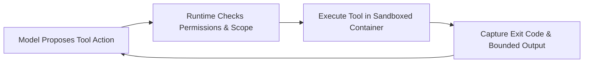

An AI language model can suggest code snippets. But an autonomous **coding agent** needs the ability to read repository files, make edits, run compilers, execute tests, and observe the results. The collection of tools, execution sandboxes, permissions, and feedback channels surrounding the model is called its **harness**.

**Harness engineering** is the discipline of designing this runtime environment. A well-engineered harness gives an agent the capabilities it needs to complete engineering tasks while enforcing strict security boundaries to prevent unauthorized operations or data corruption.

Following our previous discussions on [Prompt Engineering](), [AI Gateways](), and [Context Engineering](), this guide explores how to build safe, observable, and deterministic tooling for AI agents.

---

## Separate platform runtime controls from project guidance

A robust agent harness separates platform-level security controls from project-level developer instructions:

| Layer | Primary Responsibilities | Examples |
| :--- | :--- | :--- |
| **Platform Runtime** | Dispatches tool calls, manages sessions, enforces security sandboxes and resource limits | Container runner, filesystem permissions, process timeouts, network egress filters |
| **Project Environment** | Defines repeatable build processes, test commands, and local architectural conventions | Build scripts, pinned dependencies, test fixtures, repository instructions (`AGENTS.md`) |

A written prompt instruction like *"Never write to production databases"* is merely guidance to the model; a model can misunderstand or hallucinate. Enforced network boundaries, unprivileged service accounts, and sandboxed runtimes provide actual, non-negotiable security controls.



---

## Pair every architectural rule with observable feedback

In [Harness engineering for coding agent users](https://martinfowler.com/articles/harness-engineering.html), Birgitta Böckeler distinguishes between:
* **Guides:** Instructions that steer an agent's reasoning *before* it takes an action (such as prompts, examples, and style guides).
* **Sensors:** Automated checks that inspect the agent's work *after* execution (such as linters, type checkers, and test runners).

In our running checkout discount example, pair each architectural requirement with an automated sensor:

| Architectural Requirement | Automated Feedback Sensor | Remaining Human Review |
| :--- | :--- | :--- |
| **Pricing service owns discount logic** | Dependency linter fails if `web` imports `pricing/internal` | Review PR for duplicated pricing formulas in client code |
| **Preserve accepted quote value** | Contract tests verify API payload, UI total, and database record | Ensure test assertions match product requirements |
| **Maintain clean module boundaries** | Structural dependency linter detects circular imports or layer leaks | Evaluate if current service boundaries suit upcoming features |

Run fast, lightweight checks (type checking, unit tests) continuously during editing. Reserve slower end-to-end integration tests for CI pipelines before code review.

---

## Make maintainability feedback actionable

In [Maintainability sensors for coding agents](https://martinfowler.com/articles/sensors-for-coding-agents.html), Böckeler explores how linting, mutation testing, and dependency analyzers can guide agents. A crucial insight is that returning an unexplained error code or cryptic score leaves the model guessing.

Provide diagnostic error messages that specify both the violation and the remediation step:

```text
VIOLATION: apps/web/checkout imports services/pricing/internal/discountRules.
RULE: The web frontend must consume the published pricing quote API contract.
REMEDIATION: Import the official PricingClient from @acme/pricing-client and use the requestQuote() operation.
NOTE: If this architectural boundary must change, document the rationale in the pull request description.
```

Track how the agent resolves these warnings. An agent might simply delete a test or add `// eslint-disable-next-line` to force a check to pass. Always require that configuration or linter changes remain visible in the pull request diff for human review. For more on automated architectural governance, see *Building Evolutionary Architectures* ([Chapter 2, "Fitness Functions"](https://www.oreilly.com/library/view/building-evolutionary-architectures/9781492097532/ch02.html) and [Chapter 4, "Automating Architectural Governance"](https://www.oreilly.com/library/view/building-evolutionary-architectures/9781492097532/ch04.html)).

---

## Make commands reliable across automated environments

A command that runs smoothly in a developer's local terminal often fails when executed by an autonomous agent. Non-interactive shell sessions do not load personal `.bashrc` or `.zshrc` profiles by default, and interactive flags (`bash -i -c`) can introduce conflicting environment variables or custom aliases (see [GNU Bash Startup Files](https://www.gnu.org/software/bash/manual/html_node/Bash-Startup-Files.html)).

Standardize all agent commands in an `AGENTS.md` file using hermetic, script-backed commands:

```markdown
# AGENTS.md

## Environment Setup
- Execute all commands from the repository root.
- Use the Node.js version pinned in `.node-version`.
- Install dependencies with `npm ci` (never use `npm install`).
- Unit tests run against in-memory SQLite fixtures and require no external services.

## Verification Commands
- Type check: `npm run typecheck`
- Unit tests: `npm run test:unit`
- Linting: `npm run lint`
- Production build: `npm run build`

## Code Conventions
- Keep modifications strictly within the requested feature scope.
- If generated files in `src/generated/` change, run `npm run generate`.
- Always report executed commands, test results, and any unverified assumptions.
```

---

## Standardize tool connectivity with MCP

The **Model Context Protocol (MCP)** is an open standard that allows AI agents to discover and invoke tools exposed by local or remote servers. MCP can connect agents to database schema inspectors, issue trackers, internal APIs, or headless browsers (see [MCP Tools Specification](https://modelcontextprotocol.io/specification/2025-06-18/server/tools)).

However, using MCP does not automatically make an agent safe:
* **Enforce read-only database connections:** An MCP tool description stating "read-only" does not prevent SQL writes unless enforced by database user credentials.
* **Avoid unnecessary network dependencies:** If a standard CLI tool or local shell script already solves the problem, use it directly instead of introducing an external MCP server.

---

## Package reusable workflows as skills

Recurring development procedures (such as generating API client SDKs from OpenAPI contracts or running migration audits) should be packaged into reusable **skills**.

Under the [Agent Skills specification](https://agentskills.io/home), a skill packages instructions, templates, and scripts into a single directory rooted by a `SKILL.md` file. This allows any compatible agent to load domain-specific procedures on demand without polluting the global prompt context.

---

## Example: a bounded checkout verification tool {#example-a-bounded-checkout-verification-tool}

For our e-commerce discount feature, the platform team can expose a dedicated verification tool (`verify_checkout`) with an explicit contract:

```yaml
tool: verify_checkout
inputs:
  run_id: string (unique identifier for disposable test environment)
  suite: enum [discount-valid, discount-expired, checkout-no-code]
  candidate_manifest: string (git commit SHA and container image digest)
execution:
  timeout_seconds: 120
  prerequisites: candidate revisions deployed and ready; fixtures seeded
  isolation: creates synthetic orders only within this run_id
  concurrency: reject duplicate concurrent calls for the same run_id and suite
outputs:
  status: passed | failed | invalid_arguments | environment_unavailable | timed_out
  executed_cases: list of string
  assertions: expected and observed values for each test case
  elapsed_ms: integer
  artifact_refs: list of log and trace URLs
  cleanup_status: completed | pending | failed
```

How the agent should respond to each tool output:

| Returned Status | Agent Action |
| :--- | :--- |
| **`invalid_arguments`** | Correct tool parameters according to schema; do not modify application code |
| **`environment_unavailable`** | Check infrastructure logs and restore prerequisites within budget |
| **`failed`** | Use assertion diffs and candidate source files to diagnose and fix the bug |
| **`timed_out`** | Inspect server traces and verify cleanup before initiating another run |
| **`passed` (0 cases executed)** | Reject result as invalid verification; re-run with correct test suite |

---

## Design tool outputs for fast diagnosis

To enable rapid autonomous debugging, ensure all tool execution responses provide:
1. **Working directory and execution command.**
2. **Process exit status code.**
3. **Elapsed execution time.**
4. **Structured standard output and error logs.**

Truncate large outputs returned to the model to control context usage. Store full logs only in access-controlled artifacts, and redact secrets or personal data before sharing them with the agent or reviewers.

---

## Summary and next steps

Harness engineering transforms an AI model into a dependable engineering collaborator:

* Enforce hard security limits through **sandboxed runtimes and egress network rules**.
* Pair architectural guidelines with **automated sensors and actionable error messages**.
* Standardize build and verification scripts in **`AGENTS.md`**.
* Connect external tools via **MCP** and package recurring tasks as **skills**.

Once your agent has reliable tools and a safe execution sandbox, how do you define what it should build? In our next guide, [Spec-Driven Development: Why Planning Matters More Than Ever with AI](), we explore how specifications prevent costly architectural drift.
