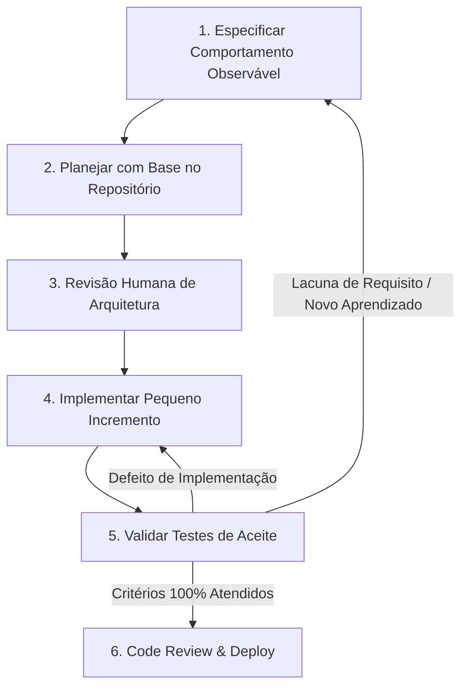

Quando um assistente de IA consegue gerar centenas de linhas de código em questão de segundos, o principal gargalo da engenharia de software muda de *escrever código* para *saber exatamente qual código deve ser escrito*. Sem um planejamento arquitetural explícito, um agente de programação pode implementar uma solução completamente equivocada dez vezes mais rápido do que um desenvolvedor humano.

**Spec-Driven Development (SDD)** é uma metodologia de desenvolvimento em que requisitos, restrições e critérios de aceite testáveis são formalizados em uma especificação (spec) *antes* de solicitar que a IA gere código. Escrever uma especificação concisa alinha o time de engenharia, identifica divergências de negócio no momento em que alterar decisões tem custo zero e fornece ao agente um alvo claro e objetivo para implementar e testar.

Dando continuidade aos artigos de [Context Engineering](/posts/context-engineering/) e [Harness Engineering](/posts/harness-engineering/), este artigo explora como especificações técnicas conectam a intenção do desenvolvedor à execução autônoma da IA.

---

## Especifique o comportamento observável antes de escrever código

Uma boa especificação documenta as decisões críticas de negócio e arquitetura necessárias para validar um pull request, sem a necessidade de microgerenciar cada linha individual de código.

Para qualquer tarefa de engenharia relevante, mantenha três artefatos bem delimitados:

1. **Especificação (Spec):** O comportamento observável esperado, as regras de negócio, os cenários de borda e o que está explicitamente fora de escopo.
2. **Plano de Implementação:** Os arquivos a serem editados, dependências necessárias e a sequência de passos proposta.
3. **Evidências de Verificação:** Os resultados reais de testes automatizados, logs de execução e traces provando que a entrega atende à especificação.

Um plano de implementação bem elaborado não salva um requisito de negócio errado. E uma suíte de testes com 100% de aprovação não comprova o funcionamento da aplicação se os cenários de falha nunca foram testados.

---

## Exemplo prático: especificando descontos no checkout de e-commerce

Vamos transformar a funcionalidade de desconto no checkout, introduzida em [Prompt Engineering](/posts/prompt-engineering/#revise-a-prompt-around-an-observed-failure), em uma especificação técnica versionada:
* **Pricing Service:** Responsável exclusivo por validar elegibilidade, aplicar regras e calcular a cotação oficial.
* **Web Storefront:** Apenas exibe o valor da cotação e as mensagens de erro retornadas; não contém fórmulas de preço.
* **Order Service:** Persiste o ID da cotação aprovada e os totais recebidos diretamente do Pricing Service.
* **Comportamento Padrão:** O fluxo de checkout sem código de desconto permanece 100% inalterado.

Antes de solicitar a codificação ao agente, estruture os cenários de aceite com evidências independentes:

| Cenário de Teste de Aceite | Setup & Execução | Evidência Independente de Validação |
| :--- | :--- | :--- |
| **Cupom de desconto válido** | Carregar carrinho com itens elegíveis e código `PROMO10` | Total exibido na UI e registro persistido no banco batem com a fixture oficial de teste |
| **Cupom de desconto expirado** | Carregar cupom com timestamp de validade anterior à data atual | Mensagem de erro oficial na UI; pedido é impedido de ser fechado com desconto |
| **Checkout sem cupom** | Fluxo padrão de checkout | Valores e schema do banco permanecem idênticos ao comportamento legado da aplicação |
| **Cotação expira durante o fluxo** | Avançar relógio de teste além da janela de tolerância da cotação | Checkout exige revalidação do cupom; impede envio com cotação expirada |
| **Consistência entre serviços** | Executar serviços web, orders e pricing integrados | Frontend, resposta da API e banco de dados refletem o mesmo quote ID e valores |

---

## Exemplo: tratando eventos duplicados de mensageria

Veja um requisito comum e vago: *"Envie uma notificação quando o pedido for despachado."*

Muitos consumidores de mensagens usam entrega *at-least-once*, portanto tentativas adicionais podem reenviar o mesmo evento. A especificação precisa tratar requisições duplicadas e resultados incertos do provedor:

```markdown
# Especificação: Consumer de Notificação de Despacho

## 1. Objetivo
Evitar efeitos duplicados no provedor por evento de despacho durante a
janela de idempotência do provedor. Encaminhar resultados sem retry seguro.

## 2. Contratos de Entrada e Premissas
- Payload do evento contém: event_id (UUID), order_id, recipient_email, shipped_at.
- O producer garante que o event_id permanece idêntico em reentregas do broker.
- O provedor externo de e-mail aceita idempotency key e deduplica requisições por pelo menos 7 dias após a primeira requisição aceita.
- Tentativas automáticas são limitadas por essa janela; uma reentrega posterior
  do broker exige conciliação se não houver sucesso registrado localmente.

## 3. Regras de Comportamento
- Criar um registro durável com event_id único antes de chamar o provedor;
  permitir que apenas um worker detenha o lease ativo para o evento.
- Usar event_id como idempotency key em todas as tentativas.
- Persistir o sucesso do provedor antes de dar ack ao broker. Uma reentrega já
  marcada como concluída recebe ack sem nova chamada ao provedor.
- Repetir resultados incertos somente dentro da janela de deduplicação de 7 dias.
  Depois disso, interromper retries automáticos e encaminhar para conciliação manual.
- Enviar payloads inválidos imediatamente à Dead-Letter Queue (DLQ); enviar
  falhas transitórias repetidas após 3 tentativas.

## 4. Cenários de Teste de Aceite
- Cenário 1: O provedor aceita a primeira requisição e o consumer persiste o sucesso.
- Cenário 2: Reentrega após sucesso gera ack imediato sem reenvio ao provedor.
- Cenário 3: Worker cai após sucesso do provedor, antes de salvar no banco; o
  retry dentro de 7 dias reutiliza a chave e o provedor deduplica a requisição.
- Cenário 4: Resultado incerto além da janela de retenção da chave no provedor aguarda conciliação, sem reenvio automático.
- Cenário 5: Payload inválido vai para a DLQ sem acionar o provedor.

## 5. Fora de Escopo
Novos templates de e-mail, canais de SMS e ferramentas de reprocessamento em massa.
```

O provedor pode deduplicar requisições na janela declarada, mas esse desenho não garante que exatamente um e-mail chegue ao destinatário. Mapeie os requisitos para testes de injeção de falhas:

| Cenário de Teste | Injeção de Falha ou Setup | Asserção de Verificação |
| :--- | :--- | :--- |
| **Reentrega pelo Broker** | Publicar o mesmo evento de despacho duas vezes | Provedor de e-mail chamado apenas 1 vez; segundo ack emitido |
| **Workers Concorrentes** | Disparar 2 workers em paralelo com a mesma mensagem | Registro único e lease selecionam um responsável; se chamadas se sobrepuserem após expiração do lease, a mesma chave evita efeito duplicado no provedor |
| **Crash Recovery** | Derrubar o processo logo após o HTTP 200 do provedor | Retry dentro de 7 dias reutiliza a mesma chave; registro no banco é concluído |
| **Janela de Deduplicação Expirada** | Reentregar evento com resultado incerto após a janela de retenção da chave no provedor | Nenhuma chamada automática ao provedor; evento aguarda conciliação |
| **Schema Inválido** | Enviar evento sem o campo `recipient_email` | Zero chamadas ao provedor externo; evento movido para a Dead-Letter Queue |

---

## Código gerado rápido demais pode inflar os custos de manutenção {#cheap-scaffolding-can-create-expensive-maintenance}

Ferramentas de IA tornam a geração de código trivial: com uma única frase, o modelo pode criar dezenas de interfaces, abstract factories, repositories e command handlers. No entanto, scaffolding fácil não significa bom design de software.

Cada camada de abstração criada por um modelo de IA torna-se complexidade permanente no repositório, que desenvolvedores humanos — e futuros agentes — terão de ler, compreender, debugar e manter.

### Avaliando trade-offs de padrões de arquitetura

Antes de permitir que um agente adicione padrões complexos à sua aplicação, analise criticamente os trade-offs:

| Padrão Arquitetural | Quando Justifica o Custo | Anti-Pattern Típico de IA a Evitar |
| :--- | :--- | :--- |
| **Clean Architecture / Ports & Adapters** | Regras de negócio de domínio precisam de isolamento completo de frameworks e banco de dados | Camadas pass-through e 5 data mappers triviais que apenas repassam dados sem agregar valor |
| **CQRS** | Cargas de leitura e escrita têm demandas de escala e requisitos completamente diferentes | Separar um CRUD simples em comandos e queries, criando pipelines de projeção sem necessidade |
| **Event Sourcing** | Reconstrução histórica de estado e auditoria são requisitos inegociáveis de negócio | Subestimar a complexidade de evolução de schemas e replays apenas porque criar events é fácil |
| **Dependency Injection & Interfaces** | Implementações concretas precisam ser alternadas para testes ou suporte a múltiplos ambientes | Criar uma interface e uma factory para cada classe concreta simples do sistema |

Como explicam Mark Richards e Neal Ford em *Software Architecture: The Hard Parts* ([Capítulo 1, "Architectural Decision Records"](https://www.oreilly.com/library/view/software-architecture-the/9781492086888/ch01.html)), não existe arquitetura perfeita — apenas trade-offs. Da mesma forma, Martin Fowler alerta que aplicar CQRS em domínios simples cria complexidade desnecessária (consulte [Martin Fowler sobre CQRS](https://martinfowler.com/bliki/CQRS.html)).

### Inclua parcimônia arquitetural no prompt

Adicione uma cláusula explícita de contenção de complexidade nas instruções do seu agente:

```text
Siga os padrões arquiteturais e convenções existentes no repositório.
Antes de introduzir qualquer nova camada de abstração, interface, fila ou tabela de banco de dados:
1. Identifique o requisito concreto de negócio que exige essa abstração.
2. Compare sua proposta contra a implementação mais simples e direta possível.
3. Demonstre como uma alteração futura típica seria feita em ambas as opções.
4. Documente os trade-offs de manutenibilidade para o code review.
```

---

## Mantenha o processo iterativo e ágil

Spec-Driven Development não significa voltar ao modelo em cascata (waterfall). Alinhado aos [Princípios Ágeis](https://agilemanifesto.org/principles.html), as especificações devem evoluir conforme testes e protótipos revelam detalhes não previstos.



Mantenha a especificação versionada no Git junto ao código-fonte da aplicação. Ao alterar uma regra de negócio, atualize a spec, os testes e o código no mesmo commit atômico.

---

## Sincronize prompts reutilizáveis com a especificação

Em [Structured-Prompt-Driven Development](https://martinfowler.com/articles/structured-prompt-driven/), Wei Zhang e Jessie Jie Xia recomendam versionar prompts técnicos no repositório como ativos de engenharia, sincronizados com a evolução do software.

Se as regras de desconto do nosso checkout mudarem (por exemplo, exigindo um valor mínimo de compra), atualize em conjunto:
1. A especificação da funcionalidade em `docs/specs/checkout-discounts.md`.
2. O prompt reutilizável do agente em `prompts/checkout-discount.txt`.
3. Os testes de aceite em `tests/checkout/discount.test.ts`.

---

## Conclusão e próximos passos

Spec-Driven Development mantém o desenvolvimento com agentes de IA previsível, seguro e alinhado aos padrões da equipe:

* Escreva **especificações claras** antes de iniciar a geração de código.
* Separe com rigor **especificação, plano de implementação e evidências de validação**.
* Evite **complexidade arquitetural prematura**; priorize simplicidade e manutenibilidade.
* Mantenha especificações **versionadas no Git** junto ao código-fonte.

Uma especificação sólida define *o que* deve ser construído. Mas como o agente implementa o código, detecta falhas em tempo de execução e se autocorige de forma autônoma? No próximo artigo da série, [Loop Engineering: projetando feedback automatizado para agentes de programação com IA](/posts/loop-engineering/), mostramos como projetar ciclos fechados de feedback e validação.
