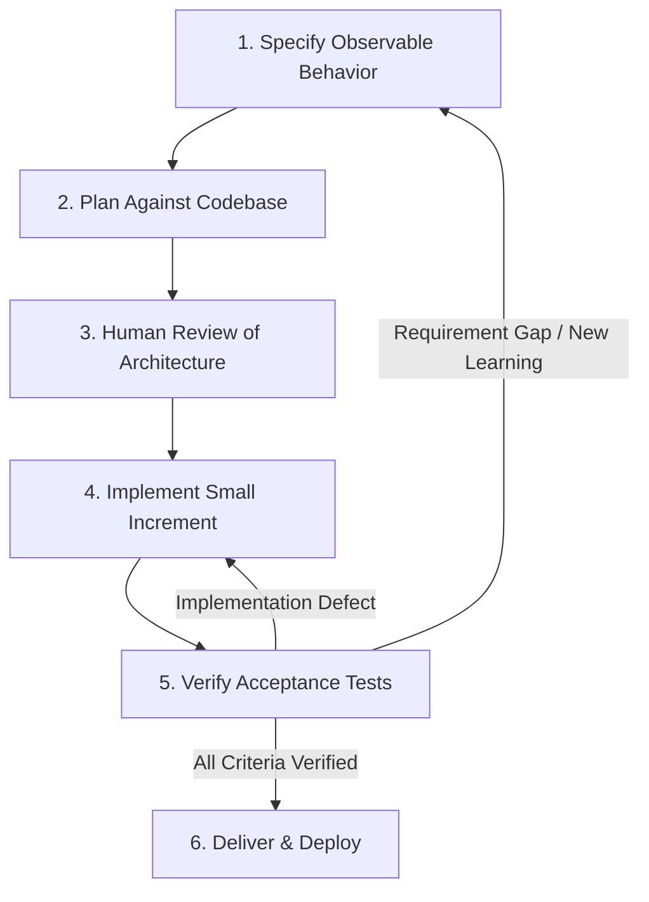

When an AI coding assistant can generate hundreds of lines of code in seconds, the primary engineering bottleneck shifts from *writing code* to *knowing what code to write*. Without explicit architectural planning, an agent can implement an entirely wrong solution ten times faster than a human engineer.

**Spec-Driven Development (SDD)** is an engineering discipline where developers define requirements, constraints, and testable acceptance criteria *before* asking an AI agent to produce code. Writing a concise specification aligns human engineers, catches misunderstandings early when changes cost nothing, and gives the agent an unambiguous target to implement and verify.

Following our previous guides on [Context Engineering]() and [Harness Engineering](), this article explores how specifications bridge human intent and autonomous AI execution.

---

## Specify observable behavior before writing implementation code

A good specification captures the critical architectural decisions required to evaluate a pull request without micromanaging every single line of code.

For any non-trivial engineering task, maintain three separate artifacts:

1. **Specification:** The desired observable behavior, business rules, edge cases, and explicit exclusions (what is out of scope).
2. **Implementation Plan:** The proposed file edits, dependency additions, and step-by-step changes.
3. **Verification Evidence:** The automated test results, execution logs, and runtime traces proving the implementation satisfies the specification.

A brilliant implementation plan cannot rescue an incorrect requirement. And passing tests cannot prove correctness if they never tested the relevant edge cases.

---

## Running example: specifying e-commerce checkout discounts

Let us formalize the checkout discount feature from our [Prompt Engineering guide](#revise-a-prompt-around-an-observed-failure) into a versioned specification:
* **Pricing Service:** Exclusively owns discount eligibility, calculation, and quote generation.
* **Web Storefront:** Displays the returned quote and error messages; contains zero pricing logic.
* **Order Service:** Persists the accepted quote ID and totals directly from Pricing Service.
* **Fallback Behavior:** Checkout without a discount code remains completely unchanged.

Before generating code, define exact acceptance test cases with independent verification evidence:

| Acceptance Test Case | Setup & Execution | Independent Verification Evidence |
| :--- | :--- | :--- |
| **Valid discount code** | Seed cart and apply code `SAVE10`; submit checkout | Displayed total and database record match precomputed test fixture |
| **Expired discount code** | Seed code with expiration timestamp in the past | User sees agreed error; order cannot be placed with discounted price |
| **No discount code** | Standard checkout flow | Total amount and database schema match existing baseline behavior |
| **Quote expires mid-session** | Advance test clock past quote validity window | Checkout prompts customer for re-quote; blocks submission with stale quote |
| **Cross-service data consistency** | Run web, orders, and pricing services together | UI, API response, and database record reflect the identical quote ID and amounts |

---

## Example: handling duplicate notification events

Consider this common, underspecified requirement: *"Send a notification when an order ships."*

Many message consumers use at-least-once delivery, so retries can redeliver the same event. The specification must account for duplicate requests and for an uncertain provider outcome:

```markdown
# Shipment Notification Consumer Specification

## 1. Goal
Avoid duplicate provider effects for a shipment event during the provider's
idempotency window. Escalate outcomes that cannot be safely retried.

## 2. Input Contracts and Assumptions
- Input payload contains: event_id (UUID), order_id, recipient_email, shipped_at.
- The producer guarantees event_id remains identical across broker redeliveries.
- The external notification provider accepts an idempotency key and deduplicates
  requests for at least 7 days after the first accepted request.
- Automatic retries are bounded by that window; a later broker redelivery is
  reconciled if no successful delivery is recorded locally.

## 3. Behavioral Rules
- Create a durable processing record with a unique event_id before the provider call;
  allow only one worker to own an active lease for that event.
- Use event_id as the provider's idempotency key on every attempt.
- Persist provider success before acknowledging the broker message. A redelivery
  already marked successful is acknowledged without calling the provider.
- Retry uncertain outcomes only within the provider's 7-day deduplication window.
  After that, stop automatic retries and send the event for manual reconciliation.
- Send malformed payloads to a Dead-Letter Queue (DLQ) immediately; send repeated
  transient failures there after 3 attempts.

## 4. Acceptance Test Scenarios
- Scenario 1: Provider accepts the first request and the consumer persists success.
- Scenario 2: Broker redelivers event after success; consumer acknowledges without duplicate send.
- Scenario 3: Worker crashes after provider success but before database write;
  retry within 7 days reuses the key, so the provider deduplicates the request.
- Scenario 4: An uncertain result beyond the provider's key-retention window is held for reconciliation,
  not automatically sent again.
- Scenario 5: Malformed payload moves to DLQ without contacting the provider.

## 5. Out of Scope
Custom email templating, SMS channels, and manual batch replay tools.
```

The provider can deduplicate requests within its stated window, but this design cannot promise that exactly one email reaches the recipient. Map the requirements to fault-injection tests:

| Acceptance Case | Injected Fault or Setup | Test Assertion |
| :--- | :--- | :--- |
| **Broker Redelivery** | Publish the same shipment event twice | Notification provider called once; second message acknowledged |
| **Concurrent Workers** | Release two parallel workers on identical event | Unique record and lease select one owner; if calls overlap after lease expiry, the shared provider key prevents a duplicate effect |
| **Crash Recovery** | Kill process immediately after provider 200 OK | Retry within 7 days reuses original idempotency key; delivery record completes |
| **Expired Deduplication Window** | Redeliver an uncertain event after the provider's key-retention window | No automatic provider call; event awaits reconciliation |
| **Malformed Schema** | Send payload missing `recipient_email` | Zero provider calls; message moved to Dead-Letter Queue |

---

## Quick code generation can raise maintenance costs {#cheap-scaffolding-can-create-expensive-maintenance}

AI coding tools make generating boilerplate effortless: with a single prompt, an agent can spin up tens of interfaces, abstract factories, repositories, and command handlers. But easy scaffolding does not equal good software design.

Every layer of abstraction introduced by an AI model is permanent complexity that future engineers—and future AI agents—must read, understand, debug, and maintain.

### Evaluating architectural patterns critically

Before letting an agent introduce heavy design patterns, evaluate the real trade-offs:

| Architectural Pattern | When It Earns Its Place | Common AI Anti-Pattern to Avoid |
| :--- | :--- | :--- |
| **Clean Architecture / Ports & Adapters** | Complex domain business rules must be decoupled from frameworks and databases | Pass-through layers and 5 trivial data mappers that add zero isolation value |
| **CQRS (Command Query Responsibility Segregation)** | Read workloads and write workloads have drastically different scaling needs | Splitting simple CRUD into command/query models, adding unnecessary projection pipelines |
| **Event Sourcing** | Auditability and temporal state reconstruction are hard legal or business requirements | Treating event evolution and replay as free simply because boilerplate was easy to write |
| **Dependency Injection & Interfaces** | Concrete implementations must be swapped for unit testing or multi-tenancy | Generating an interface and factory for every single concrete service class |

As Mark Richards and Neal Ford explain in *Software Architecture: The Hard Parts* ([Chapter 1, "Architectural Decision Records"](https://www.oreilly.com/library/view/software-architecture-the/9781492086888/ch01.html)), there are no universally best architectures—only trade-offs. Similarly, Martin Fowler warns that applying CQRS to simple domain models introduces significant architectural risk (see [Martin Fowler on CQRS](https://martinfowler.com/bliki/CQRS.html)).

### Enforce architectural restraint in your prompt

Add an explicit restraint clause to your agent instructions:

```text
Follow the existing codebase conventions and architectural style.
Before introducing any new abstraction layer, interface, message queue, or database table:
1. Identify the concrete business requirement that necessitates this abstraction.
2. Compare your design against the simplest possible implementation.
3. Trace how a typical future modification would be implemented across both options.
4. Document the maintenance and operational trade-offs for code review.
```

---

## Keep the specification process agile and iterative

Spec-Driven Development is not a rigid waterfall process. In accordance with [Agile Principles](https://agilemanifesto.org/principles.html), specifications should evolve as prototypes and unit tests uncover hidden edge cases.



Maintain the specification in git alongside the source code. When business rules change, update the specification, tests, and code in the same atomic commit.

---

## Synchronize reusable prompts with specifications

In [Structured-Prompt-Driven Development](https://martinfowler.com/articles/structured-prompt-driven/), Wei Zhang and Jessie Jie Xia recommend maintaining prompts as versioned engineering assets synchronized with codebase changes.

If our checkout discount rules change (e.g., adding minimum purchase thresholds), update:
1. The feature specification in `docs/specs/checkout-discounts.md`.
2. The reusable agent prompt in `prompts/checkout-discount.txt`.
3. The automated acceptance tests in `tests/checkout/discount.test.ts`.

---

## Summary and next steps

Spec-Driven Development keeps AI coding agents focused, efficient, and aligned with engineering standards:

* Write **unambiguous specifications** before generating implementation code.
* Separate **specifications, implementation plans, and verification evidence**.
* Guard against **premature architectural complexity**; reject gratuitous boilerplate.
* Keep specifications **versioned and synchronized** in git alongside application code.

A clear specification defines what needs to be built. But how does an agent iteratively write code, detect errors, and fix them autonomously? In our next guide, [Loop Engineering: Designing Automated Feedback for AI Coding Agents](), we examine how to build closed-loop development cycles.
