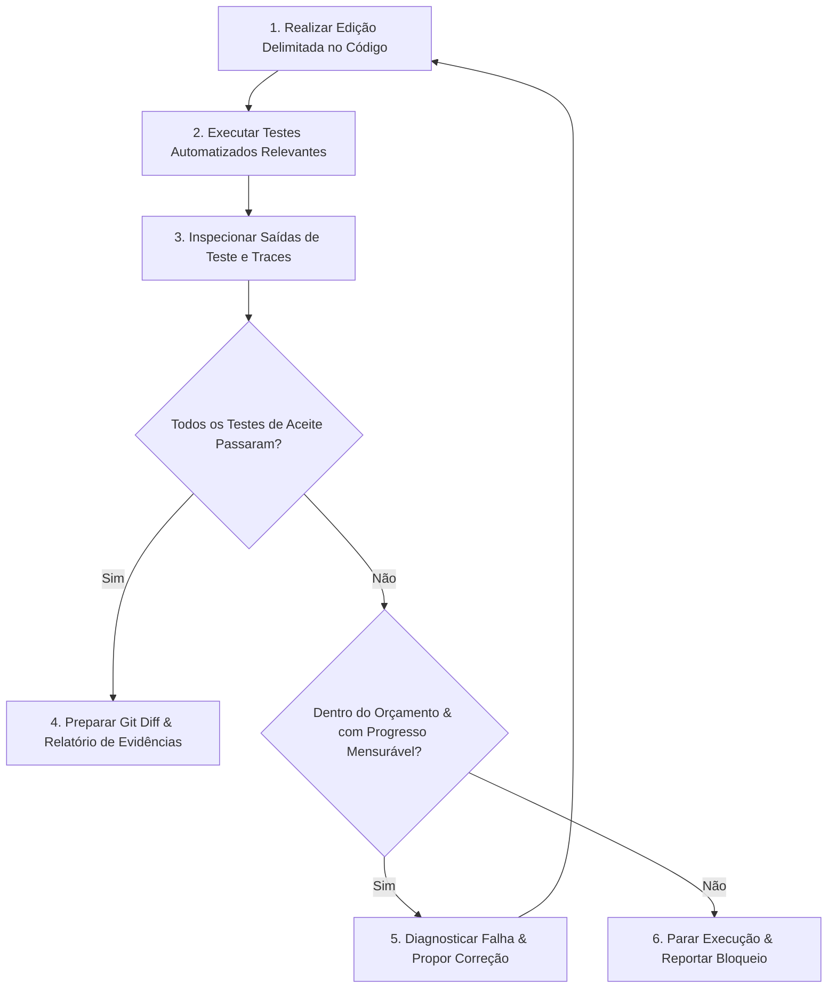

Quando um desenvolvedor utiliza um assistente de IA em uma interface tradicional de chat sem ferramentas integradas, o ser humano atua como um roteador manual ineficiente: copia a instrução, cola o código gerado no editor, roda os testes no terminal, copia o stack trace de erro de volta para o chat e repete o processo.

Um **agente de programação com IA** autônomo elimina esse trabalho braçal: ele executa comandos diretamente, analisa erros de compilação, inspeciona os resultados dos testes e edita o código até que todas as validações passem. No entanto, conceder permissão de execução sem controle traz sérios riscos: o agente pode entrar em loops infinitos, alterar asserções de testes para forçar um resultado positivo ou consumir orçamentos exorbitantes de tokens sem fazer progresso real.

**Loop engineering** é a disciplina de engenharia de software voltada a projetar ciclos de feedback delimitados e autocorretivos. Esses ciclos conectam as alterações de código feitas pelo agente a sensores automatizados de validação (testes, linters, traces), regras rígidas de consumo de recursos e condições explícitas de parada.

Concluindo os conceitos abordados em [Spec-Driven Development](/posts/spec-driven-development/), este artigo fecha a visão técnica da arquitetura de agentes de programação.

---

## Feche o ciclo de feedback com evidências objetivas

Como aponta a Anthropic em [Building effective agents](https://www.anthropic.com/engineering/building-effective-agents), a autonomia e assertividade de um agente dependem diretamente da qualidade do feedback do ambiente em que ele atua.

Um ciclo de feedback confiável deve seguir um fluxo delimitado e baseado em decisões claras:



O meio de transporte utilizado (terminal shell, chamada de API ou Model Context Protocol) é secundário. O que realmente importa é garantir que o agente receba o código de saída real do processo (exit code) e os logs de erro sem distorções.

---

## Alinhe o tipo de sensor à natureza da alteração

Diferentes tipos de código exigem sensores de validação específicos:

| Sensor de Validação | O Que Ele Comprova | O Que Ele Não Garante Sozinho |
| :--- | :--- | :--- |
| **Compilador & Type Checker** | Conformidade sintática e compatibilidade com o sistema de tipos | Correção das regras de negócio ou validações em runtime |
| **Testes Unitários e de Integração** | Regras de negócio esperadas e comportamento de fronteiras | Desempenho e estabilidade sob alta concorrência em produção |
| **Logs e Traces em Runtime** | Comportamento real observado durante a execução de teste | Ausência de bugs de borda em fluxos não executados |
| **Testes E2E com Browser Headless** | Elementos renderizados no DOM, fluxos de clique e UI | Acessibilidade completa (a11y) ou compatibilidade com todos os navegadores |

Ao corrigir um bug, estabeleça sempre uma linha de base (baseline): confirme que o teste de regressão falha *antes* da correção e passa com sucesso *depois* da alteração.

---

## Exemplo prático: verificando o checkout de ponta a ponta

Retomando nosso exemplo de desconto no checkout: após o agente atualizar os serviços de web, orders e pricing, ele deve validar o fluxo em um ambiente de testes isolado e reproduzível.

O fluxo de verificação deve seguir etapas rigorosas:
1. Subir containers efêmeros para os serviços de `web`, `orders` e `pricing`.
2. Injetar cupons válidos e expirados nas fixtures do banco de teste.
3. Aguardar probes de prontidão (readiness checks) em todos os endpoints HTTP.
4. Conduzir um browser headless pelo fluxo completo de checkout.
5. Fazer asserções no banco de dados para garantir que o total persistido no pedido reflita com fidelidade a cotação oficial do Pricing Service.
6. Limpar bancos temporários e finalizar os processos.

Esse fluxo ponta a ponta é exposto ao agente por meio da ferramenta `verify_checkout`, definida no nosso artigo de [Harness Engineering](/posts/harness-engineering/#example-a-bounded-checkout-verification-tool).

---

## Nunca permita que a IA defina seus próprios critérios de sucesso

Se um agente de IA escrever a implementação e os testes de aceite na mesma sessão sem diretrizes, ele frequentemente codificará o mesmo erro em ambos os lados, criando um falso positivo perfeito.

Para garantir validação técnica real:
* **Derive critérios de aceite da especificação técnica:** Baseie os testes nos cenários definidos durante o [Spec-Driven Development](/posts/spec-driven-development/).
* **Proteja a suíte de testes existente:** Proíba explicitamente o agente de modificar ou remover testes legados de regressão sem autorização.
* **Cuidado com falsos positivos de exit code 0:** Um status de saída zero não significa que o software está correto se o test runner encontrou 0 testes ou rodou na pasta errada. O agente deve reportar explicitamente a quantidade de testes executados.

---

## Delimite retries, tempo de execução e efeitos colaterais

Para evitar loops infinitos e custos descontrolados de API, estabeleça guardrails operacionais estritos:

* **Limite máximo de retries:** Permita no máximo de 3 a 5 tentativas de correção por tarefa antes de interromper a execução e solicitar apoio humano.
* **Orçamento de timeout:** Defina limites rígidos de tempo (por exemplo, 5 a 10 minutos) para cada suíte de testes.
* **Detecção de repetição estéril:** Se o agente rodar o mesmo comando três vezes seguidas e receber o mesmo erro, aborte imediatamente — insistir sem novo contexto não mudará o resultado.
* **Sandboxes isolados:** Isole a execução para que testes com falha não afetem bancos de dados compartilhados nem disparem requisições externas para gateways reais de pagamento.

---

## Delegação multi-agente sem sobrecarga de contexto

Como explica Rahul Garg em [The Orchestrator's Tax](https://martinfowler.com/articles/orchestrator-tax.html), ter um agente orquestrador delegando tarefas para múltiplos subagentes pode se tornar contraproducente se os workers devolverem transcripts gigantescos de terminal para a janela de contexto principal.

Para manter o contexto limpo:
* **Exija relatórios estruturados:** Subagentes devem retornar apenas os arquivos alterados, comandos executados, contagem de testes aprovados/reprovados e eventuais bloqueios.
* **Mantenha logs detalhados em disco:** Guarde os logs em artefatos com acesso restrito, oculte dados sensíveis e repasse ao agente pai apenas referências e um resumo conciso.
* **Isole workspaces com worktrees:** Utilize git worktrees ou branches separadas para os subagentes, rodando testes de integração apenas após o merge.

---

## Preserve o ciclo de aprendizado do desenvolvedor

Em [The Learning Loop and LLMs](https://martinfowler.com/articles/llm-learning-loop.html), Unmesh Joshi alerta que delegar todo o código para IA pode eliminar o processo mental de experimentação pelo qual engenheiros constroem entendimento profundo de sistemas.

Durante o code review de PRs gerados por agentes:
* Peça ao desenvolvedor que explique o comportamento em cenários de borda (por exemplo: *"O que ocorre se a cotação expirar exatamente no milissegundo em que o cliente clica em pagar?"*).
* Valide se o engenheiro compreende *por que* determinada fronteira arquitetural foi escolhida, e não apenas se os testes passaram.
* Use agentes de IA para acelerar a execução, mantendo os engenheiros humanos no comando das decisões arquiteturais.

---

## Entregue relatórios de conclusão estruturados para code review

Quando o agente concluir uma tarefa, ele deve emitir um relatório claro e estruturado para revisão humana. As contagens abaixo são ilustrativas:

```markdown
### Resumo de Conclusão da Tarefa

**Arquivos Modificados:**
- `apps/web/src/components/Checkout.tsx`: Input de cupom e exibição de erro.
- `services/orders/src/services/OrderService.ts`: Persistência do quote ID no pedido.
- `tests/e2e/checkout-discount.spec.ts`: Suíte de regressão automatizada.

**Resultados das Validações:**
- Baseline: Teste de regressão falhou conforme esperado antes da alteração.
- Pós-correção: 14 testes unitários, 4 de integração e 2 E2E de browser aprovados.
- Type check: Aprovado sem erros (0 errors).
- Linter: Aprovado sem avisos (0 warnings).

**Premissas e Limitações:**
- A expiração da cotação foi testada com mock de relógio; validação em staging recomendada.
```

---

## Compare versões de workflow com execuções reais {#compare-workflow-versions-with-fresh-executions}

Ao aprimorar seu harness de engenharia (por exemplo, adicionando probes de prontidão ou novas regras de linter), avalie as melhorias de modo sistemático. O registro YAML abaixo é um exemplo de formato, não um resultado medido:

1. **Defina um conjunto congelado de tarefas:** Selecione 10 tarefas reais de código com commits iniciais e testes de aceite estabelecidos.
2. **Execute Harness A (Baseline) vs. Harness B (Candidato):** Rode ambas as versões nas 10 tarefas em ambientes limpos, com parâmetros de modelo e orçamentos idênticos.
3. **Meça métricas completas:** Compare a taxa de sucesso nas tarefas, regressões, tentativas de correção, tempo de review, latência e custo total de tokens.

```yaml
task_id: checkout-delayed-pricing
starting_commit: a1b2c3d4
workflow_version: Harness_B_com_readiness_probe
model: claude-3-5-sonnet
outcome: accepted
acceptance_tests: 5 aprovados / 5 total
regressions_detected: 0
repair_attempts: 1
avoidable_test_failures: 0
elapsed_seconds: 84
total_billed_cost: $0.038
```

---

## Conectando as seis práticas

Os seis artigos desta série compõem uma arquitetura coesa para o uso profissional e seguro de agentes de IA na engenharia de software:

| Prática | Pergunta Central de Arquitetura |
| :--- | :--- |
| [Prompt Engineering](/posts/prompt-engineering/) | Qual tarefa e restrições estamos definindo para o agente? |
| [AI Gateways e Roteamento](/posts/ai-gateway-routing/) | Qual modelo executará a chamada, sob quais políticas de segurança e custo? |
| [Context Engineering](/posts/context-engineering/) | Quais fatos, contratos e instruções do repositório ele precisa consultar? |
| [Harness Engineering](/posts/harness-engineering/) | Quais ferramentas, sandboxes e sensores executam e validam o trabalho? |
| [Spec-Driven Development](/posts/spec-driven-development/) | Qual comportamento observável e critérios de aceite definem o sucesso? |
| **Loop Engineering** | Como o agente executa, valida, se autocorige e para com segurança? |

---

## Referência: runbook executável de testes end-to-end {#define-an-executable-end-to-end-test-runbook}

Para capacitar o agente a rodar verificações ponta a ponta com segurança, documente os passos operacionais em um runbook versionado:

1. **Dependências de serviços:** Comandos explícitos de docker-compose para inicializar bancos e serviços mockados.
2. **Checagem de prontidão:** Endpoints confiáveis de health check (`curl -f http://localhost:8080/health`).
3. **Credenciais isoladas:** Variáveis de ambiente exclusivas para testes, sem senhas reais versionadas.
4. **Rotinas de cleanup:** Scripts que limpam os dados gerados e encerram os processos filhos ao final da execução.

Para equipes que avaliam execuções com modelos, a [primitiva Score do TypeSafe Jev](https://docs.typesafe.ai/primitives/score) pode fornecer julgamentos estruturados sobre evidências sanitizadas. Valide a rubrica com exemplos conhecidos e mantenha a revisão humana para decisões importantes.

---

## Conclusão

Loop engineering traz rigor técnico à autonomia dos agentes de IA. Especificações claras, ferramentas em sandbox, feedback de testes e limites de parada tornam o trabalho mais fácil de inspecionar e corrigir; a revisão humana continua necessária para comportamentos que as verificações não cobriram.

Compreendidos os seis pilares dos agentes de IA, como documentar sistemas de grande escala e coordenar revisões de arquitetura entre humanos e agentes? No nosso artigo complementar, [System Design com IA: um guia prático para documentar decisões](/posts/ai-system-design-documents/), demonstramos como estruturar, desafiar e validar documentos de arquitetura em produção.
