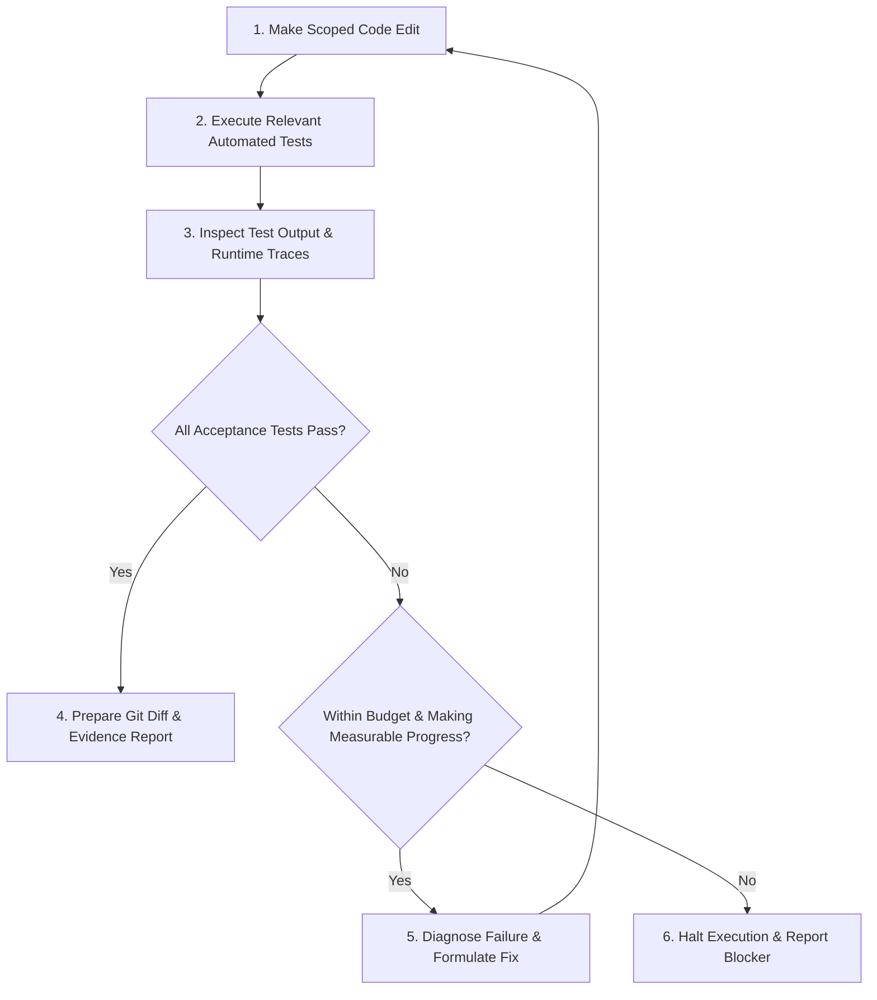

When a software engineer uses an AI chat assistant without execution tools, the human acts as an inefficient manual router: copy the prompt, paste the generated code into an editor, run tests in a terminal, copy the error message back into the chat, and repeat.

An autonomous **AI coding agent** eliminates this manual back-and-forth by directly executing commands, reading compiler errors, inspecting test results, and modifying its own code until tests pass. However, granting an agent execution capabilities is not enough: without strict boundaries, agents can enter infinite loops, modify test assertions to fake a pass, or rack up massive API bills without making real progress.

**Loop engineering** is the architectural practice of designing bounded, self-correcting feedback cycles that connect an agent's code edits to objective verification sensors, strict resource limits, and explicit stopping conditions.

Following our previous guide on [Spec-Driven Development](), this article completes our core agent architecture series.

---

## Close the feedback loop with objective evidence

As Anthropic highlights in [Building effective agents](https://www.anthropic.com/engineering/building-effective-agents), an agent's autonomy depends directly on the quality of environmental feedback it receives.

A reliable agent feedback loop should follow a bounded, decision-driven lifecycle:



The underlying communication transport (terminal shell, REST API, or Model Context Protocol) matters far less than ensuring the agent receives the actual, unadulterated process exit status and error logs.

---

## Match feedback granularity to the type of change

Different code changes require different verification sensors:

| Verification Sensor | What It Verifies | What It Cannot Prove Alone |
| :--- | :--- | :--- |
| **Compiler & Type Checker** | Syntactic correctness and type system compatibility | Business logic accuracy or runtime data correctness |
| **Unit & Integration Tests** | Predefined business rules and isolated boundary behavior | Behavior under high-concurrency production load |
| **Runtime Logs & Traces** | Observable behavior during a specific test run | Prevention of edge-case bugs in unexercised branches |
| **Headless Browser Tests** | Rendered DOM elements, user interactions, and visual layout | Complete accessibility (a11y) or multi-browser quirks |

When an agent fixes a bug, always establish a baseline first: ensure the regression test reproduces the failure *before* the fix, and passes cleanly *after* the fix.

---

## Running example: verifying e-commerce checkout end-to-end

Returning to our running e-commerce discount feature: after the agent updates the web storefront, order service, and pricing service, it must verify the feature against an isolated, reproducible test environment.

The verification process follows a strict sequence:
1. Spin up ephemeral container instances of `web`, `orders`, and `pricing` services.
2. Seed valid and expired discount codes into test database fixtures.
3. Wait for HTTP readiness probes on all service endpoints.
4. Drive a headless browser through the checkout flow.
5. Query the database to assert that the persisted order total reflects the authoritative pricing quote.
6. Clean up temporary test databases and processes.

This end-to-end flow is exposed to the agent through the bounded `verify_checkout` tool defined in our [Harness Engineering guide](#example-a-bounded-checkout-verification-tool).

---

## Never let the agent define its own definition of success

If an AI agent writes both the implementation code and the acceptance tests in the same session, it will often encode the exact same mistaken assumption in both places.

To ensure genuine verification:
* **Derive acceptance criteria directly from the specification:** Use the test scenarios established during [Spec-Driven Development]().
* **Protect existing test suites:** Instruct the agent that modifying or deleting existing regression tests is strictly forbidden unless explicitly requested.
* **Watch for false positives:** An exit code of `0` does not guarantee success if the test runner discovered 0 tests or executed the wrong directory. The agent must verify and report the count of executed test cases.

---

## Bound retries, execution time, and side effects

To prevent costly runaway execution loops, configure strict operational guardrails:

* **Maximum repair iterations:** Allow at most 3 to 5 repair attempts per task before requiring the agent to stop and request human help.
* **Timeout budgets:** Enforce hard execution timeouts (e.g., 5 to 10 minutes) on all test runs.
* **Repetition detection:** If an agent executes the identical command three times and receives the identical error, halt immediately—more attempts without new context will not produce a different result.
* **Isolated sandboxes:** Isolate test execution so failed runs cannot corrupt shared databases, send real customer emails, or charge real payment gateways.

---

## Manage multi-agent delegation without context bloating

As Rahul Garg explains in [The Orchestrator's Tax](https://martinfowler.com/articles/orchestrator-tax.html), having a primary orchestrator agent delegate subtasks to multiple worker agents can backfire if workers dump massive terminal transcripts back into the orchestrator's context window.

To maintain clean context:
* **Require structured summaries:** Subagents must return only file paths changed, executed commands, test pass/fail counts, and unresolved blockers.
* **Offload detailed traces to disk:** Store logs in access-controlled artifacts, redact sensitive content, and pass only artifact references and a concise summary to the parent agent.
* **Isolate workspaces:** Use separate git worktrees or branches for subtasks, running integration checks only after branches are merged.

---

## Preserve developer learning and mental models

In [The Learning Loop and LLMs](https://martinfowler.com/articles/llm-learning-loop.html), Unmesh Joshi warns that relying entirely on AI-generated code can bypass the mental experimentation through which developers build deep system understanding.

When reviewing agent pull requests:
* Ask the engineer to predict edge-case behavior (e.g., *"What happens if a discount quote expires precisely at the millisecond of order submission?"*).
* Verify that the engineer understands *why* an architectural boundary was chosen, not just that tests passed.
* Use AI agents to accelerate implementation, while keeping human engineers in command of architectural decisions.

---

## Deliver structured, reviewable completion reports

When an agent completes a task, it should produce a structured summary formatted for fast human review. The counts in this example are illustrative:

```markdown
### Task Completion Summary

**Files Modified:**
- `apps/web/src/components/Checkout.tsx`: Added discount code input and error banner.
- `services/orders/src/services/OrderService.ts`: Persisted quote ID in order record.
- `tests/e2e/checkout-discount.spec.ts`: Added automated regression suite.

**Verification Results:**
- Baseline: New regression test failed as expected before code changes.
- Post-fix: 14 unit tests, 4 integration tests, and 2 E2E browser tests passed.
- Type check: Clean (0 errors).
- Linter: Clean (0 warnings).

**Remaining Assumptions & Limitations:**
- Quote expiration was verified using a simulated clock fixture; staging verification recommended.
```

---

## Compare workflow versions with fresh executions {#compare-workflow-versions-with-fresh-executions}

When improving your engineering harness (e.g., adding readiness probes or new linting rules), evaluate the changes systematically. The YAML record below shows a sample format, not measured results:

1. **Establish a frozen test set:** Gather 10 diverse coding tasks with verified starting commits and acceptance tests.
2. **Run Harness A (Baseline) vs. Harness B (Candidate):** Execute both versions across all 10 tasks in clean environments with identical model settings and budgets.
3. **Measure complete metrics:** Compare task success rates, regression counts, repair iterations, review time, latency, and token costs.

```yaml
task_id: checkout-delayed-pricing
starting_commit: a1b2c3d4
workflow_version: Harness_B_with_readiness_probe
model: claude-3-5-sonnet
outcome: accepted
acceptance_tests: 5 passed / 5 total
regressions_detected: 0
repair_attempts: 1
avoidable_test_failures: 0
elapsed_seconds: 84
total_billed_cost: $0.038
```

---

## Connecting the six practices

The six guides in this series form a cohesive architecture for reliable AI-assisted engineering:

| Practice | Core Architectural Question |
| :--- | :--- |
| [Prompt Engineering]() | What specific task and constraints are we giving the agent? |
| [AI Gateways and Routing]() | Which model target handles the request, under what cost and security rules? |
| [Context Engineering]() | What authoritative codebase facts, schemas, and instructions does it need? |
| [Harness Engineering]() | What tools, sandboxes, and automated sensors execute and observe the work? |
| [Spec-Driven Development]() | What observable behavior and acceptance criteria define success? |
| **Loop Engineering** | How does the agent iteratively execute, verify, self-correct, and safely halt? |

---

## Reference: executable end-to-end test runbook {#define-an-executable-end-to-end-test-runbook}

To enable an agent to run end-to-end verification safely, document exact operational steps in a versioned runbook:

1. **Service dependencies:** Specify exact docker-compose or container commands to initialize mock dependencies.
2. **Readiness verification:** Provide reliable health check endpoints (`curl -f http://localhost:8080/health`).
3. **Isolated credentials:** Provide scoped test credentials via environment variables, never hardcoding secrets.
4. **Cleanup routines:** Ensure test runners clean up database rows and shut down child processes on completion.

For teams running model-based evaluations, [TypeSafe Jev's Score primitive](https://docs.typesafe.ai/primitives/score) can provide structured judgments about sanitized execution evidence. Validate its rubric against known examples and keep human review for consequential decisions.

---

## Conclusion

Loop engineering brings engineering discipline to autonomous AI agents. Clear specifications, sandboxed tools, actionable test feedback, and stopping limits make their work easier to inspect and correct; human review remains necessary for behavior the checks did not cover.

Now that we understand the six technical pillars of AI coding agents, how do we document large-scale architectural systems and coordinate human-AI design reviews? In our companion guide, [Creating System Design Documents with AI: A Practical Guide](), we explore how to draft, challenge, and verify production architecture documents.
