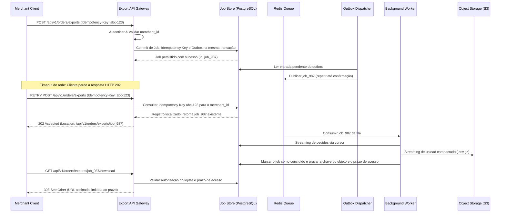

Peça para um modelo de IA "projetar um sistema de pagamentos" e ele gerará um documento aparentemente impecável em menos de trinta segundos. No entanto, esse documento frequentemente ignora os bancos de dados já existentes na empresa, erra cálculos básicos de throughput de rede, subestima cenários de falha distribuída e alucina recursos de APIs externas.

Um **System Design Document** (também chamado de RFC ou Design Doc) é o artefato de engenharia que alinha a equipe técnica quanto à estratégia de arquitetura, fronteiras de microsserviços, propriedade de dados e recuperação de falhas *antes* da escrita do primeiro commit. Ferramentas de IA aceleram expressivamente o processo ao estruturar rascunhos, calcular estimativas de capacidade (back-of-the-envelope), gerar diagramas de sequência em Mermaid e auditar contratos de API. Contudo, os engenheiros humanos continuam sendo os responsáveis finais por avaliar trade-offs e aprovar os requisitos.

Este guia prático apresenta um framework completo para criar documentos de System Design de alto nível com IA, integrando as práticas de [Context Engineering](/posts/context-engineering/), [Harness Engineering](/posts/harness-engineering/) e [Loop Engineering](/posts/loop-engineering/).

Ao longo do artigo, utilizamos um cenário realista de arquitetura: **projetar um serviço assíncrono de exportação de pedidos em um e-commerce**.

---

## 1. Comece com um brief técnico que explicite as incógnitas

Antes de gerar diagramas complexos ou schemas de banco de dados, elabore um brief técnico conciso em `docs/design/order-export/brief.md`.

No nosso cenário:
* Um **job** é uma tarefa assíncrona solicitando a exportação de dados.
* Um **worker** é um processo em background que executa a query no banco, gera as linhas em CSV e faz o upload para o object storage.

```markdown
# Funcionalidade de Exportação de Pedidos: Brief Técnico

## Objetivo
Permitir que lojistas autenticados exportem até 100.000 pedidos em formato CSV diretamente pelo dashboard.

## Requisitos de Negócio e Segurança
- R1 (Autorização): Apenas usuários com o escopo `orders:export` podem iniciar ou solicitar exportações.
- R2 (Isolamento Multi-Tenant): Queries e endpoints de download devem aplicar isolamento por lojista (`merchant_id`). URLs assinadas diretas devem ser tratadas como credenciais de acesso temporárias.
- R3 (Idempotência): O envio de requisições duplicadas com o mesmo idempotency key não pode criar múltiplos jobs de processamento.
- R4 (Durabilidade): Persistir jobs aceitos e recuperar trabalho enfileirado ou abandonado após reinícios dos workers; quando o processamento voltar, cada job deve alcançar um estado terminal visível (`completed` ou `failed`).
- R5 (Expiração de Acesso): O acesso ao download termina 24 horas após a conclusão do job. Uma URL assinada emitida nesse período não pode permanecer válida além desse prazo.

## Metas de Desempenho (Pendente de Confirmação com Stakeholders)
- Suportar até 100.000 pedidos por exportação individual.
- Suportar pico de até 20 novos jobs de exportação por minuto.
- 95% dos jobs aceitos devem ser concluídos em menos de 5 minutos durante a carga de pico.

## Restrições de Arquitetura
- Reutilizar o banco PostgreSQL e o cluster de Redis existentes, se a capacidade permitir.
- Reutilizar o provedor corporativo de OAuth2; não criar sistema próprio de autenticação.

## Fora de Escopo
Exportações agendadas recorrentes, formatos PDF/Excel e relatórios agregados entre múltiplos lojistas.

## Dúvidas em Aberto
- Os dados exportados precisam refletir um snapshot pontual consistente do banco?
- Quais campos de dados pessoais (PII) precisam ser mascarados no CSV?
- Qual a política legal de retenção dos arquivos no bucket de cloud storage?
```

Atribuir identificadores estáveis aos requisitos (R1 a R5) permite que engenheiros e modelos de IA rastreiem cada necessidade de negócio diretamente nas decisões de arquitetura, diagramas e suítes de teste.

---

## 2. Reúna evidências do repositório antes de propor a arquitetura

Nunca permita que a IA desenhe uma arquitetura no vácuo. Forneça como contexto as evidências reais do repositório: migrations de banco de dados, schemas atuais de API, manifests de deploy e runbooks operacionais.

Utilize um prompt focado em levantamento de fatos:

```text
Leia docs/design/order-export/brief.md e inspecione os contratos existentes,
migrations de banco e infraestrutura em services/orders.
NÃO proponha a nova arquitetura ainda.

Crie o arquivo docs/design/order-export/evidence.md contendo:
1. Fatos técnicos confirmados com caminhos de arquivos e linhas.
2. O hash exato do commit git inspecionado no repositório.
3. Documentações desatualizadas ou contraditórias identificadas.
4. Premissas técnicas e dúvidas pendentes, explicitamente rotuladas.
5. Bibliotecas internas e componentes de infraestrutura reutilizáveis.

Diferencie a implementação atual de produção dos requisitos futuros.
Sinalize dúvidas críticas cujas respostas alterariam o design da arquitetura.
```

---

## 3. Estabeleça diretrizes claras no repositório para a fase de design

Padronize as convenções no arquivo `AGENTS.md` para que humanos e agentes de IA sigam as mesmas regras durante a elaboração do documento:

```markdown
# AGENTS.md (Workspace de Documentação de Design)

- Sempre leia `brief.md` antes de alterar qualquer documento de design.
- Sustente qualquer afirmação sobre o sistema atual citando o caminho do arquivo e o commit SHA.
- Rotule explicitamente propostas, premissas e decisões ainda não aprovadas.
- Mantenha os IDs de requisitos (R1, R2, etc.) em todos os diagramas, ADRs e checklists.
- Reutilize a infraestrutura existente a menos que um requisito justifique uma nova tecnologia.
- Documente modos de falha, propriedade de dados, timeouts e estratégias de rollback.
- Nunca marque um documento de design como "Aprovado" sem o sign-off de engenheiros humanos.
```

---

## 4. Estruture decisões técnicas e compare trade-offs

Antes de escrever um documento longo de vinte páginas, formalize a decisão estrutural central em um **Architectural Decision Record (ADR)**.

Solicite à IA uma análise comparativa entre uma abordagem síncrona e um padrão de workers assíncronos:

```text
Utilizando brief.md e evidence.md, compare uma abordagem de exportação HTTP síncrona
contra uma arquitetura assíncrona baseada em background jobs reutilizando as filas Redis existentes.

Para cada opção, avalie:
- Latência observada pelo cliente e risco de timeout na conexão.
- Carga de leitura no banco de dados e pressão sobre a memória.
- Recuperação em caso de queda de processos e falhas de rede.
- Esforço operacional de sustentação e custo de infraestrutura.

Demonstre os cálculos de capacidade com fórmulas e unidades explícitas.
Formule a recomendação como uma proposta de ADR (docs/design/order-export/adr/0001-async-jobs.md)
incluindo contexto, alternativas consideradas, consequências e gatilhos de reavaliação.
```

Para entender em profundidade como estruturar ADRs e avaliar riscos em sistemas complexos, consulte *Fundamentals of Software Architecture* de Mark Richards e Neal Ford ([Capítulo 21, "Architectural Decisions"](https://www.oreilly.com/library/view/fundamentals-of-software/9781098175504/ch21.html) e [Capítulo 22, "Analyzing Architecture Risk"](https://www.oreilly.com/library/view/fundamentals-of-software/9781098175504/ch22.html)).

### Traduzindo atributos de qualidade em cenários testáveis

Substitua adjetivos genéricos como "sistema escalável" e "seguro" por cenários objetivos de arquitetura:

| Atributo de Qualidade | Cenário Concreto de Arquitetura | Evidência de Validação Requerida |
| :--- | :--- | :--- |
| **Performance** | No pico de carga (20 jobs/min, 100k linhas/job), 95% das exportações concluem em menos de 5 min | Teste de carga com injeção sintética de dados e percentis de fila |
| **Confiabilidade** | Se o processo do worker cair durante o upload no S3, o job atinge o estado `failed` ou faz retry seguro | Teste de injeção de caos derrubando o container no meio do upload |
| **Segurança** | Um lojista autenticado tenta acessar o download de outro lojista forjando o `job_id` | Testes de integração multi-tenant validando retornos HTTP 403 / 404 |
| **Operabilidade** | Engenheiros de plantão conseguem diagnosticar gargalos na fila instantaneamente | Dashboard no Grafana monitorando idade da fila, tempo de claim e taxa de erros |

### Estimativas de capacidade com cálculos práticos (back-of-the-envelope)

Exija que o modelo detalhe fórmulas, unidades e premissas ao dimensionar o sistema:

| Métrica | Cálculo & Fórmula | Impacto Arquitetural |
| :--- | :--- | :--- |
| **Limite superior de leitura no banco** | Se todos os 20 jobs/min contiverem 100.000 linhas: **2.000.000 linhas/min (~33.300 linhas/s)** | Estimar a capacidade do banco e ler em lotes delimitados; a demanda real depende do tamanho e do agendamento dos jobs |
| **Tamanho sem compressão** | 100.000 linhas × 2 KB/linha (premissa) = **~200 MB por exportação** | Fazer streaming até o object storage e medir a taxa de compressão antes de dimensionar armazenamento e rede |
| **Limite superior do upload sem compressão** | 20 jobs/min × 200 MB/job = **~4 GB/min (~67 MB/s, ~530 Mbps)** | Dimensionar a conexão entre workers e storage conforme a concorrência e a compressão escolhidas |

Análise de sensibilidade: Se 90% dos lojistas exportarem menos de 5.000 pedidos, o throughput médio cai expressivamente. A infraestrutura deve ser dimensionada para absorver picos repentinos sem onerar os custos operacionais de base.

---

## 5. Gere contratos de API e diagramas a partir das decisões

Um documento de System Design de qualidade alinha texto explicativo, diagramas de sequência em Mermaid e especificações OpenAPI:



O commit no banco e a publicação no Redis são operações separadas; por isso, o dispatcher precisa repetir entradas do outbox após uma falha. A entrega pela fila também pode se repetir: o worker deve reivindicar o job de modo idempotente, usar um lease para recuperar trabalho abandonado e limpar uploads parciais. Emita URLs assinadas com TTL curto (por exemplo, cinco minutos), limitado pelo prazo contado da conclusão. A URL assinada do objeto é um link de acesso: qualquer pessoa que a obtenha pode usá-la até o vencimento. Se cada download precisar revalidar a identidade do usuário, sirva o arquivo por um endpoint autenticado em vez de redirecionar para o object storage.

### Revisando a especificação OpenAPI como consumidor

Não avalie apenas a sintaxe OpenAPI; revise o contrato sob a ótica de um desenvolvedor externo integrando com a API:

| Cenário de Integração do Cliente | Pergunta Técnica que o Contrato Deve Responder |
| :--- | :--- |
| **Início do job de exportação** | A resposta retorna HTTP 202 Accepted com o header `Location` para polling de status? |
| **Timeout de rede no envio** | Reenviar o request com o mesmo idempotency key retorna o job existente sem duplicar o processamento? |
| **Reuso do idempotency key com parâmetros diferentes** | A API retorna HTTP 409 Conflict com payload claro de erro informando a divergência? |
| **Polling do status do job** | Os estados possíveis do job (`queued`, `processing`, `completed`, `failed`) estão bem documentados com timestamps? |
| **Download do arquivo finalizado** | O endpoint revalida a autorização do lojista e o prazo após a conclusão antes de emitir uma URL assinada de vida curta cujo TTL não ultrapasse o tempo restante? |

---

## 6. Automatize verificações estruturais de diagramas e schemas

Garanta que todos os artefatos de design sejam validados no terminal com ferramentas padronizadas e fixadas no `package.json`:

```bash
# Instalar o linter de OpenAPI (Spectral) e o compilador de Mermaid
npm install --save-dev --save-exact @stoplight/spectral-cli @mermaid-js/mermaid-cli

# Validar o schema OpenAPI gerado
./node_modules/.bin/spectral lint docs/design/order-export/api.yaml --ruleset .spectral.yaml

# Compilar o diagrama Mermaid para validar sintaxe e renderização
./node_modules/.bin/mmdc -i docs/design/order-export/diagrams/sequence.mmd -o build/sequence.svg
```

Caso o Spectral aponte ausência de schemas de resposta ou campos indefinidos, repasse o erro diretamente para a IA com instruções de correção delimitadas:

```text
Corrija os erros apontados pelo Spectral em docs/design/order-export/api.yaml.
Preserve integralmente os IDs de requisitos (R1 a R5).
Não desabilite regras de linter para forçar a validação.
Rode o linter novamente e certifique-se de que o exit code seja 0.
```

---

## 7. Valide a consistência semântica e a prontidão operacional

Aprovação em linters comprova apenas que a sintaxe está correta. Ela não comprova que o isolamento multi-tenant funciona nem que o sistema é resiliente à queda de workers.

Mantenha uma matriz de rastreabilidade de requisitos em `review.md`:

| ID do Requisito | Mecanismo de Arquitetura | Validação Obrigatória Pré-Deploy |
| :--- | :--- | :--- |
| **R1: Autorização** | Endpoint valida escopo OAuth2 `orders:export` | Teste de integração com token sem permissão retorna HTTP 403 |
| **R2: Multi-Tenant** | Queries e endpoint de download filtram pelo `merchant_id` autenticado; URLs de objeto assinadas dão acesso a um arquivo e têm vida curta | Teste multi-tenant garantindo que lojista A não solicite exports do lojista B; revisar separadamente o risco de exposição do link |
| **R3: Idempotência** | Unique constraint no PostgreSQL em `(merchant_id, idempotency_key)` | Teste de carga concorrente enviando chaves duplicadas simultâneas |
| **R4: Durabilidade** | Job e outbox gravados na mesma transação; dispatcher repete publicações; lease e conciliação recuperam jobs abandonados | Testes de falha após commit e antes da publicação, durante o upload e antes da atualização final |
| **R5: Expiração** | Gravar chave do objeto e prazo contado da conclusão; autorizar cada download; limitar URL assinada ao tempo restante | Testar o instante do vencimento e garantir que uma URL já emitida não sobreviva a ele; testar limpeza do storage separadamente |

Peça para a IA realizar uma revisão crítica adversarial:

```text
Atue como Principal Software Architect revisando docs/design/order-export/.
Identifique contradições lógicas, modos de falha distribuída não tratados e vulnerabilidades.
Para cada ponto encontrado:
- Cite a seção exata do documento e o ID do requisito afetado.
- Descreva um cenário real de falha em produção.
- Recomende alternativas técnicas apontando os trade-offs de cada uma.
Não aprove o documento. Retorne uma lista priorizada de riscos para revisão humana.
```

---

## Conclusão: a parceria entre engenheiros e IA no System Design

Utilizar IA para elaborar documentos de System Design acelera a exploração técnica enquanto consolida rigor e disciplina de engenharia:

1. **Inicie com um brief explícito** delimitando requisitos, restrições e dúvidas em aberto.
2. **Ancore o modelo em evidências reais do código** antes de discutir propostas de arquitetura.
3. **Use ADRs para documentar trade-offs** (síncrono vs. assíncrono, banco relacional vs. filas).
4. **Conecte diagramas em Mermaid, contratos OpenAPI e cálculos de capacidade** às mesmas decisões.
5. **Automatize a checagem de sintaxe** via Spectral e Mermaid CLI no pipeline de CI.
6. **Mantenha a validação semântica e aprovação de riscos** sob a responsabilidade de engenheiros humanos.

Combinar rascunhos feitos com IA e revisão de engenharia pode acelerar a elaboração de designs mais claros e revisáveis. A prontidão para produção ainda depende de resolver as dúvidas em aberto e validar o sistema nas condições previstas.
