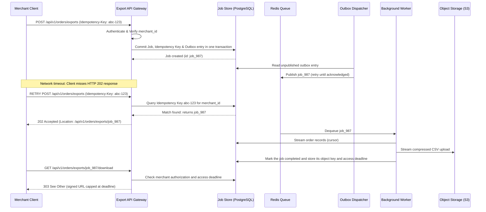

Ask an AI model to "design a payment system," and it will generate a plausible-looking architecture document within thirty seconds. However, that document often ignores existing databases, miscalculates network throughput, glosses over distributed failure recovery, and hallucinates API capabilities.

A **System Design Document** (also known as an RFC or Design Doc) is an engineering artifact that aligns teams on technical strategy, service boundaries, data ownership, and failure modes *before* writing code. AI tools can dramatically accelerate system design by drafting sections, calculating back-of-the-envelope capacity estimates, generating sequence diagrams, and checking API schemas for consistency. But human engineers must remain responsible for evaluating trade-offs and validating requirements.

This guide provides an end-to-end framework for writing reviewable system design documents with AI, applying the principles from [Context Engineering](), [Harness Engineering](), and [Loop Engineering]().

Throughout this guide, we use a concrete architectural scenario: **designing an asynchronous order export service for an e-commerce platform**.

---

## 1. Start with a technical brief that exposes unknowns

Before generating architectural diagrams or database schemas, write a concise project brief in `docs/design/order-export/brief.md`.

In our scenario:
* A **job** is an asynchronous task requesting an export.
* A **worker** is a background process that queries data, streams CSV lines, and uploads files to object storage.

```markdown
# Order Export Feature: Technical Brief

## Goal
Enable authenticated merchants to export up to 100,000 orders as a CSV file from their dashboard.

## Business & Security Requirements
- R1 (Authorization): Only users with the `orders:export` scope can initiate or request exports.
- R2 (Tenant Isolation): Database queries and download endpoints must enforce merchant data isolation. Treat direct signed object URLs as short-lived bearer credentials.
- R3 (Idempotency): Submitting duplicate requests with the same idempotency key must not trigger duplicate processing jobs.
- R4 (Durability): Persist accepted jobs and recover queued or abandoned work after worker restarts; once processing resumes, each job must reach a visible terminal state (`completed` or `failed`).
- R5 (Access Expiration): Download access ends 24 hours after job completion. A signed URL issued during that period must not remain valid beyond the deadline.

## Target Performance Benchmarks (Requires Stakeholder Confirmation)
- Support up to 100,000 orders per export.
- Handle peak loads of up to 20 new export requests per minute.
- 95% of accepted export jobs must complete in under 5 minutes at peak load.

## Architectural Constraints
- Reuse the existing PostgreSQL database and Redis cluster where capacity permits.
- Reuse corporate OAuth2 identity providers; do not build custom user authentication.

## Explicitly Out of Scope
Scheduled recurring exports, PDF/Excel formats, and cross-merchant analytics.

## Critical Open Questions
- Must export data reflect a point-in-time database snapshot?
- Which personally identifiable fields (PII) must be redacted from CSV exports?
- What are the legal retention policies for completed export files in cloud storage?
```

Assigning stable identifiers (R1 through R5) allows human reviewers and AI models to trace each requirement directly to architectural decisions, sequence diagrams, and automated tests.

---

## 2. Gather codebase evidence before proposing architecture

Do not let an AI assistant invent a system design in a vacuum. Feed the model existing codebase evidence: database migrations, current API schemas, deployment manifests, and infrastructure runbooks.

Use an evidence-gathering prompt:

```text
Read docs/design/order-export/brief.md and inspect our existing repository contracts,
database migrations, and service infrastructure in services/orders.
Do NOT draft the proposed architecture yet.

Create docs/design/order-export/evidence.md containing:
1. Confirmed facts with file paths and line numbers.
2. The exact repository git commit SHA inspected.
3. Outdated or contradictory documentation discovered.
4. Technical assumptions and unanswered questions, explicitly labeled.
5. Reusable internal libraries and infrastructure components.

Distinguish current production implementation from future requirements.
Flag any critical questions whose answers would change the architectural design.
```

---

## 3. Establish clear repository guidelines for the design phase

Document conventions in `AGENTS.md` so that human engineers and AI tools follow identical guidelines during document creation:

```markdown
# AGENTS.md (Design Documentation Workspace)

- Always read `brief.md` before modifying design documents.
- Support every claim about existing systems with a specific file path and commit SHA.
- Explicitly label proposals, assumptions, and unresolved decisions.
- Maintain requirement IDs (R1, R2, etc.) across all diagrams, ADRs, and checklists.
- Reuse existing infrastructure unless a verified requirement proves it insufficient.
- Document failure modes, data ownership, timeouts, and rollbacks for all components.
- Never mark a design document as "Approved" without human engineering sign-off.
```

---

## 4. Draft architectural decisions and compare trade-offs

Before writing a 20-page document, structure the foundational decisions as an **Architectural Decision Record (ADR)**.

Start by having the AI compare synchronous execution versus an asynchronous worker pattern:

```text
Using brief.md and evidence.md, compare a synchronous HTTP export endpoint
against an asynchronous background-job architecture that reuses existing Redis queues.

For each option, analyze:
- Client latency and connection timeouts.
- Database read load and memory pressure.
- Recovery from process crashes and network failures.
- Operational maintenance and infrastructure costs.

Provide capacity math with explicit units and assumptions.
Formulate the recommendation as a proposed ADR (docs/design/order-export/adr/0001-async-jobs.md)
including context, alternatives considered, consequences, and re-evaluation triggers.
```

For deeper guidance on structuring ADRs and analyzing systemic risk, see *Fundamentals of Software Architecture* by Mark Richards and Neal Ford ([Chapter 21, "Architectural Decisions"](https://www.oreilly.com/library/view/fundamentals-of-software/9781098175504/ch21.html) and [Chapter 22, "Analyzing Architecture Risk"](https://www.oreilly.com/library/view/fundamentals-of-software/9781098175504/ch22.html)).

### Converting quality attributes into testable scenarios

Replace vague buzzwords like "scalable" and "secure" with concrete architectural scenarios:

| Quality Attribute | Architectural Scenario | Verification Evidence Required |
| :--- | :--- | :--- |
| **Performance** | At peak arrival (20 jobs/min, 100k rows/job), 95% of exports complete within 5 minutes | Load test with synthetic database seeding and queue wait percentiles |
| **Reliability** | If a worker process crashes during S3 file upload, the job reaches terminal `failed` state or safely retries | Chaos fault-injection killing container process mid-upload |
| **Security** | An authenticated merchant attempts to access another merchant's export via forged job ID | Multi-tenant integration tests verifying HTTP 403 / 404 responses |
| **Operability** | On-call engineers can immediately diagnose queue backlogs | Grafana dashboard monitoring queue age, worker claim times, and failure rates |

### Back-of-the-envelope capacity calculations

Always force the AI model to show units, formulas, and assumptions during capacity planning:

| Metric | Calculation & Formula | Architectural Implication |
| :--- | :--- | :--- |
| **Upper-bound database read rate** | If all 20 jobs/min contain 100,000 rows: **2,000,000 rows/min (~33,300 rows/sec)** | Estimate database capacity and stream rows in bounded batches; actual demand depends on job size and queue scheduling |
| **Uncompressed job size** | 100,000 rows × an assumed 2 KB/row = **~200 MB per export** | Stream to object storage and measure the compression ratio before sizing storage and network links |
| **Uncompressed upload upper bound** | 20 jobs/min × 200 MB/job = **~4 GB/min (~67 MB/sec, ~530 Mbps)** | Size worker-to-storage throughput for the concurrency and compression strategy actually chosen |

Sensitivity analysis: If 90% of merchant exports contain fewer than 5,000 orders, average throughput drops dramatically. The architecture must be sized to handle burst workloads without incurring massive baseline infrastructure costs.

---

## 5. Generate contracts and diagrams from shared decisions

A complete System Design Document links prose, sequence diagrams, and OpenAPI contracts:



The database commit and Redis publication are separate operations, so the dispatcher must retry outbox entries after a crash. Queue delivery can also repeat: the worker must claim the job idempotently, use a lease to recover abandoned work, and clean up partial uploads. Issue signed URLs with a short TTL (for example, five minutes) capped by the completion-based deadline. A signed object URL is a bearer link; anyone who obtains it can use it until expiry. If every download must recheck the user's identity, serve the file through an authenticated endpoint instead of redirecting to object storage.

### Reviewing the OpenAPI specification as a consumer

Do not just validate OpenAPI syntax; review the contract from the perspective of an external developer integrating with the API:

| Client Integration Scenario | Contract Question the Specification Must Answer |
| :--- | :--- |
| **Export job initiated** | Does the response return HTTP 202 Accepted with a `Location` header to poll status? |
| **Network timeout on submission** | Does repeating the request with the identical idempotency key return the original job without creating duplicates? |
| **Idempotency key reused with different parameters** | Does the API return HTTP 409 Conflict with a clear error payload? |
| **Polling job status** | Are job states clearly enumerated (`queued`, `processing`, `completed`, `failed`) with timestamps? |
| **Downloading the completed file** | Does the endpoint recheck merchant authorization and the completion-based deadline before issuing a short-lived signed URL whose TTL is no longer than the remaining access window? |

---

## 6. Automate structural checks for diagrams and API specs

Ensure all design artifacts are validated automatically using locked developer tooling:

```bash
# Install OpenAPI linter and Mermaid diagram compiler
npm install --save-dev --save-exact @stoplight/spectral-cli @mermaid-js/mermaid-cli

# Lint the generated OpenAPI specification
./node_modules/.bin/spectral lint docs/design/order-export/api.yaml --ruleset .spectral.yaml

# Compile Mermaid diagrams to verify syntax and rendering
./node_modules/.bin/mmdc -i docs/design/order-export/diagrams/sequence.mmd -o build/sequence.svg
```

If Spectral reports missing response schemas or invalid types, provide the linter error directly to the AI agent with a bounded repair instruction:

```text
Fix the Spectral validation warnings in docs/design/order-export/api.yaml.
Preserve all agreed requirement IDs (R1-R5).
Do not disable or bypass Spectral lint rules.
Re-run the linter and verify exit code 0.
```

---

## 7. Review semantic correctness and operational readiness

Passing linter rules proves only that the syntax is valid. It does not prove that tenant isolation works or that the system can survive worker crashes.

Maintain a requirement traceability matrix in `review.md`:

| Requirement ID | Design Mechanism | Verification Method Required Before Launch |
| :--- | :--- | :--- |
| **R1: Authorization** | Endpoint checks `orders:export` OAuth scope | Integration test with unprivileged token returns HTTP 403 |
| **R2: Tenant Isolation** | Queries and download endpoint filter by authenticated `merchant_id`; signed object URLs are scoped to one file and kept short-lived | Multi-tenant test verifying merchant A cannot request merchant B's exports; review bearer-link exposure separately |
| **R3: Idempotency** | PostgreSQL unique constraint on `(merchant_id, idempotency_key)` | Concurrent load test sending duplicate keys simultaneously |
| **R4: Durability** | Job and outbox entry committed together; dispatcher retries publication; worker lease and reconciliation recover abandoned jobs | Crash tests after commit but before publish, during upload, and before completion update |
| **R5: Access Expiration** | Store object key and completion-based deadline; authorize every download request; cap each signed URL to remaining access time | Test at the deadline and verify that a previously issued URL cannot outlive it; test storage cleanup separately |

Ask the AI to conduct a critical adversarial review:

```text
Act as a Principal Infrastructure Architect reviewing docs/design/order-export/.
Find contradictions, unaddressed distributed failure modes, and security vulnerabilities.
For each finding:
- Cite the exact section and affected requirement ID.
- Describe a concrete production failure scenario.
- Recommend remediation options with architectural trade-offs.
Do not approve the document. Output a prioritized list of concerns for human engineering review.
```

---

## Summary: the human-AI design partnership

Using AI to draft System Design Documents accelerates architectural exploration while enforcing rigorous engineering discipline:

1. **Start with an explicit brief** containing requirements, constraints, and open questions.
2. **Ground the model in real repository evidence** before asking for architectural proposals.
3. **Use ADRs to evaluate architectural trade-offs** (monolith vs. microservices, sync vs. async).
4. **Link sequence diagrams, OpenAPI schemas, and capacity math** to the same shared decisions.
5. **Automate syntax validation** using Spectral and Mermaid CLI in CI pipelines.
6. **Separate syntactic validation from human approval** of security, reliability, and data ownership.

Combining AI drafting with engineering review can produce clearer, more reviewable designs sooner. Production readiness still depends on resolving the open requirements and validating the proposed system under its intended conditions.
