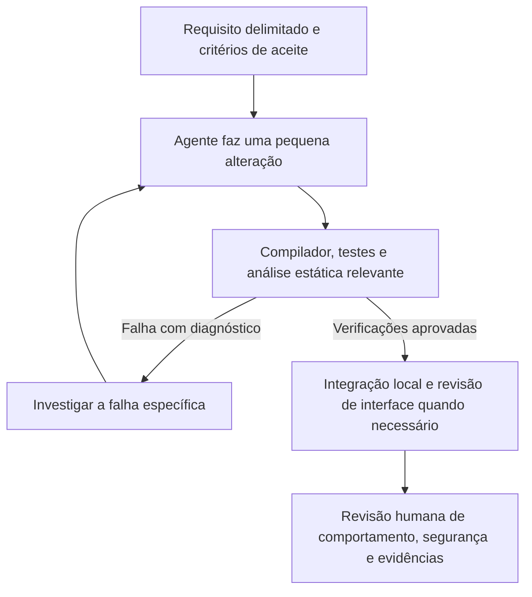

Um modelo de IA mais barato consegue construir software distribuído útil quando recebe requisitos claros e feedback rápido? Explorei essa questão em cinco projetos educacionais inspirados no [Byte Byte Go](https://bytebytego.com/): um [encurtador de URLs](https://github.com/marcelomiyake/url-shortener), um [web crawler](https://github.com/marcelomiyake/web-crawler), um [sistema de notificações](https://github.com/marcelomiyake/notification-system), o [OpenTube](https://github.com/marcelomiyake/opentube) e um [sistema de autocompletar buscas](https://github.com/marcelomiyake/search-autocomplete-system).

Os READMEs dos repositórios atribuem seu desenvolvimento ao GPT-6 Luna com esforço Max. Essa atribuição descreve o fluxo de trabalho informado pelo autor; os repositórios não registram de forma independente o modelo usado em cada execução nem apresentam uma comparação controlada com um modelo de fronteira. Eles contêm código, documentos de design, registros de verificação local e limitações que podem ser inspecionados.

São **provas de conceito locais**, não implantações em produção. Seu valor está em mostrar como requisitos, feedback do compilador, testes, análise estática e verificações no Kubernetes local tornam o desenvolvimento com IA mais fácil de revisar. Se um modelo menor sai mais barato *no total* ainda precisa ser medido: tentativas adicionais, revisão humana e tempo de infraestrutura também contam.

---

## O que os cinco projetos demonstram

| Projeto | Comportamento implementado localmente | Limite relevante |
| :--- | :--- | :--- |
| [URL Shortener](https://github.com/marcelomiyake/url-shortener) | API em Rust, frontend Vue, mapeamento de URLs no Cassandra e redirecionamentos | O README o descreve como um MVP local; controles contra abuso público, backup e política de disponibilidade estão fora do escopo. |
| [Web Crawler](https://github.com/marcelomiyake/web-crawler) | Coleta delimitada de HTML com API e worker em Rust, estado no PostgreSQL, regras de robots e interface Vue | É um arquivo local sob demanda, sem autenticação para serviço público nem plano de recuperação de produção. |
| [Notification System](https://github.com/marcelomiyake/notification-system) | API e worker em Rust, RabbitMQ, PostgreSQL e adaptadores de simulação para e-mail, SMS e push | Os adaptadores simulam o aceite dos provedores. A entrega real e a ausência de efeitos duplicados em provedores externos não foram demonstradas. |
| [OpenTube](https://github.com/marcelomiyake/opentube) | Serviços de vídeo em Rust, clientes Vue e Android, processamento com RabbitMQ e armazenamento HLS local no MinIO | O README não reivindica escala de produção, criptografia nem comportamento de CDN. |
| [Search Autocomplete](https://github.com/marcelomiyake/search-autocomplete-system) | Três serviços em Rust, interface Vue, agregações no PostgreSQL e índice de prefixos em memória | A meta de 100 ms no design é uma premissa de cenário, não um nível de serviço medido. |

Cada repositório documenta sua própria arquitetura e verificação. Os projetos compartilham práticas, mas não usam todos o mesmo banco, broker de mensagens, processo de design de interface ou quality gate. O [microservices-template](https://github.com/marcelomiyake/microservices-template), criado posteriormente, reúne padrões desses projetos em um exemplo pequeno de Rust e Vue; ele não foi a base inicial comum dos cinco.

---

## Construa o harness em torno de requisitos observáveis

Um harness de programação permite ao agente inspecionar o repositório, editar arquivos, executar comandos delimitados e usar os resultados para orientar a próxima alteração. O feedback mais útil aponta qual requisito falhou, com o comando e a evidência necessários para reproduzir a falha. Os artigos sobre [Harness Engineering](/posts/harness-engineering/) e [Loop Engineering](/posts/loop-engineering/) detalham esses controles.

Um ciclo prático para uma alteração funciona assim:

O ciclo deve parar quando esgotar o orçamento de tempo ou tentativas, ou quando as evidências forem ambíguas. Verificações aprovadas mostram que os comportamentos examinados passaram naquele ambiente. Elas não certificam todos os caminhos de falha distribuída.

### Rust fornece feedback útil, com limites

As verificações de tipos e propriedade do Rust detectam muitos erros de segurança de memória e de concorrência em código seguro antes da execução. Os diagnósticos do compilador e do Clippy indicam pontos concretos para o agente examinar. Ainda são necessários testes de regras de negócio, tratamento de erros, falhas de rede, persistência e concorrência. Um serviço que compila pode cobrar duas vezes, perder um job ou retornar dados de outro lojista.

Os cinco projetos usam Rust em componentes de backend, enquanto os frontends usam Vue e TypeScript; o OpenTube também possui clientes Kotlin. Tipagem rigorosa ajuda nessas fronteiras, mas não substitui testes de contrato e integração.

### Kubernetes local verifica a configuração do deploy

Os projetos incluem charts Helm para implantações locais no [Kind](https://kind.sigs.k8s.io/). Executá-los pode revelar configuração ausente, falhas de prontidão, endereços incorretos entre serviços e problemas na integração entre frontend e API. Isso não demonstra disponibilidade nem throughput de produção. Várias pilhas locais possuem apenas uma instância ou um único domínio de falha para PostgreSQL, Cassandra, RabbitMQ ou MinIO; os READMEs registram os limites correspondentes.

### Análise estática e julgamentos de modelos têm papéis diferentes

Os repositórios documentam configurações do SonarQube e, em alguns casos, resultados locais registrados. Um quality gate aprovado é uma evidência útil para o código e as regras analisados. Ele não prova que um fluxo é seguro, acessível ou correto sob carga de produção. Consulte o [registro de verificação de cada projeto](https://github.com/marcelomiyake/search-autocomplete-system/tree/main/docs/verification) para saber a revisão, o escopo e o ambiente, sem presumir um limite universal.

O [OpenDesign](https://github.com/nexu-io/open-design) pode apoiar o design de interfaces, com o fluxo aceito e as notas de revisão registrados no projeto. O [README do Search Autocomplete](https://github.com/marcelomiyake/search-autocomplete-system#opendesign-workflow) informa expressamente que a seleção do diretório de trabalho ficou incompleta; seria incorreto apresentar as cinco interfaces como geradas e verificadas integralmente com a ferramenta.

O [Score do TypeSafe AI](https://docs.typesafe.ai/primitives/score) pode devolver notas estruturadas e distribuições para uma rubrica definida. Esse julgamento pode ajudar a classificar um design ou revisar evidências sanitizadas, mas o valor de confiança descreve a resposta do modelo, não garante que ela esteja correta. As [orientações sobre Jev no template](https://github.com/marcelomiyake/microservices-template/blob/main/docs/jev-quality.md) e o [registro do Search Autocomplete](https://github.com/marcelomiyake/search-autocomplete-system/blob/main/docs/verification/jev-readiness.md) tratam Jev como apoio à revisão, não como autorização automática para produção.

---

## Meça os custos com uma comparação controlada

Os projetos mostram que um modelo de menor custo pode contribuir para implementações locais substanciais. Eles **não** estabelecem um percentual de economia, vantagem de throughput ou qualidade equivalente à de um modelo de fronteira. Para responder a essas perguntas, compare os modelos nas mesmas tarefas:

1. Escolha alterações representativas e fixe para cada tarefa o commit inicial, a especificação e os critérios de aceite.
2. Ofereça aos dois modelos as mesmas ferramentas, busca de contexto, limites de execução e processo de revisão humana.
3. Registre modelo e versão, tokens de entrada e saída, custo cobrado, tempo decorrido, tentativas de correção, alterações aceitas, regressões e tempo de revisão.
4. Repita as execuções para observar a variação e apresente a distribuição completa, não apenas o melhor resultado.

O preço menor por token pode economizar em uma tarefa curta e bem delimitada. Se o modelo precisar de mais tentativas ou gerar defeitos que levem mais tempo para revisar, o custo total pode aumentar. O harness pode melhorar os resultados de ambos os modelos; mantenha-o constante para isolar o efeito da escolha do modelo.

---

## Aplique as lições sem exagerar as conclusões

Comece com uma especificação pequena e explícita e um exemplo existente no repositório. Deixe o agente fazer uma alteração delimitada e devolva saídas do compilador, resultados de testes e observações de deploy que identifiquem falhas concretas. Mantenha o registro de verificação junto ao código e revise as lacunas antes de ampliar o escopo.

Os cinco repositórios oferecem exemplos inspecionáveis desse fluxo e de seus limites. Suas verificações locais facilitam a avaliação das implementações. A prontidão para produção exigiria trabalho adicional em segurança, provedores reais, recuperação, escala, operações e níveis de serviço medidos para cada sistema.
