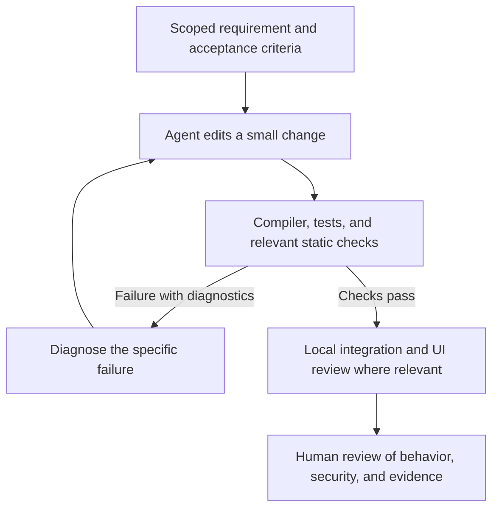

Can a less expensive AI model build useful distributed software when it has clear requirements and rapid feedback? I explored that question through five educational projects inspired by [Byte Byte Go](https://bytebytego.com/): a [URL shortener](https://github.com/marcelomiyake/url-shortener), [web crawler](https://github.com/marcelomiyake/web-crawler), [notification system](https://github.com/marcelomiyake/notification-system), [OpenTube](https://github.com/marcelomiyake/opentube), and [search autocomplete system](https://github.com/marcelomiyake/search-autocomplete-system).

The repository READMEs attribute their development to GPT-6 Luna at Max effort. That attribution describes the project owner's workflow; the repositories do not independently record the model used for each run or provide a controlled comparison with a frontier model. They do contain code, design documents, local verification records, and limits that readers can inspect.

These are **local proofs of concept**, not production deployments. Their value is in showing how requirements, compiler feedback, tests, static analysis, and local Kubernetes checks can make AI-assisted development more reviewable. Whether a smaller model is cheaper *overall* remains a measurement question: retries, human review, and infrastructure time count too.

---

## What the five projects actually demonstrate

| Project | Implemented local behavior | Boundary to keep in mind |
| :--- | :--- | :--- |
| [URL Shortener](https://github.com/marcelomiyake/url-shortener) | Rust API, Vue frontend, Cassandra-backed URL mappings, and redirects | The README calls it a local MVP; public abuse controls, backup, and availability policy are outside its scope. |
| [Web Crawler](https://github.com/marcelomiyake/web-crawler) | Bounded HTML crawling with Rust API and worker, PostgreSQL frontier state, robots checks, and a Vue UI | It is an on-demand local archive, without public-service authentication or a production recovery design. |
| [Notification System](https://github.com/marcelomiyake/notification-system) | Rust API and worker, RabbitMQ, PostgreSQL, and recording adapters for email, SMS, and push | The adapters simulate provider acceptance. Real delivery and exactly-once provider side effects are not established. |
| [OpenTube](https://github.com/marcelomiyake/opentube) | Rust video services, Vue and Android clients, RabbitMQ processing, and local MinIO HLS storage | The README does not claim production scale, encryption, or CDN behavior. |
| [Search Autocomplete](https://github.com/marcelomiyake/search-autocomplete-system) | Three Rust services, a Vue UI, PostgreSQL aggregates, and an in-memory prefix index | The design's 100 ms goal is a scenario assumption, not a measured service level. |

Each repository documents its own architecture and verification. The projects share practices, but they do not all use the same database, message broker, UI workflow, or quality gate. The later [microservices-template](https://github.com/marcelomiyake/microservices-template) consolidates patterns from these projects into a small Rust and Vue starter; it was not the common starting point for all five.

---

## Build a harness around observable requirements

A coding harness gives an agent a way to inspect a repository, edit files, run bounded commands, and use their results to guide the next change. The useful unit of feedback is a specific failed requirement, with the command and evidence needed to reproduce it. Our [Harness Engineering]() and [Loop Engineering]() guides describe these controls in more detail.

A practical loop for one change looks like this:

The loop should stop when it exhausts its time or retry budget, or when evidence is ambiguous. Passing checks means the checked behaviors passed in that environment. It does not certify all distributed failure paths.

### Rust supplies useful feedback, within its limits

Rust's type and ownership checks catch many memory-safety and data-race mistakes in safe code before execution. Compiler and Clippy diagnostics give an agent concrete locations to inspect. Tests must still cover business rules, error handling, network failures, persistence, and concurrency behavior. A compiling service can charge twice, lose a queued job, or return the wrong tenant's data.

The five projects use Rust for backend components, while their frontends use Vue and TypeScript; OpenTube also includes Kotlin clients. Strict typing is valuable across these boundaries, but it does not replace contract or integration tests.

### Local Kubernetes checks exercise deployment wiring

The projects include Helm charts for local [Kind](https://kind.sigs.k8s.io/) deployments. Running them can expose missing configuration, readiness failures, incorrect service addresses, and frontend-to-API integration problems. It does not establish production availability or throughput. Several local stacks have a single PostgreSQL, Cassandra failure domain, RabbitMQ, or MinIO instance, and the project READMEs state the corresponding limits.

### Static analysis and model judgments serve different purposes

The repositories document SonarQube configurations and, in some cases, recorded local quality results. A passing quality gate is useful evidence for the code and rules it scanned. It cannot prove that a workflow is secure, accessible, or correct under production load. Check each project's [verification record](https://github.com/marcelomiyake/search-autocomplete-system/tree/main/docs/verification) for the revision, scope, and environment instead of assuming one universal threshold.

[OpenDesign](https://github.com/nexu-io/open-design) can support interface design, with the accepted flow and review notes kept in the project. The [search autocomplete README](https://github.com/marcelomiyake/search-autocomplete-system#opendesign-workflow) explicitly records that its working-directory selection was unfinished; it would be inaccurate to present all five UIs as fully generated and verified through OpenDesign.

[TypeSafe AI's Score primitive](https://docs.typesafe.ai/primitives/score) can return structured ratings and distributions for a defined rubric. Such a judgment can help triage a design or review sanitized evidence, but its confidence value describes the model's answer, not a guarantee of correctness. The [template's Jev guidance](https://github.com/marcelomiyake/microservices-template/blob/main/docs/jev-quality.md) and the [search autocomplete record](https://github.com/marcelomiyake/search-autocomplete-system/blob/main/docs/verification/jev-readiness.md) treat Jev as advisory, not as an automatic production release gate.

---

## Measure model economics with a controlled comparison

The projects show that a lower-cost model can contribute to substantial local implementations. They do **not** establish a percentage cost saving, a throughput advantage, or equal quality against a frontier model. To answer those questions, compare the models on the same tasks:

1. Select representative changes and fix each task's starting commit, specification, and acceptance checks.
2. Give both models the same tools, context retrieval, execution limits, and human review process.
3. Record model and version, input and output tokens, billed cost, elapsed time, repair attempts, accepted changes, regressions, and reviewer time.
4. Repeat runs to capture variance, then report the full distribution rather than only the best result.

A cheaper token price may save money on a short, well-scoped task. If a model needs more retries or produces defects that take longer to review, the total cost may rise. The harness can improve either model's results; the comparison must hold it constant to isolate model choice.

---

## Apply the lessons without overstating the result

Start with a small, explicit specification and an existing codebase example. Let the agent make a bounded change, then return compiler output, test results, and deployment observations that identify concrete failures. Keep the verification record beside the code and review the gaps before expanding scope.

These five repositories provide inspectable examples of that workflow and of its limits. Their local checks make the implementations easier to evaluate. Production readiness would require further work on security, real providers, recovery, scale, operations, and measured service levels for each system.
