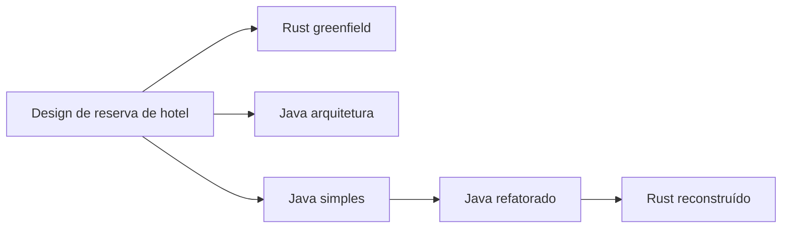

Cinco projetos partiram do mesmo design de reservas de hotel, utilizando o **GPT-6 Luna com esforço Max no Codex**. Alguns começaram em Rust ou Java; outros herdaram uma implementação, ganharam camadas arquiteturais e, por fim, mudaram de linguagem. O design de negócio sobreviveu? A arquitetura melhorou a qualidade? Qual versão eu escolheria manter?

As revisões inspecionadas oferecem três respostas diretas:

- **Nenhum implementa o design original completo com garantias demonstradas para produção.** O núcleo de reservas sobrevive nos cinco, mas omissões de requisitos, lacunas de autorização e falhas em cenários de exceção permanecem.
- **O Rust greenfield tem o comportamento de cancelamento verificado mais robusto; o Rust reconstruído tem a topologia operacional mais simples.** O backend reescrito é menor e possui menos serviços, mas contém um bug reproduzível de corrupção de inventário e não mantém a estrutura arquitetural do backend Java. A preferência de manutenção depende de priorizarmos o comportamento correto atual ou uma plataforma mais simples para reparar e evoluir.
- **A refatoração em Java aumenta a complexidade estrutural enquanto introduz pontos de desacoplamento úteis.** Ela adiciona portas, estados tipados e alguma validação de domínio, mas mantém quase intacta a orquestração existente e um componente React volumoso. Mais camadas não corrigiram, por si sós, os comportamentos herdados.

Este estudo de caso comparativo é a **Parte I** de uma investigação em duas etapas sobre a manutenção de software gerado por IA. Aqui, analiso a qualidade basal dos snapshots existentes: se o design de negócio sobreviveu através de forks e reescritas, como cada arquitetura se comporta sob concorrência e falhas, e o que suas estruturas estáticas revelam. Na **Parte II**, medirei o custo prático de implementar uma nova funcionalidade em cada projeto, comparando esforço de desenvolvimento, iterações de prompt, raio de impacto (*blast radius*) e atrito de verificação entre as cinco arquiteturas.

## As cinco implementações e a comparação real

Utilizo nomes curtos ao longo do artigo:

| Nome | Repositório | Commit inspecionado | Topologia do backend |
| :--- | :--- | :--- | :--- |
| Rust greenfield | [hotel-rust][rust-repo] | [961071e][rust-commit] | Cinco serviços em Rust e uma crate compartilhada |
| Java arquitetura | [hotel-ddd-cleanarch-cqrs][ddd-repo] | [47b0c3b][ddd-commit] | Dois serviços em Java |
| Java simples | [hotel-dry-kiss-yagni][simple-repo] | [2945cbb][simple-commit] | Quatro serviços em Java e uma biblioteca compartilhada |
| Java refatorado | [hotel-dry-kiss-yagni-refactored-ddd-cleanarch-cqrs][refactored-repo] | [429f97f][refactored-commit] | Quatro serviços em Java e uma biblioteca compartilhada |
| Rust reconstruído | [hotel-dry-kiss-yagni-refactored-ddd-cleanarch-cqrs-rermade-rust][rebuilt-repo] | [fba2378][rebuilt-commit] | Um único backend em Rust |

O módulo Java compartilhado é uma biblioteca utilitária, não um quinto serviço em execução. As contagens de topologia provêm do código-fonte e dos manifestos de implantação.

Os READMEs registram o modelo, o esforço, os prompts originais e as métricas de implementação. O proprietário do projeto também confirmou as configurações do modelo. Não auditei de forma independente a íntegra dos logs de geração.

As três construções iniciais compartilham a mesma especificação de referência e restrições tecnológicas, mas são implementações separadas. A cadeia de transformações documentada é:



Os artefatos preservados comprovam essa cadeia: a refatoração em Java mantém todos os quatro esquemas SQL byte a byte; o Rust reconstruído retém esses esquemas sob novos caminhos e todos os 11 arquivos do diretório `src/` do frontend refatorado de forma idêntica. Isso estabelece reaproveitamento concreto sem depender de um histórico Git compartilhado entre os repositórios.

O prompt de reescrita solicita um backend em Rust mantendo o design system e os contratos de API. Ele não repete cada restrição arquitetural do prompt de refatoração anterior. Consequentemente, “Rust reconstruído a partir de um projeto Java arquitetado” **não** significa “a mesma arquitetura implementada em Rust.” [Prompt de refatoração Java][refactored-readme], [Prompt de reescrita em Rust][rebuilt-readme].

## Método: seguir as regras e desafiar os testes

O estudo inspecionou as cinco cópias locais em **30 de setembro de 2026**, fixadas nos commits acima. Rastreou fluxos de reserva, cancelamento, precificação, alterações de inventário e acesso de hóspedes por meio de handlers HTTP, código de aplicação e consultas SQL. Também comparou limites do frontend, configurações de implantação, comportamento de build, escopo de testes e documentação.

Uma segunda análise fornecida pelo Gemini favoreceu o Rust reconstruído em termos de manutenibilidade e criticou o excesso de camadas no Java. Essas são perspectivas úteis. Verifiquei as alegações contestadas confrontando-as com as mesmas fontes fixadas e com os registros de teste deste estudo, incorporando os argumentos sustentados por evidências. O [registro de reconciliação de revisão]({{ '/assets/studies/hotel-implementations/review-reconciliation.json' | relative_url }}) documenta as alegações aceitas, qualificadas e rejeitadas; a segunda análise foi tratada como fonte de hipóteses, não como evidência empírica independente.

As evidências foram separadas em três categorias:

1. **Observada:** contagens de código-fonte, relações de dependência, resultados atuais de testes, falhas de inicialização e saídas de probes dirigidas.
2. **Relatada:** cobertura histórica no SonarCloud, pontuações do Lighthouse, tempos de sessão e estimativas de tokens registradas nos READMEs.
3. **Inferida:** custos prováveis de manutenção e caminhos de erro não executados sugeridos pela inspeção do código.

Todas as cinco suítes de frontend e builds de produção passaram. Todas as três suítes de backend Java passaram, incluindo testes de integração com PostgreSQL; ambas as suítes de backend em Rust passaram com URLs de banco descartável fornecidas explicitamente. Probes adicionais utilizaram instâncias isoladas de PostgreSQL. Nenhum cluster Kind existente ou banco de dados de aplicação foi modificado.

Essas verificações não medem vazão em produção, latência de cauda (*tail latency*), uso de memória, disponibilidade, tempo de recuperação nem esforço humano de manutenção. Nenhuma “pontuação geral de qualidade” numérica foi atribuída: um fluxo ausente de pagamento e um contador de inventário corrompido não devem sumir dentro da média de métricas desconexas.

O [registro do estudo em formato legível por máquina]({{ '/assets/studies/hotel-implementations/results.json' | relative_url }}) contém os hashes dos snapshots, definições de contagem, resumo de testes e resultados das probes. Um [harness de reprodução em Python]({{ '/assets/studies/hotel-implementations/probes.py' | relative_url }}) repete as duas probes em Rust e a probe de cancelamento do Java arquitetura contra um novo contêiner PostgreSQL descartável.

## O que conta como preservação do design original do sistema?

A referência de base é o capítulo de [Sistema de Reserva de Hotel do ByteByteGo][baseline]. Seu comportamento essencial inclui detalhes de hotéis e quartos, gerenciamento de funcionários, reserva e cancelamento, pagamento no momento da reserva, preços por noite e até 10% de overbooking. Seu modelo de consistência central reserva por tipo de quarto, verifica cada noite, previne requisições duplicadas e mantém a reserva e a atualização de inventário em uma única transação relacional. Alta concorrência é um requisito central; busca avançada de quartos está fora do escopo inicial. Redis e particionamento (*sharding*) são opções de escala e não componentes obrigatórios de partida.

Esses requisitos constituem um checklist de aceitação muito mais útil do que simplesmente comparar o número de caixas em um diagrama de serviços.

| Capacidade no código inspecionado | Rust greenfield | Java arquitetura | Java simples | Java refatorado | Rust reconstruído |
| :--- | :--- | :--- | :--- | :--- | :--- |
| Catálogo e navegação por tipos de quarto | Presente | Presente | Presente | Presente | Presente |
| Inventário noturno por tipo de quarto | Presente | Presente | Presente | Presente | Presente |
| Reserva e inventário criados em transação local | Presente | Presente | Presente | Presente | Presente |
| Replay de requisição idêntica e checagem de alteração | Presente, com ressalvas | Presente | Presente, com ressalvas | Presente, com ressalvas | Presente, com ressalvas |
| Overbooking de até 10% | Presente | Ausente | Presente | Presente | Presente |
| Preços dinâmicos por noite | Presente | Ausente; preço único por quarto | Presente | Presente | Presente |
| Registros de pagamento e estorno | Simulador | Ausente | Simulador | Simulador | Simulador |
| Operações de staff para catálogo, inventário e tarifas | Presente | Ausente | Presente | Presente | Presente |
| Posse autenticada de reservas pelo hóspede | Ausente | Apenas comparação de e-mail | Ausente | Ausente | Ausente |
| Metas de escala e níveis de serviço estabelecidos | Não medido | Não medido | Não medido | Não medido | Não medido |

“Presente” significa que a capacidade existe no código, não que todos os seus caminhos de falha passaram por verificação. Esses achados apoiam-se no [fluxo de reserva em Rust][rust-booking], no [adaptador de inventário do Java arquitetura][ddd-inventory], no [código transacional do Java simples][simple-transactions], no [código transacional do Java refatorado][refactored-transactions] e no [fluxo de reserva do Rust reconstruído][rebuilt-booking].

### A maior perda de escopo ocorre no Java arquitetura

O Java arquitetura apresenta a separação mais rigorosa entre regras de negócio e detalhes técnicos, mas seu escopo funcional é o mais restrito. Seu esquema de banco impede que a disponibilidade ultrapasse a capacidade física de quartos, descartando o overbooking. O preço consiste em um único valor `price_per_night_cents` no tipo de quarto, multiplicado pelas noites e quantidade de quartos. Uma reserva bem-sucedida torna-se `CONFIRMED` diretamente, sem tabela de pagamentos nem orquestração financeira. Seus controllers expõem leitura de catálogo e operações de reserva, omitindo os fluxos administrativos da equipe. [Esquema de inventário][ddd-schema], [modelo de reserva][ddd-domain], [controller de catálogo][ddd-catalog].

São desvios substanciais. Um modelo de domínio perfeitamente isolado pode expressar uma especificação incompleta.

### A cadeia de forks preserva boa parte do produto, incluindo suas fraquezas

Java simples, Java refatorado e Rust reconstruído mantêm tarifas noturnas, atualizações versionadas de inventário, snapshots de reserva, simulador de pagamento e endpoints administrativos. Portanto, preservam mais do escopo funcional original do que o Java arquitetura.

Eles também mantêm a busca de reservas por e-mail e operações de cancelamento via UUID sem exigir um usuário autenticado. A refatoração preservou esse comportamento em vez de corrigi-lo. A compatibilidade de APIs pode preservar um defeito com a mesma fidelidade com que preserva uma funcionalidade.

Mudar a topologia de serviços, por si só, não viola o design do sistema. Todos os cinco mantêm a criação da reserva e a atualização do inventário dentro da mesma transação de banco. O Rust reconstruído também poderia coordenar suas tabelas locais de pagamento de forma atômica, mas seu código atual ainda confirma reserva, pagamento e finalização em transações separadas.

Isso distingue três dimensões de fidelidade: **retenção de funcionalidades e contratos**, **preservação de invariantes sob falha** e **manutenção de fronteiras de implantação**. A cadeia de forks tem bom desempenho na primeira, exibe falhas comprovadas na segunda e altera a terceira no código final. Esquemas idênticos e o mesmo frontend não garantem equivalência de comportamento. Por outro lado, substituir chamadas HTTP internas por chamadas locais em memória não viola por si só as regras de reserva.

## A prova de concorrência que muda a comparação em Rust

A diferença mais impactante observada envolve **cancelamentos concorrentes sobrepostos**.

O cenário montado é deliberadamente enxuto:

1. Criar duas reservas confirmadas de um quarto para o mesmo tipo de acomodação e data.
2. Reter um lock explícito no banco sobre a linha de inventário daquela noite.
3. Disparar duas requisições simultâneas cancelando a **mesma** reserva.
4. Aguardar até que ambas as requisições fiquem bloqueadas esperando o lock de banco e, então, liberar o lock de inventário.
5. Inspecionar o contador final enquanto a outra reserva permanece ativa.

O resultado correto exige que um quarto permaneça reservado.

| Implementação testada | Respostas | Inventário final esperado | Inventário final observado |
| :--- | :--- | :--- | :--- |
| Rust greenfield | Ambos HTTP 200 | Um quarto reservado | Um quarto reservado |
| Rust reconstruído | Ambos HTTP 200 | Um quarto reservado | **Zero quartos reservados** |
| Java arquitetura | Ambos HTTP 200 | Seis quartos disponíveis de sete | **Sete quartos disponíveis**, apesar de uma reserva ativa |

As requisições sobrepuseram-se sob um cronograma de locks controlado; não foi um teste de estresse probabilístico. Esses resultados comprovam falhas funcionais sob esse agendamento, embora não quantifiquem sua frequência em produção.

### Por que o Rust greenfield sobrevive

Sua transação de cancelamento bloqueia a linha da reserva com `FOR UPDATE`, reavalia o status atual e utiliza um marcador `inventory_released_at`. O segundo cancelamento enxerga a transição já concluída e não devolve o inventário novamente. O marcador de liberação e a mudança de status são protegidos pela mesma transação local. [Implementação de cancelamento e liberação][rust-booking].

Essa é uma vantagem concreta de qualidade. Ela decorre do desenho transacional, e não apenas do sistema de tipos do Rust.

### Por que o Rust reconstruído falha

O handler do Rust reconstruído consulta a reserva antes de abrir sua transação de cancelamento. Ambas as requisições enxergam `CONFIRMED`; ambas partem para decrementar o inventário. Sua atualização condicional de status ocorre **após** a liberação, sendo incapaz de impedir a segunda subtração. O guard `total_reserved >= rooms` impede números negativos, mas a reserva ativa de outro cliente permite uma segunda subtração indevida. [Código de cancelamento reconstruído][rebuilt-booking].

A invariante exigida é mais forte do que “o contador nunca fica negativo”: **o contador de reservados deve ser rigorosamente igual ao inventário consumido pelas reservas ativas**.

### Por que o modelo de domínio do Java também falha

O Java arquitetura rejeita um segundo cancelamento quando executado sequencialmente. Sob concorrência simultânea, ambas as requisições leem a mesma reserva confirmada antes que qualquer uma grave o status cancelado. As linhas de inventário sofrem lock, mas a transição de estado da reserva não é serializada. A devolução limita a disponibilidade à capacidade física total; esse teto mascara o cancelamento duplo quando outra reserva permanece ativa. [Handler de cancelamento][ddd-cancel], [repositório de banco][ddd-store].

O teste existente `cancellationChecksGuestIdentityAndRestoresEveryNightOnce` cobre apenas chamadas sequenciais. Ele passa com louvor enquanto o caso concorrente sobreposto corrompe o estado. [Teste de integração][ddd-tests].

O Java simples e o Java refatorado trazem riscos estruturais idênticos: seus métodos transacionais de cancelamento leem a reserva sem lock na linha, liberam o inventário e só depois atualizam o status. Essa falha é **inferida a partir do código**, não reproduzida dinamicamente aqui, pois problemas de inicialização descritos adiante impediram as probes HTTP planejadas. [Transação original][simple-transactions], [transação refatorada][refactored-transactions].

## Outras falhas que o caminho feliz não revela

### O replay de uma reserva paga depende de um serviço de tarifas ativo

O Rust greenfield consulta as tarifas vigentes antes de verificar se a chave de idempotência já corresponde a uma reserva finalizada. Em uma probe, uma reserva inicial foi concluída e permaneceu `paid`. Retornar HTTP 503 no simulador do serviço de tarifas fez com que o replay idêntico da reserva respondesse **HTTP 502**, em vez de devolver a reserva já gravada. [Handler de reservas][rust-booking].

A restrição de unicidade no banco ainda impede uma reserva duplicada. O defeito reside na disponibilidade do replay: uma operação já finalizada torna-se indevidamente dependente da saúde atual do serviço de precificação.

O Rust reconstruído também resolve o hotel e a cotação antes de buscar uma reserva preexistente. Isso gera dependência de dados mutáveis de catálogo e tarifas, embora essa falha não tenha sido injetada isoladamente.

Um fluxo resiliente consulta primeiro a existência da requisição concluída e sua assinatura estável antes de acionar dependências externas necessárias apenas para uma nova compra.

Java simples e Java refatorado apresentam outro risco: na captura da violação de unicidade, buscam a reserva existente sem revalidar a igualdade dos parâmetros originais. Requisições concorrentes com a mesma chave e dados divergentes podem cair em um caminho menos protegido. Essa sequência não foi executada dinamicamente, constituindo um apontamento de revisão estática. [Orquestração refatorada de reserva][refactored-service].

### Uma chamada de pagamento com falha deixa inventário pendente persistido

Com o simulador de pagamentos do Rust greenfield indisponível, a API retornou HTTP 502 e a reserva armazenada permaneceu com status `pending`. O inventário já havia sido debitado. Repetir a requisição pode retomar o fluxo, mas o código não possui rotina automática de expiração ou conciliação para liberar reservas pendentes abandonadas. [Fluxo de reserva][rust-booking].

As implementações da cadeia de forks também separam reserva pendente, cobrança e confirmação. O Rust reconstruído utiliza um único banco e chamadas locais, mas preserva essas fronteiras de commit. Unificar o backend reduz coordenação de rede, mas não torna a operação de negócio atômica automaticamente.

Essa é uma lacuna de recuperabilidade. O sistema precisa de políticas claras para reservas abandonadas e falhas intermediárias de pagamento, garantindo transições duráveis e mecanismos de conciliação.

### A estratégia de bloqueio não define o limite da transação de pagamento

A análise prévia do Gemini atribuiu uma desvantagem grave ao Rust greenfield: reter locks de linha no inventário enquanto aguardava a resposta de pagamento via HTTP. O código inspecionado **não** faz isso. O método `reserve_inventory` faz commit antes de retornar para `create_reservation`; somente então o handler chama o pagamento. Finalizada a cobrança, `finish_payment` inicia uma transação separada. [Sequência de reserva e pagamento][rust-booking].

| Etapa | Rust greenfield | Rust reconstruído |
| :--- | :--- | :--- |
| Reservar noites e criar reserva pendente | Bloqueia inventário com `FOR UPDATE`; commit | Atualiza inventário com checagem de versão; commit |
| Registrar pagamento | Chamada HTTP para o serviço de pagamento | Invoca módulo de pagamento, que executa SQL via `PgPool` |
| Confirmar reserva | Nova transação de reserva | Atualização SQL separada via `PgPool` |

Ambos liberam a transação inicial de inventário antes do pagamento. Ambos, portanto, precisam lidar com interrupções entre commits sucessivos. A consolidação torna viável uma transação única para o simulador de pagamentos, mas o Rust reconstruído não a implementa. [Sequência de reserva reconstruída][rebuilt-booking], [persistência de pagamentos][rebuilt-payments].

Além disso, concorrência otimista não significa ausência de espera: no PostgreSQL, comandos `UPDATE` adquirem locks de linha mantidos até o fim da transação. Ordenação consistente previne deadlocks; nem a presença nem a ausência de `FOR UPDATE` explícito garante imunidade contra eles. [Documentação de locks do PostgreSQL][postgres-locking]. Não há medições aqui sustentando tempos de bloqueio em milissegundos ou declarando um vencedor em vazão. O sucesso do cancelamento depende de proteger a transição de estado da reserva e seu efeito no inventário, e não meramente do rótulo otimista ou pessimista.

### A capacidade de hóspedes é verificada na busca, mas ignorada na reserva

O Rust reconstruído aceitou uma reserva via HTTP para **999 hóspedes** em um quarto com `max_guests` igual a **2**, gravando 999 hóspedes na reserva confirmada. A busca filtra ofertas por capacidade, mas a rota autoritativa de reserva verifica apenas se a contagem de hóspedes é positiva. [Validação de reserva][rebuilt-booking].

A mesma omissão aparece no código do Java simples e refatorado. As validações da interface gráfica não garantem as invariantes da API. O Java arquitetura fornece o contraexemplo correto: seu domínio compara explicitamente o número de hóspedes com a capacidade do quarto e a quantidade de quartos reservados. [Modelo de disponibilidade de quartos][ddd-availability].

### Uma chave de staff vazia muda de significado na reescrita em Rust

O filtro original de administração em Java nega o acesso explicitamente caso a chave configurada esteja em branco. O Rust reconstruído compara os bytes fornecidos com os esperados em tempo constante, mas não rejeita uma chave configurada como vazia. Em uma probe local, configurar uma chave vazia e enviar o cabeçalho `X-Admin-Key` em branco permitiu alterar tarifas recebendo **HTTP 200**. [Filtro Java][simple-admin], [Middleware Rust][rebuilt-router].

Esse achado aplica-se à hipótese de configuração vazia, e não a chaves devidamente configuradas. Os manifestos podem injetar um segredo válido, mas a reescrita alterou o comportamento de falha na ausência de configuração.

### Identificadores de reserva e strings de e-mail não estabelecem posse

Ambos os backends em Rust retornaram uma reserva existente com HTTP 200 ao receber seu UUID, sem exigir credenciais do hóspede. Java simples e Java refatorado expõem rotas de busca e cancelamento igualmente desprotegidas. O Java arquitetura compara o e-mail informado com o da reserva; isso é mais restritivo, mas não autentica a identidade de quem chama. [Rotas do Rust greenfield][rust-booking], [Rotas do Rust reconstruído][rebuilt-router], [Controller Java][simple-controller], [Controller de consulta Java arquitetura][ddd-query].

Em um sistema público, a posse deve derivar de uma identidade verificada ou de um mecanismo deliberado de acesso por token seguro. UUIDs imprevisíveis e conhecimento de um endereço de e-mail são substitutos frágeis.

## Os testes passam, mas duas aplicações Java não iniciam empacotadas

Os resultados das suítes de testes existentes são positivos dentro de suas limitações:

| Snapshot | Testes de backend aprovados | Testes de frontend aprovados | Build do frontend |
| :--- | ---: | ---: | :--- |
| Rust greenfield | 34 | 19 | Passou |
| Java arquitetura | 17 | 26 | Passou |
| Java simples | 19 | 13 | Passou |
| Java refatorado | 24 | 15 | Passou |
| Rust reconstruído | 12 | 15 | Passou |

Todos os testes listados passaram sem registros de pulos (*skips*). Os testes de banco do Rust greenfield podem retornar silenciosamente se as variáveis de ambiente com as URLs do banco estiverem ausentes; este estudo forneceu os quatro bancos, garantindo sua execução. O teste de contrato de API do Rust reconstruído exige banco descartável explicitamente. [Configuração de testes do Rust greenfield][rust-booking], [teste de contrato da API reconstruída][rebuilt-tests].

Duas observações cruciais surgiram no empacotamento:

- **Java simples e Java refatorado geram JARs convencionais sem a entrada `Main-Class`.** Seus Dockerfiles invocam `java -jar`, mas seus POMs declaram o plugin do Spring Boot sem configurar o objetivo (*goal*) `repackage`. A tentativa de iniciar diretamente o JAR de reservas do Java simples falhou com `no main manifest attribute`; a inspeção do manifesto revelou a mesma ausência em todos os quatro JARs de ambos os projetos.
- **A execução do serviço de reservas do Java simples via classpath direto também falhou:** seu cliente de catálogo requer um bean `RestClient.Builder`, e o Spring indicou que nenhum bean desse tipo estava registrado. Seus testes de integração substituem os clientes de catálogo, tarifas e pagamentos por mocks do Mockito, mascarando a falha de fiação.

Esses achados apoiam-se no [POM do Java simples][simple-pom], no [Dockerfile do Java simples][simple-docker], no [POM refatorado][refactored-pom], no [Dockerfile refatorado][refactored-docker] e na [configuração com mocks][simple-tests]. A falha de inicialização em tempo de execução foi executada no Java simples; o setup equivalente no projeto refatorado demanda checagem idêntica.

O JAR executável do Java arquitetura iniciou normalmente para a probe de cancelamento. Não reconstruí nem publiquei todas as imagens de Kubernetes durante este estudo.

A lição para o harness de desenvolvimento é direta: **teste o serviço empacotado com sua injeção real de dependências**, e não apenas testes unitários isolados ou testes de banco com clientes substituídos por mocks.

## Qualidade arquitetural: inspecionando as dependências

A Regra de Dependência da Clean Architecture protege as regras de negócio de frameworks e mecanismos externos. Uma pasta chamada `domain` só tem utilidade real se seu conteúdo e suas dependências respeitarem essa fronteira. [Explicação de Robert C. Martin][clean-architecture].

### Java arquitetura possui o núcleo mais limpo

Seus handlers de reserva dependem de interfaces para inventário, persistência, transações, geração de IDs e tempo. A fiação do Spring e os adaptadores de PostgreSQL vivem fora desses handlers. O domínio isola conceitos claros de hóspede, estadia, disponibilidade, reserva e status. Injetar o `Clock` torna regras temporais determinísticas nos testes. [Handler de criação][ddd-place], [modelo de reserva][ddd-domain].

Esse design oferece um ponto limpo para acomodar políticas de cancelamento, regras de hóspedes e precificação sem espalhar preocupações HTTP pelo código. Contudo, ainda carece de uma especificação de negócio completa e de uma persistência à prova de concorrência. A pureza de domínio não impediu a falha de cancelamento sobreposto.

### Java refatorado adiciona pontos de extensão reais e isolamento parcial

A refatoração introduz portas para catálogo, tarifas, pagamento, inventário e reserva. Ela separa interfaces de comando e consulta, substitui strings de status por enums e adiciona construtores que rejeitam estados inválidos. São melhorias reais.

O isolamento, porém, é parcial. Handlers de aplicação continuam importando anotações do Spring; alguns utilizam `HttpStatus` e exceções compartilhadas da camada de API. O handler de comando de reserva delega a execução aos componentes existentes gerenciados pelo Spring (`ReservationService` e `ReservationTransactions`), preservando o fluxo original. Classes de requisição continuam carregando anotações do Jakarta Validation através das interfaces de aplicação. [Handler de comando][refactored-handler], [serviço de reserva][refactored-service], [handler de consulta de pagamento][refactored-payment-query], [requisição de reserva][refactored-request].

Uma anotação de framework isolada representa um acoplamento menor do que códigos de status HTTP espalhados nas decisões de erro da aplicação. A questão central é quanto do comportamento de negócio pode ser testado e modificado de forma independente. Essa refatoração aprimora a substituibilidade de componentes externos, mas não atinge os casos de uso agnósticos de framework do projeto Java greenfield.

### Rust reconstruído preserva conceitos, mas remove camadas arquiteturais no backend

Seu backend agrupa funções nos módulos `hotel`, `rates`, `payments` e `reservations`, compartilhando modelos e erros comuns. Esses módulos concentram handlers Axum, chamadas via SQLx, validações e coordenação de fluxo. Não há portas equivalentes para catálogo/pagamento/inventário nem separação de camadas de comando e consulta. [Roteamento e composição de módulos][rebuilt-router], [módulo de reservas][rebuilt-booking].

Essa estrutura pode ser perfeitamente aceitável para um serviço pequeno. No entanto, ela altera o experimento: trata-se de um backend consolidado em Rust que manteve contratos e telas, e não de uma transposição fiel da arquitetura Java para Rust.

Uma observação pertinente da análise do Gemini é que uma reescrita não precisa espelhar cada interface Java em uma trait Rust. Menos camadas intermediárias encurtam o caminho de leitura do código. Contudo, nomes de módulos e visibilidade de compilação não estabelecem, por si sós, isolamento de dependências: todos compartilham o mesmo pool, modelos e funções internas da crate. Portas e abstrações continuam valiosas em Rust quando protegem regras centrais de negócio. Essa reescrita reflete uma escolha de organização particular; não demonstra que a IA convirja naturalmente para a arquitetura ideal de uma linguagem.

A evolução da persistência também varia. O Rust greenfield utiliza migrações versionadas no SQLx; o Rust reconstruído executa scripts idempotentes de inicialização na subida do serviço. Isso cria as tabelas iniciais, mas mudanças futuras de esquema exigirão estratégias de migração e coordenação entre réplicas. Ter menos arquivos de código não elimina essa responsabilidade operacional. [Inicialização reconstruída][rebuilt-router].

### O CQRS é modesto em ambas as variantes de arquitetura Java

Os projetos em Java separam pontos de entrada e handlers entre comandos e consultas. Eles não chegam a estabelecer bancos de leitura e escrita independentes, projeções assíncronas ou event sourcing. O CQRS não exige event sourcing e pode operar sobre um banco compartilhado, mas seu custo conceitual precisa justificar-se na prática. [Martin Fowler sobre CQRS][cqrs].

Na busca refatorada, a consulta invoca `ensureRows`, que pode inserir linhas de inventário sob demanda. Logo, o rótulo de query não assegura que a leitura seja estritamente livre de efeitos colaterais. [Serviço de busca][refactored-search], [adaptador de inventário][refactored-inventory].

## Complexidade: contagem consistente e explicação dos números

Os READMEs originais utilizam critérios distintos de contagem de linhas e escopos de escaneamento, inviabilizando comparações diretas de seus totais. Este estudo recontou **código-fonte rastreado de backend (Java/Rust) e frontend (TypeScript/TSX)**, isolando os testes. As métricas consideram linhas físicas não em branco, incluindo comentários; SQL, CSS, configurações, arquivos gerados, dependências externas e documentação foram excluídos. Em Rust, os módulos de teste `#[cfg(test)]` no final dos arquivos foram contabilizados como linhas de teste.

| Snapshot | Arquivos prod backend | Linhas prod backend | Linhas teste backend | Arquivos prod frontend | Linhas prod frontend | Linhas teste frontend | Serviços backend |
| :--- | ---: | ---: | ---: | ---: | ---: | ---: | ---: |
| Rust greenfield | 15 | 2.065 | 1.950 | 7 | 809 | 402 | 5 |
| Java arquitetura | 50 | 1.210 | 400 | 14 | 938 | 299 | 2 |
| Java simples | 47 | 1.272 | 465 | 5 | 1.411 | 294 | 4 |
| Java refatorado | 77 | 1.798 | 565 | 10 | 1.538 | 325 | 4 |
| Rust reconstruído | 8 | 1.532 | 654 | 10 | 1.538 | 325 | 1 |

Trata-se de indicadores estruturais, e não de complexidade ciclomática, tempo de desenvolvimento ou índice de qualidade. Java e Rust expressam tipos, importações e assincronia de maneiras distintas; o escopo funcional também varia.

A comparação mais sólida e controlada é **Java simples → Java refatorado**, pois mantém linguagem, esquemas SQL, produto e topologia de microsserviços. O backend cresce em **30 arquivos de produção** (cerca de **64%**) e **526 linhas não em branco** (cerca de **41%**). O código de testes cresce 100 linhas, ganhando cinco novos testes de backend.

Esse acréscimo comprou mais interfaces, handlers, estados de domínio tipados e pontos para substituição de dependências. Em contrapartida, adicionou custo de navegação e fiação. O fluxo central de cancelamento permaneceu substancialmente o mesmo, preservando seus riscos de concorrência.

O Java arquitetura tem menos linhas de produção no backend do que o Java simples, mesmo contendo mais arquivos. Seu escopo reduzido explica boa parte dessa diferença. Isso não comprova que padrões arquiteturais reduzam o volume de código para comportamentos equivalentes.

### Rastreando uma requisição de leitura para ver o que as camadas extras compram

Para a rota `GET /api/hotels/{id}`, o caminho de execução altera-se conforme abaixo (setas indicam invocações e despachos de interface, omitindo transporte e infraestrutura):

| Snapshot | Caminho de leitura |
| :--- | :--- |
| Java simples | `HotelController` → `HotelRepository` → JDBC |
| Java refatorado | `HotelController` → `HotelQueries` / `HotelQueryHandler` → `HotelReadPort` / `HotelRepository` → JDBC |

O handler de consulta atua como mero repassador, sem introduzir decisões de negócio. Isso valida a preocupação levantada pelo Gemini sobre indirection desnecessária em leituras simples. Porém, o exemplo de oito classes citado naquela análise prévia não condiz com este código: `HotelQueries` é uma interface, e nem o record `FindById`, nem `HotelDetailsResponse`, nem `HotelNotFoundException` existem nesse serviço. O controller continua retornando `Hotel` diretamente. [Controller original][simple-hotel-controller], [controller refatorado][refactored-hotel-controller], [handler de consulta][refactored-hotel-query], [interface de consulta][refactored-hotel-queries].

Classificar todo o código adicionado como inútil seria um erro. O construtor refatorado de `Hotel` valida dados essenciais, rejeitando identificadores nulos, nomes em branco e notas fora da faixa; além disso, realiza cópia defensiva da lista de quartos. Novos testes unitários validam esses limites de domínio. São ganhos palpáveis frente ao registro de dados anêmico anterior. [Modelo original][simple-hotel-model], [modelo refatorado][refactored-hotel-model], [testes de domínio][refactored-hotel-tests].

Minha avaliação é pontual: o benefício imediato do handler de consulta intermediário limita-se a um ponto de substituição (*mock*), enquanto os construtores blindam invariantes reais. Consultas CRUD estáveis raramente necessitam de tantas interfaces; integrações mutáveis ou políticas dinâmicas podem justificar a separação. Contagens de arquivos revelam o custo estrutural, e não se cada abstração justificou sua existência.

### O frontend revela onde a refatoração pouco atuou

O arquivo `App.tsx` do Java simples possui **1.241 linhas não em branco**. No Java refatorado, o componente principal foi movido para `presentation/HotelApp.tsx`, mantendo **1.239 linhas**. O Rust reconstruído preserva esse mesmo arquivo intacto. [Componente original][simple-ui], [componente refatorado][refactored-ui].

As novas interfaces de aplicação e o gateway HTTP fornecem fronteiras de desacoplamento, permitindo testar validações isoladas. Contudo, a concentração de estados de busca, checkout, viagens e administração em um único componente permaneceu inalterada.

O Java arquitetura distribui a interface em arquivos menores, com o maior componente somando 214 linhas não em branco. O componente principal do Rust greenfield conta com 413. Essas contagens indicam onde a manutenção exigirá maior carga cognitiva sobre o estado da UI; não estabelecem medição direta do tempo de alteração.

Princípios como DRY, KISS e YAGNI são perfeitamente compatíveis com DDD e Clean Architecture. A divergência prática reside em decidir onde abstrações adicionais resguardam regras de negócio reais ou acomodam mudanças previsíveis.

## Operações, desempenho e a evidência por trás dos dashboards

| Dimensão | O que os snapshots demonstram | O que permanece não comprovado |
| :--- | :--- | :--- |
| Implantação | Duas réplicas por aplicação nos manifestos; Rust greenfield tem cinco implantações backend, Rust reconstruído tem uma | Se todas as imagens inicializam sem falha ou se atendem aos SLAs |
| Disponibilidade de dados | Um StatefulSet PostgreSQL único em cada stack local | Replicação, failover, restauração testada ou resiliência geográfica |
| Concorrência | Transações locais de reserva; locks pessimistas ou updates versionados | Comportamento sob contenção real em produção, retentativas e latência de cauda |
| Observabilidade | Endpoints de saúde e logs básicos; alguns manifestos trazem limites de recursos | Rastreamento distribuído de ponta a ponta, alertas de negócio e runbooks |
| Desempenho | Sucesso em testes funcionais e compilação | Vazão comparativa, consumo de CPU/memória, custo de queries ou latências p95/p99 |
| Qualidade do frontend | Interfaces responsivas e registros históricos de auditoria | Condições equivalentes de auditoria, cobertura de todas as telas ou dados reais de usuários |

Para um time enxuto, operar um único backend reduz a complexidade do dia a dia: menos imagens, deploys, contratos de rede e falhas distribuídas. Essa é uma dedução da topologia, e não um dado medido de tempo de manutenção. Cinco microsserviços permitem escalabilidade e entregas independentes, mas cobram coordenação adicional.

Esse é o argumento mais consistente a favor da preferência do Gemini pelo Rust reconstruído. O desenvolvedor consegue depurar todo o trajeto do catálogo à reserva em um único processo e publicá-lo em um único artefato:

| Aspecto operacional | Rust greenfield | Rust reconstruído |
| :--- | :--- | :--- |
| Unidades de deploy backend | Cinco implantações, duas réplicas cada | Uma implantação, duas réplicas |
| Comunicação interna para tarifas e pagamento | Fronteiras HTTP com serialização e risco de indisponibilidade | Chamadas de funções locais que ainda realizam I/O no banco |
| Isolamento de releases e recursos | Cada serviço pode ser publicado e dimensionado de forma independente | Catálogo, tarifas, pagamento e reservas compartilham o mesmo processo e pool |
| Separação do banco de dados | Quatro bancos lógicos em uma mesma instância de PostgreSQL | Quatro esquemas lógicos em uma mesma instância de PostgreSQL |

Os manifestos comprovam a topologia de implantação, não uma disponibilidade superior comprovada em produção. A consolidação remove falhas de rede entre backends, mas concentra a disputa por conexões e recursos no processo único. Ela não elimina falhas de banco nem descompassos entre transações sucessivas. Da mesma forma, os quatro bancos do greenfield compartilham a mesma instância física de PostgreSQL, sem isolar zonas de falha. [Deploy do greenfield][rust-deployment], [Deploy do reconstruído][rebuilt-deployment], [Estado da aplicação reconstruída][rebuilt-router].

Todas as cinco stacks utilizam uma única instância de PostgreSQL local. Duas réplicas da aplicação não compensam uma queda no banco. O estudo não avaliou recuperação de desastres ou failover automático.

As garantias de segurança de memória do Rust não asseguram que “um cancelamento devolva o inventário exatamente uma vez”. Tampouco garantem que o status do simulador financeiro corresponda à reserva no banco. Essas regras pertencem às invariantes de aplicação e persistência.

### O SonarCloud e a cobertura utilizam escopos diferentes

Os READMEs históricos relatam zero vulnerabilidades abertas no SonarCloud e coberturas superiores às metas estipuladas: 89,1% no Java arquitetura, 85,2% no Java simples, 86,6% no Java refatorado e 91,1% no Rust reconstruído. O Rust greenfield exibe sete projetos analisados isoladamente, com percentuais distintos e alguns quality gates marcados como “Not computed”, em vez de um índice unificado. São registros legados dos autores, e não escaneamentos novos desta auditoria.

As configurações dos scanners diferem em linguagens, relatórios importados, exclusões e granularidade de análise. Portanto, essas porcentagens não definem qual base é mais sustentável. Um teste automatizado pode cobrir quase todas as linhas de código e ainda ignorar cancelamentos simultâneos que corrompem o inventário. [Script de análise do greenfield][rust-sonar], [Escopo do Java arquitetura][ddd-sonar], [Escopo do reconstruído][rebuilt-sonar].

### As evidências do Lighthouse são desiguais

O Rust greenfield registra pontuações de 100 no desktop e 99 no mobile. O Java arquitetura reporta auditoria local bem-sucedida. Java refatorado e Rust reconstruído reportam 100 no desktop. O Java simples registra expressamente que sua implantação no Kind e a auditoria do Lighthouse **não foram executadas** porque a porta 8080 estava ocupada no momento. [Registro do Java simples][simple-readme].

Nenhuma auditoria nova do Lighthouse foi conduzida para este artigo. Notas elevadas em uma página inicial estática não atestam precisão no controle de estoque, autorização correta de hóspedes ou robustez em estados complexos de erro no checkout.

### O esforço de geração com IA é outra comparação distorcida

Utilizar o mesmo modelo e o modo Max fixa dois parâmetros, mas não iguala o esforço total nem a complexidade do ponto de partida. Os READMEs reportam **2h 32m 55s** para o Rust greenfield, **3h 46m 53s** para o Java arquitetura e **1h 02m 24s** para o Rust reconstruído. Os READMEs do Java simples e refatorado não informam tempos decorridos equivalentes, motivo pelo qual as estimativas do Gemini para esses dois foram descartadas. Trata-se de durações de sessão reportadas, não de medições de tarefas humanas de manutenção. [Registro do Rust][rust-readme], [Registro do Java arquitetura][ddd-readme], [Registro da reescrita][rebuilt-readme].

A contabilização de tokens também varia na documentação. O Rust reconstruído lista suas entradas como não cacheadas, enquanto projetos anteriores tratam tokens cacheados como fração da entrada total. O Java simples discrimina $0,84 em tokens de modelo e $0,15 em buscas web; juntar esses valores enquanto outros projetos consideram apenas tokens distorce a base. Sem inspecionar os logs originais das requisições, não é viável estabelecer um ranking justo de custo por arquitetura. [Contabilidade do Java simples][simple-readme], [Contabilidade da reescrita][rebuilt-readme].

O esforço da reescrita final não inclui o trabalho prévio investido no frontend reaproveitado, nos contratos e nos projetos Java antecessores. Sua sessão mais breve é perfeitamente compatível com herança de código e escopo reduzido de implantação; não isola uma vantagem intrínseca de produtividade do Rust. Da mesma forma, a sessão mais longa do Java arquitetura não prova que o uso de interfaces foi o causador exclusivo do tempo adicional.

## Qual implementação eu escolheria manter?

A decisão varia conforme a prioridade técnica, mas o código avaliado sustenta escolhas bem delimitadas:

| Decisão | Preferência nestas revisões | Justificativa e ressalva |
| :--- | :--- | :--- |
| Escolher entre as implementações em Rust pela correção verificada do fluxo de reserva | **Rust greenfield** | Sobrevive à concorrência sobreposta de cancelamentos e possui salvaguardas sólidas de liberação. Ainda requer autenticação de hóspedes, replay resiliente e conciliação de pagamentos pendentes. |
| Escolher a base mais simples em Rust para operação e evolução futura | **Rust reconstruído, após correção de suas invariantes** | O backend único reduz fronteiras de deploy e elimina saltos de rede. Não é aceitável no estado atual em razão dos bugs observados de concorrência e validação. |
| Estudar casos de uso desacoplados de frameworks e regras puras de domínio | **Java arquitetura** | Apresenta a melhor direção de dependências e tratamento determinístico de tempo. Deve ter suas funcionalidades ausentes implementadas e o race condition de cancelamento corrigido. |
| Preservar as funcionalidades do Java simples com pontos formais de substituição | **Java refatorado** | Portas e tipos ricos melhoram pontos de alteração, mas geram custo estrutural, mantêm falhas de concorrência e carregam problemas de empacotamento. |
| Minimizar abstrações para um conjunto enxuto e estável de requisitos | **Java simples serve como referência de partida** | Seus fluxos no backend são bastante diretos. O frontend volumoso e as falhas no empacotamento dos JARs impedem tomar o rótulo “simples” como sinônimo automático de baixo custo de manutenção. |

Se precisasse adotar um repositório em Rust **hoje**, escolheria o greenfield com base na robustez funcional comprovada. Não afirmaria, contudo, que ele possui o menor custo total de propriedade: seus cinco microsserviços elevam o esforço operacional, e nenhum teste cronometrado de manutenção contínua foi realizado.

Para um projeto sucessor mantido por um time enxuto, minha aposta seria reparar e modularizar o Rust reconstruído. Sua topologia consolidada é altamente vantajosa, mas requer transições atômicas de estado, validação autoritativa no domínio e fronteiras nítidas de casos de uso. É aqui que concordo com o direcionamento operacional do Gemini, embora discorde de sua classificação irrestrita de manutenibilidade. Um experimento empírico de correção e evolução poderá justificar a escolha desse backend menor; as evidências atuais não determinam seu custo de correção nem o menor custo histórico de manutenção.

## Olhando para a frente: Parte II e o custo de implementar uma nova funcionalidade

Esta primeira parte estabelece a base comparativa: como cada base de código se posiciona quanto à fidelidade aos requisitos, garantias de concorrência e complexidade estrutural. Contudo, o teste definitivo de uma arquitetura de software é a sua capacidade de responder a mudanças reais de negócio.

Na **Parte II**, conduzirei um experimento empírico medindo o custo real de implementação de uma nova funcionalidade em todos os cinco projetos. Escolhendo um requisito de negócio concreto — como políticas personalizadas de overbooking por hotel ou regras sazonais de desconto — e implementando-o em cada base sob o mesmo harness automatizado de aceitação, avaliaremos como cada estilo arquitetural impacta a velocidade e a sustentabilidade do desenvolvimento:

| Tarefa de alteração | Evidência de aceitação exigida |
| :--- | :--- |
| Concluir reserva com retentativas e quedas parciais de dependências | Apenas uma reserva e um pagamento registrados; replay funcional mesmo se a resposta original for perdida |
| Cancelamento sob duplicidade, concorrência e sobreposição de reserva/cancelamento | Inventário reflete fielmente as reservas ativas após qualquer agendamento de execução |
| Alterar política de overbooking para propriedades selecionadas | Todas as noites afetadas respeitam a regra, inclusive reduções forçadas de inventário |
| Adicionar preços por noite e orquestração de pagamento ao Java arquitetura | Funcionalidades equivalentes demonstradas, com rollback e conciliação em falhas |
| Impor posse de reserva pelo hóspede e limite de ocupação | Requisições diretas à API não conseguem burlar identidade nem capacidade máxima do quarto |
| Substituir um provedor externo ou adaptador de persistência | Comportamento do domínio permanece estável; medição de arquivos alterados, tempo de revisão e regressões |
| Modificar interação de checkout ou gestão na interface | Avaliação da facilidade de evolução na tela e clareza de testes, além da mera contagem de pastas |
| Gerar artefatos e inicializar a implantação | Fiação real de dependências e checagens de saúde validadas a partir de builds limpos |

O experimento utilizará os mesmos snapshots de partida, especificações de tarefa, critérios de revisão e suítes de aceitação. Para cada implementação, a Parte II registrará:

- **Esforço do desenvolvedor e do modelo:** tempo ativo de desenvolvimento, iterações de prompt e tentativas de correção necessárias até a aprovação nos testes.
- **Raio de impacto (*blast radius*):** número de arquivos modificados, linhas adicionadas ou alteradas e efeitos colaterais em esquemas de banco, DTOs e controllers.
- **Atrito de verificação:** facilidade para testar novas regras em testes unitários rápidos versus necessidade de configurar múltiplos serviços interconectados.
- **Incidência de regressões:** se a nova funcionalidade introduz comportamentos anômalos ou quebra fluxos consolidados de reserva, cancelamento ou pagamento.

Para os cinco snapshots analisados nesta Parte I, a conclusão mais marcante já está demonstrada: **forks preservam exatamente aquilo que o processo de aceitação protege**. Esquemas compartilhados e telas de frontend sobrevivem facilmente. Invariantes ausentes, requisitos omitidos e fiações de runtime incompletas também sobrevivem. O maior ganho em engenharia consiste em transformar regras de negócio em verificações executáveis nas transações de banco e nos limites reais de implantação.

## Apêndice de verificação

Comandos efetivamente executados nas checagens finais das suítes existentes:

- Rust greenfield (da raiz do repositório): `cargo test --workspace`, `cargo fmt --check` e `cargo clippy --workspace --all-targets -- -D warnings`. A execução recebeu `HOTEL_TEST_DATABASE_URL`, `RATE_TEST_DATABASE_URL`, `PAYMENT_TEST_DATABASE_URL` e `RESERVATION_TEST_DATABASE_URL`, cada uma apontando para um banco PostgreSQL descartável independente.
- Rust reconstruído (em `services/backend`): `cargo test --all-targets`, `cargo fmt --check` e `cargo clippy --all-targets --all-features -- -D warnings`, com `DATABASE_URL` direcionada ao seu banco descartável.
- Java arquitetura: `./mvnw -B -f services/pom.xml clean verify`.
- Java simples e Java refatorado: `mvn -B clean verify` dentro da imagem `maven:3.9-eclipse-temurin-25`, com repositório, cache do Maven e socket do Docker montados conforme documentado para os testes de integração com PostgreSQL.
- Todos os frontends: `npm test` e `npm run build`, executados em `web/` nos dois primeiros projetos e em `frontend/` nos outros três.

Todas as rotinas acima passaram com sucesso. Tentativas anteriores com Maven local no Java simples e refatorado falharam porque diretórios gerados previamente pertenciam ao usuário root; o ambiente em contêiner documentado sanou esse problema de ambiente. Essa ocorrência de permissão de arquivos não foi considerada defeito da aplicação.

As probes direcionadas utilizaram os binários de debug compilados em Rust e o JAR executável do Java arquitetura, com bancos isolados e requisições HTTP locais. As integrações de taxas e pagamentos do Rust greenfield usaram stubs locais para simular falhas de disponibilidade. A sobreposição em cancelamento foi garantida mantendo um lock explícito na linha de inventário, aguardando o bloqueio de ambas as conexões no PostgreSQL e realizando o commit da transação de bloqueio. Checagens de inicialização inspecionaram manifestos de JAR e testaram execuções via JAR direto e classpath no Java simples.

Para reproduzir as probes selecionadas, compile o Rust greenfield com `cargo build --locked -p reservation-service` e o Rust reconstruído com `cargo build --locked`, e em seguida gere o JAR do Java arquitetura com o Maven. Com Python 3, Docker e Java 25 disponíveis, baixe o harness e execute:

```sh
python3 probes.py --projects-root /caminho/para/os/repositorios \
  --output-dir /tmp/hotel-study-results
```

O harness exige os três snapshots limpos e fixados, provisionando e descartando seu próprio contêiner de banco de dados. O término com sucesso do script indica que as observações foram registradas, inclusive os defeitos mapeados; ele não constitui um selo de aprovação de produção.

Novos scans no SonarCloud, auditorias do Lighthouse, deploys completos no Kind, integração com adquirentes reais de pagamento, testes de carga, recuperação de backups e failover em ambiente distribuído não foram realizados. Os achados apresentados refletem os caminhos de execução auditados e as provas executadas, sem extrapolar para a totalidade dos cenários possíveis.

[rust-repo]: https://github.com/marcelomiyake/hotel-rust
[ddd-repo]: https://github.com/marcelomiyake/hotel-ddd-cleanarch-cqrs
[simple-repo]: https://github.com/marcelomiyake/hotel-dry-kiss-yagni
[refactored-repo]: https://github.com/marcelomiyake/hotel-dry-kiss-yagni-refactored-ddd-cleanarch-cqrs
[rebuilt-repo]: https://github.com/marcelomiyake/hotel-dry-kiss-yagni-refactored-ddd-cleanarch-cqrs-rermade-rust
[rust-commit]: https://github.com/marcelomiyake/hotel-rust/commit/961071eaa773c6f0e37c438da8336d2ac2f466eb
[ddd-commit]: https://github.com/marcelomiyake/hotel-ddd-cleanarch-cqrs/commit/47b0c3b79a96ba94c433e54639bfe9cdc5be1541
[simple-commit]: https://github.com/marcelomiyake/hotel-dry-kiss-yagni/commit/2945cbb7fdd929d29ec1671654d6dd09486d15a0
[refactored-commit]: https://github.com/marcelomiyake/hotel-dry-kiss-yagni-refactored-ddd-cleanarch-cqrs/commit/429f97f28ffaa47ba208463fd11e555763a07b58
[rebuilt-commit]: https://github.com/marcelomiyake/hotel-dry-kiss-yagni-refactored-ddd-cleanarch-cqrs-rermade-rust/commit/fba23789a507bf3179a214560ee7f215ad9eaa74
[baseline]: https://bytebytego.com/courses/system-design-interview/hotel-reservation-system
[clean-architecture]: https://blog.cleancoder.com/uncle-bob/2012/08/13/the-clean-architecture.html
[cqrs]: https://martinfowler.com/bliki/CQRS.html
[rust-booking]: https://github.com/marcelomiyake/hotel-rust/blob/961071eaa773c6f0e37c438da8336d2ac2f466eb/services/reservation-service/src/lib.rs
[rust-sonar]: https://github.com/marcelomiyake/hotel-rust/blob/961071eaa773c6f0e37c438da8336d2ac2f466eb/scripts/sonar-analyze.sh
[ddd-place]: https://github.com/marcelomiyake/hotel-ddd-cleanarch-cqrs/blob/47b0c3b79a96ba94c433e54639bfe9cdc5be1541/services/reservation-service/src/main/java/com/wayfarer/reservation/application/PlaceReservationHandler.java
[ddd-domain]: https://github.com/marcelomiyake/hotel-ddd-cleanarch-cqrs/blob/47b0c3b79a96ba94c433e54639bfe9cdc5be1541/services/reservation-service/src/main/java/com/wayfarer/reservation/domain/Reservation.java
[ddd-availability]: https://github.com/marcelomiyake/hotel-ddd-cleanarch-cqrs/blob/47b0c3b79a96ba94c433e54639bfe9cdc5be1541/services/reservation-service/src/main/java/com/wayfarer/reservation/domain/RoomAvailability.java
[ddd-inventory]: https://github.com/marcelomiyake/hotel-ddd-cleanarch-cqrs/blob/47b0c3b79a96ba94c433e54639bfe9cdc5be1541/services/reservation-service/src/main/java/com/wayfarer/reservation/adapter/out/postgres/JdbcRoomInventory.java
[ddd-store]: https://github.com/marcelomiyake/hotel-ddd-cleanarch-cqrs/blob/47b0c3b79a96ba94c433e54639bfe9cdc5be1541/services/reservation-service/src/main/java/com/wayfarer/reservation/adapter/out/postgres/JdbcReservationStore.java
[ddd-schema]: https://github.com/marcelomiyake/hotel-ddd-cleanarch-cqrs/blob/47b0c3b79a96ba94c433e54639bfe9cdc5be1541/services/reservation-service/src/main/resources/db/migration/V1__create_reservations_and_inventory.sql
[ddd-catalog]: https://github.com/marcelomiyake/hotel-ddd-cleanarch-cqrs/blob/47b0c3b79a96ba94c433e54639bfe9cdc5be1541/services/catalog-service/src/main/java/com/wayfarer/catalog/adapter/in/web/HotelController.java
[ddd-cancel]: https://github.com/marcelomiyake/hotel-ddd-cleanarch-cqrs/blob/47b0c3b79a96ba94c433e54639bfe9cdc5be1541/services/reservation-service/src/main/java/com/wayfarer/reservation/application/CancelReservationHandler.java
[ddd-query]: https://github.com/marcelomiyake/hotel-ddd-cleanarch-cqrs/blob/47b0c3b79a96ba94c433e54639bfe9cdc5be1541/services/reservation-service/src/main/java/com/wayfarer/reservation/adapter/in/web/ReservationQueryController.java
[ddd-tests]: https://github.com/marcelomiyake/hotel-ddd-cleanarch-cqrs/blob/47b0c3b79a96ba94c433e54639bfe9cdc5be1541/services/reservation-service/src/test/java/com/wayfarer/reservation/ReservationIntegrationTest.java
[ddd-sonar]: https://github.com/marcelomiyake/hotel-ddd-cleanarch-cqrs/blob/47b0c3b79a96ba94c433e54639bfe9cdc5be1541/sonar-project.properties
[simple-transactions]: https://github.com/marcelomiyake/hotel-dry-kiss-yagni/blob/2945cbb7fdd929d29ec1671654d6dd09486d15a0/services/reservation-service/src/main/java/com/stays/reservation/ReservationTransactions.java
[simple-controller]: https://github.com/marcelomiyake/hotel-dry-kiss-yagni/blob/2945cbb7fdd929d29ec1671654d6dd09486d15a0/services/reservation-service/src/main/java/com/stays/reservation/ReservationController.java
[simple-admin]: https://github.com/marcelomiyake/hotel-dry-kiss-yagni/blob/2945cbb7fdd929d29ec1671654d6dd09486d15a0/services/common/src/main/java/com/stays/common/AdminKeyFilter.java
[simple-tests]: https://github.com/marcelomiyake/hotel-dry-kiss-yagni/blob/2945cbb7fdd929d29ec1671654d6dd09486d15a0/services/reservation-service/src/test/java/com/stays/reservation/ReservationFlowIntegrationTest.java
[simple-pom]: https://github.com/marcelomiyake/hotel-dry-kiss-yagni/blob/2945cbb7fdd929d29ec1671654d6dd09486d15a0/pom.xml
[simple-docker]: https://github.com/marcelomiyake/hotel-dry-kiss-yagni/blob/2945cbb7fdd929d29ec1671654d6dd09486d15a0/services/Dockerfile
[simple-ui]: https://github.com/marcelomiyake/hotel-dry-kiss-yagni/blob/2945cbb7fdd929d29ec1671654d6dd09486d15a0/frontend/src/App.tsx
[simple-readme]: https://github.com/marcelomiyake/hotel-dry-kiss-yagni/blob/2945cbb7fdd929d29ec1671654d6dd09486d15a0/README.md
[refactored-readme]: https://github.com/marcelomiyake/hotel-dry-kiss-yagni-refactored-ddd-cleanarch-cqrs/blob/429f97f28ffaa47ba208463fd11e555763a07b58/README.md
[refactored-transactions]: https://github.com/marcelomiyake/hotel-dry-kiss-yagni-refactored-ddd-cleanarch-cqrs/blob/429f97f28ffaa47ba208463fd11e555763a07b58/services/reservation-service/src/main/java/com/stays/reservation/ReservationTransactions.java
[refactored-handler]: https://github.com/marcelomiyake/hotel-dry-kiss-yagni-refactored-ddd-cleanarch-cqrs/blob/429f97f28ffaa47ba208463fd11e555763a07b58/services/reservation-service/src/main/java/com/stays/reservation/application/command/ReservationCommandHandler.java
[refactored-service]: https://github.com/marcelomiyake/hotel-dry-kiss-yagni-refactored-ddd-cleanarch-cqrs/blob/429f97f28ffaa47ba208463fd11e555763a07b58/services/reservation-service/src/main/java/com/stays/reservation/ReservationService.java
[refactored-payment-query]: https://github.com/marcelomiyake/hotel-dry-kiss-yagni-refactored-ddd-cleanarch-cqrs/blob/429f97f28ffaa47ba208463fd11e555763a07b58/services/payment-service/src/main/java/com/stays/payment/application/query/PaymentQueryHandler.java
[refactored-request]: https://github.com/marcelomiyake/hotel-dry-kiss-yagni-refactored-ddd-cleanarch-cqrs/blob/429f97f28ffaa47ba208463fd11e555763a07b58/services/reservation-service/src/main/java/com/stays/reservation/ReservationRequest.java
[refactored-search]: https://github.com/marcelomiyake/hotel-dry-kiss-yagni-refactored-ddd-cleanarch-cqrs/blob/429f97f28ffaa47ba208463fd11e555763a07b58/services/reservation-service/src/main/java/com/stays/reservation/SearchService.java
[refactored-inventory]: https://github.com/marcelomiyake/hotel-dry-kiss-yagni-refactored-ddd-cleanarch-cqrs/blob/429f97f28ffaa47ba208463fd11e555763a07b58/services/reservation-service/src/main/java/com/stays/reservation/adapter/out/jdbc/InventoryRepository.java
[refactored-pom]: https://github.com/marcelomiyake/hotel-dry-kiss-yagni-refactored-ddd-cleanarch-cqrs/blob/429f97f28ffaa47ba208463fd11e555763a07b58/pom.xml
[refactored-docker]: https://github.com/marcelomiyake/hotel-dry-kiss-yagni-refactored-ddd-cleanarch-cqrs/blob/429f97f28ffaa47ba208463fd11e555763a07b58/services/Dockerfile
[refactored-ui]: https://github.com/marcelomiyake/hotel-dry-kiss-yagni-refactored-ddd-cleanarch-cqrs/blob/429f97f28ffaa47ba208463fd11e555763a07b58/frontend/src/presentation/HotelApp.tsx
[rebuilt-readme]: https://github.com/marcelomiyake/hotel-dry-kiss-yagni-refactored-ddd-cleanarch-cqrs-rermade-rust/blob/fba23789a507bf3179a214560ee7f215ad9eaa74/README.md
[rebuilt-booking]: https://github.com/marcelomiyake/hotel-dry-kiss-yagni-refactored-ddd-cleanarch-cqrs-rermade-rust/blob/fba23789a507bf3179a214560ee7f215ad9eaa74/services/backend/src/reservations.rs
[rebuilt-router]: https://github.com/marcelomiyake/hotel-dry-kiss-yagni-refactored-ddd-cleanarch-cqrs-rermade-rust/blob/fba23789a507bf3179a214560ee7f215ad9eaa74/services/backend/src/lib.rs
[rebuilt-tests]: https://github.com/marcelomiyake/hotel-dry-kiss-yagni-refactored-ddd-cleanarch-cqrs-rermade-rust/blob/fba23789a507bf3179a214560ee7f215ad9eaa74/services/backend/tests/api_contract.rs
[rebuilt-sonar]: https://github.com/marcelomiyake/hotel-dry-kiss-yagni-refactored-ddd-cleanarch-cqrs-rermade-rust/blob/fba23789a507bf3179a214560ee7f215ad9eaa74/sonar-project.properties
[rust-readme]: https://github.com/marcelomiyake/hotel-rust/blob/961071eaa773c6f0e37c438da8336d2ac2f466eb/README.md
[ddd-readme]: https://github.com/marcelomiyake/hotel-ddd-cleanarch-cqrs/blob/47b0c3b79a96ba94c433e54639bfe9cdc5be1541/README.md
[rust-deployment]: https://github.com/marcelomiyake/hotel-rust/blob/961071eaa773c6f0e37c438da8336d2ac2f466eb/deploy/kind.yaml
[rebuilt-deployment]: https://github.com/marcelomiyake/hotel-dry-kiss-yagni-refactored-ddd-cleanarch-cqrs-rermade-rust/blob/fba23789a507bf3179a214560ee7f215ad9eaa74/k8s/apps.yaml
[rebuilt-payments]: https://github.com/marcelomiyake/hotel-dry-kiss-yagni-refactored-ddd-cleanarch-cqrs-rermade-rust/blob/fba23789a507bf3179a214560ee7f215ad9eaa74/services/backend/src/payments.rs
[simple-hotel-controller]: https://github.com/marcelomiyake/hotel-dry-kiss-yagni/blob/2945cbb7fdd929d29ec1671654d6dd09486d15a0/services/hotel-service/src/main/java/com/stays/hotel/HotelController.java
[simple-hotel-model]: https://github.com/marcelomiyake/hotel-dry-kiss-yagni/blob/2945cbb7fdd929d29ec1671654d6dd09486d15a0/services/hotel-service/src/main/java/com/stays/hotel/Hotel.java
[refactored-hotel-controller]: https://github.com/marcelomiyake/hotel-dry-kiss-yagni-refactored-ddd-cleanarch-cqrs/blob/429f97f28ffaa47ba208463fd11e555763a07b58/services/hotel-service/src/main/java/com/stays/hotel/adapter/in/web/HotelController.java
[refactored-hotel-query]: https://github.com/marcelomiyake/hotel-dry-kiss-yagni-refactored-ddd-cleanarch-cqrs/blob/429f97f28ffaa47ba208463fd11e555763a07b58/services/hotel-service/src/main/java/com/stays/hotel/application/query/HotelQueryHandler.java
[refactored-hotel-queries]: https://github.com/marcelomiyake/hotel-dry-kiss-yagni-refactored-ddd-cleanarch-cqrs/blob/429f97f28ffaa47ba208463fd11e555763a07b58/services/hotel-service/src/main/java/com/stays/hotel/application/query/HotelQueries.java
[refactored-hotel-model]: https://github.com/marcelomiyake/hotel-dry-kiss-yagni-refactored-ddd-cleanarch-cqrs/blob/429f97f28ffaa47ba208463fd11e555763a07b58/services/hotel-service/src/main/java/com/stays/hotel/Hotel.java
[refactored-hotel-tests]: https://github.com/marcelomiyake/hotel-dry-kiss-yagni-refactored-ddd-cleanarch-cqrs/blob/429f97f28ffaa47ba208463fd11e555763a07b58/services/hotel-service/src/test/java/com/stays/hotel/HotelDomainTest.java
[postgres-locking]: https://www.postgresql.org/docs/17/explicit-locking.html
