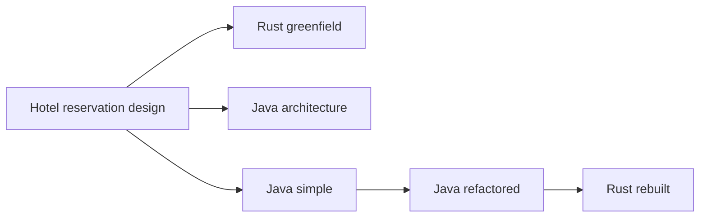

Five projects started from the same hotel reservation design, using **GPT-6 Luna at Max effort in Codex**. Some started in Rust or Java; others inherited an implementation, gained architectural layers, and eventually changed language. Did the business design survive? Did the architecture improve quality? Which version would I choose to maintain?

The inspected revisions give three direct answers:

- **None implements the complete original design with demonstrated production guarantees.** The booking core survives in all five, but feature omissions, authorization gaps, and failure cases remain.
- **Greenfield Rust has the stronger verified cancellation behavior; rebuilt Rust has the simpler operational topology.** The rewritten backend is smaller and has fewer services, but it contains a reproducible inventory corruption bug and does not retain the Java backend's full architectural structure. The maintenance preference depends on whether we prioritize the current behavior or a simpler platform to repair and evolve.
- **The Java refactor increases structural complexity while adding useful seams.** It introduces ports, typed statuses, and some domain validation, but largely retains the existing orchestration and a large React component. More layers have not, by themselves, corrected inherited behavior.

This comparative case study is **Part I** of a two-part investigation into AI software maintenance. Here, I analyze the baseline quality of the existing snapshots: whether the business design survived across forks and rewrites, how each architecture holds up under concurrency and failure, and what their static structures reveal. In **Part II**, I will measure the practical cost of implementing a new feature in each project, comparing developer effort, prompt iterations, blast radius, and verification friction across the five architectures.

## The five implementations and the actual comparison

I use short names throughout the article:

| Name | Repository | Inspected commit | Backend topology |
| :--- | :--- | :--- | :--- |
| Rust greenfield | [hotel-rust][rust-repo] | [961071e][rust-commit] | Five Rust services and a shared crate |
| Java architecture | [hotel-ddd-cleanarch-cqrs][ddd-repo] | [47b0c3b][ddd-commit] | Two Java services |
| Java simple | [hotel-dry-kiss-yagni][simple-repo] | [2945cbb][simple-commit] | Four Java services and a shared library |
| Java refactored | [hotel-dry-kiss-yagni-refactored-ddd-cleanarch-cqrs][refactored-repo] | [429f97f][refactored-commit] | Four Java services and a shared library |
| Rust rebuilt | [hotel-dry-kiss-yagni-refactored-ddd-cleanarch-cqrs-rermade-rust][rebuilt-repo] | [fba2378][rebuilt-commit] | One Rust backend |

The shared Java module is a library, not a fifth running service. The topology counts come from the code and deployment manifests.

The READMEs record the model, effort, original prompts, and implementation measurements. The project owner also confirmed the model settings. I did not independently audit the complete generation logs.

The three initial builds share a design reference and technology constraints, but they are separate implementations. The documented transformation chain is:



The retained artifacts substantiate that chain: the Java refactor keeps all four SQL schemas byte for byte; Rust rebuilt retains those schemas under new paths and all 11 files under the refactored frontend's `src/` directory byte for byte. That establishes concrete reuse, without assuming that the separate repositories retain a complete shared Git history.

The rewrite prompt asks for a Rust backend while retaining the design system and API contracts. It does not restate every architectural constraint from the earlier refactoring prompt. Consequently, “Rust rebuilt from an architected Java project” does **not** mean “the same architecture implemented in Rust.” [Java refactoring prompt][refactored-readme], [Rust rewrite prompt][rebuilt-readme].

## Method: follow the rules, then challenge the tests

The study inspected the five local checkouts on **September 30, 2026**, pinned to the commits above. It traced booking, cancellation, pricing, inventory changes, and guest access through HTTP handlers, application code, and SQL. It also compared frontend boundaries, deployment configuration, build behavior, test scope, and documentation.

A second analysis supplied by Gemini favored Rust rebuilt for maintainability and criticized the extra Java layers. Those are useful alternative perspectives. I checked its disputed claims against the same pinned sources and the study's test records, incorporating the supported arguments below. The [review reconciliation record]({{ '/assets/studies/hotel-implementations/review-reconciliation.json' | relative_url }}) documents the accepted, qualified, and rejected claims; the second analysis is a source of hypotheses, not independent experimental evidence.

Evidence is separated into three categories:

1. **Observed:** source counts, dependency relationships, current test results, startup failures, and outcomes of targeted probes.
2. **Reported:** historical SonarCloud coverage, Lighthouse scores, generation times, and token estimates in the READMEs.
3. **Inferred:** likely maintenance costs and unexecuted failure paths suggested by the inspected code.

All five existing frontend suites and production frontend builds passed. All three Java backend suites passed, including PostgreSQL integration tests; both Rust backend suites passed with explicit disposable database URLs. Additional probes used isolated PostgreSQL databases. No existing Kind cluster or application database was modified.

These checks do not measure production throughput, tail latency, memory use, availability, recovery time, or human maintenance effort. No numerical “overall quality score” is assigned: a missing payment workflow and a corrupted inventory counter should not disappear inside an average of unrelated metrics.

The [machine-readable study record]({{ '/assets/studies/hotel-implementations/results.json' | relative_url }}) contains the snapshot hashes, count definitions, test summary, and probe results. A [Python reproduction harness]({{ '/assets/studies/hotel-implementations/probes.py' | relative_url }}) repeats the two Rust probes and the Java architecture cancellation probe against a new disposable PostgreSQL container.

## What counts as preserving the original system design?

The baseline is ByteByteGo's [Hotel Reservation System chapter][baseline]. Its essential behavior includes hotel and room details, staff management, booking and cancellation, payment at booking, nightly prices, and up to 10% overbooking. Its core consistency model books by room type, checks every night, prevents duplicate requests, and keeps reservation and inventory changes in one relational transaction. High concurrency matters; room search is outside the initial scope. Redis and sharding are scaling options rather than mandatory starting components.

Those requirements make a more useful acceptance checklist than matching a diagram's number of services.

| Capability in the inspected code | Rust greenfield | Java architecture | Java simple | Java refactored | Rust rebuilt |
| :--- | :--- | :--- | :--- | :--- | :--- |
| Catalog and room-type browsing | Present | Present | Present | Present | Present |
| Nightly room-type inventory | Present | Present | Present | Present | Present |
| Reservation plus inventory creation in a local transaction | Present | Present | Present | Present | Present |
| Same-request replay and changed-request checks | Present, with caveats | Present | Present, with caveats | Present, with caveats | Present, with caveats |
| Up to 10% overbooking | Present | Absent | Present | Present | Present |
| Prices that can differ by night | Present | Absent; one room-type price | Present | Present | Present |
| Payment and refund records | Simulator | Absent | Simulator | Simulator | Simulator |
| Staff catalog, inventory, and rate operations | Present | Absent | Present | Present | Present |
| Authenticated guest ownership | Absent | Email comparison only | Absent | Absent | Absent |
| Scale and service-level targets established by this study | Unmeasured | Unmeasured | Unmeasured | Unmeasured | Unmeasured |

“Present” means the capability exists in code, not that all of its failure paths have passed verification. These are implementation findings, supported by the [Rust reservation flow][rust-booking], [Java architecture inventory adapter][ddd-inventory], [Java simple transaction code][simple-transactions], [Java refactored transaction code][refactored-transactions], and [Rust rebuilt reservation flow][rebuilt-booking].

### The largest scope loss is in Java architecture

Java architecture has the strongest separation of business policy from technical details, but its feature scope is narrower. Its inventory schema prevents availability from exceeding physical room count; it has no overbooking allowance. Its price is a single `price_per_night_cents` value on a room type, multiplied by nights and rooms. A successful booking becomes `CONFIRMED` directly, without a payment ledger or payment orchestration. Its controllers expose catalog reads and reservation operations rather than the original staff management workflows. [Inventory schema][ddd-schema], [reservation model][ddd-domain], [catalog controller][ddd-catalog].

These are substantive deviations. A neatly isolated domain model can encode an incomplete specification.

### The fork chain preserves much of the product, including its weaknesses

Java simple, Java refactored, and Rust rebuilt retain nightly rates, versioned inventory updates, reservation snapshots, a payment simulator, and staff endpoints. They therefore preserve more of the original functional scope than Java architecture.

They also retain guest lookup by email and reservation operations by UUID without an authenticated principal. Refactoring has largely preserved this behavior rather than repairing it. API compatibility can preserve a defect as effectively as a feature.

Changing service topology alone is not a loss of the business design. All five keep reservation creation and its inventory update in one database transaction. Rust rebuilt could also coordinate its local payment tables atomically, but its current code still commits booking, payment, and confirmation in separate steps.

This separates three meanings of fidelity: **retaining features and contracts**, **preserving invariants under failure**, and **retaining deployment boundaries**. The fork chain performs well on the first, has demonstrated gaps on the second, and changes the third in its resulting code. Identical schemas and a retained frontend cannot establish complete behavioral equivalence. Conversely, replacing backend HTTP calls with local calls does not inherently violate the booking requirements.

## The concurrency probe that changes the Rust comparison

The most consequential observed difference concerns **overlapping cancellations**.

The setup is deliberately small:

1. Create two confirmed, one-room reservations for the same room type and night.
2. Hold a database lock on that night's inventory row.
3. Start two requests cancelling the **same** reservation.
4. Wait until both requests are blocked on database locks, then release the inventory lock.
5. Check the counter while the other reservation remains active.

The correct result is one room still reserved.

| Implementation probed | Responses | Expected final inventory | Observed final inventory |
| :--- | :--- | :--- | :--- |
| Rust greenfield | Both HTTP 200 | One room reserved | One room reserved |
| Rust rebuilt | Both HTTP 200 | One room reserved | **Zero rooms reserved** |
| Java architecture | Both HTTP 200 | Six rooms available out of seven | **Seven rooms available**, despite one active booking |

The requests overlapped under a controlled lock schedule; this was not a timing-only stress test. These results establish defects under that schedule, without establishing how often they occur in a deployed system.

### Why Rust greenfield survives

Its cancellation transaction locks the reservation row with `FOR UPDATE`, rechecks its current status, and uses an `inventory_released_at` marker. The second cancellation sees the completed transition and does not release inventory again. The inventory marker and status change are protected by the local transaction. [Cancellation and release implementation][rust-booking].

That is a concrete quality advantage. It comes from the transaction design, not from Rust's type system alone.

### Why Rust rebuilt fails

The rebuilt handler reads the booking before its cancellation transaction. Both requests can see `CONFIRMED`; both proceed to subtract inventory. Its conditional status update occurs **after** the release, so it cannot prevent the second subtraction. The guard `total_reserved >= rooms` prevents a negative counter, but another guest's active reservation makes a second subtraction possible. [Rebuilt cancellation code][rebuilt-booking].

The invariant is stronger than “the counter never becomes negative”: **the counter must equal the inventory consumed by active reservations**.

### Why the Java domain model also fails

Java architecture rejects a second cancellation when executed sequentially. Under overlap, both requests read the same confirmed reservation before either saves the cancelled state. Inventory rows are locked, but the reservation's status transition is not serialized. The release operation caps availability at physical capacity; that cap hides the double release when another booking remains active. [Cancellation handler][ddd-cancel], [database store][ddd-store].

The existing test named `cancellationChecksGuestIdentityAndRestoresEveryNightOnce` exercises sequential calls. It passes while this overlapping case fails. [Integration test][ddd-tests].

Java simple and Java refactored contain a related source-level risk: their transactional cancellation methods read the reservation without a reservation-row lock, release inventory, and then update status. Their concurrency failure is **inferred from code**, not dynamically reproduced here; runtime startup problems described below blocked the intended HTTP probes. [Original transaction method][simple-transactions], [refactored transaction method][refactored-transactions].

## Other failures the happy path does not reveal

### A paid booking replay depends on a live rate service

Rust greenfield loads current rates before checking whether the idempotency key already identifies a completed reservation. In a probe, an initial booking succeeded and remained `paid`. Returning HTTP 503 from the rate-service stub caused the identical booking replay to return **HTTP 502**, rather than return the stored result. [Booking handler][rust-booking].

The database uniqueness constraint still prevents a duplicate reservation. The defect concerns replay availability: an already completed operation unnecessarily depends on a currently healthy pricing service.

Rust rebuilt also resolves the hotel and current quote before retrieving an existing booking. This creates a similar source-level dependency on mutable catalog and rate data, although that failure was not separately injected.

A stronger flow checks a previously completed request and its stable request fingerprint before consulting dependencies needed only for a new booking.

Java simple and Java refactored have another source-level replay risk: their uniqueness-error fallback fetches the existing reservation without repeating the request-equality check. Concurrent requests using the same ID but different details can reach a weaker path than sequential replay. That schedule was not executed here, so this is a code-review finding requiring a dedicated regression probe. [Refactored booking orchestration][refactored-service].

### A failed payment call leaves committed pending inventory

With Rust greenfield's payment stub unavailable, the API returned HTTP 502 and the stored booking remained `pending`. Inventory had already been reserved. Retrying can resume the workflow, but the inspected code has no automatic expiry or reconciliation worker to settle an abandoned pending booking. [Reservation workflow][rust-booking].

The fork-chain implementations also separate pending creation, charging, and confirmation. Rust rebuilt uses one database and local calls, yet keeps these commit boundaries. A single deployable backend therefore reduces network coordination without automatically making the business operation atomic.

This is a recoverability gap. A system needs a policy for abandoned bookings and ambiguous payment outcomes, with durable transitions and a way to reconcile them.

### Locking strategy does not determine the payment transaction boundary

Gemini's review attributed a serious disadvantage to Rust greenfield: holding inventory locks while awaiting payment over HTTP. The inspected code does **not** do that. `reserve_inventory` commits before returning to `create_reservation`; only then does the handler call payment. `finish_payment` starts another transaction. [Reservation and payment sequence][rust-booking].

| Step | Rust greenfield | Rust rebuilt |
| :--- | :--- | :--- |
| Reserve nights and create pending booking | Lock inventory with `FOR UPDATE`; commit | Update inventory with version checks; commit |
| Record payment | HTTP request to the payment service | Call the payment module, which executes SQL through `PgPool` |
| Confirm booking | New reservation transaction | Separate SQL update through `PgPool` |

Both release the initial inventory transaction before payment. Both therefore need to handle interruption between committed steps. Consolidation makes a shared transaction possible for the local payment simulator, but Rust rebuilt does not implement one. [Rebuilt booking sequence][rebuilt-booking], [payment persistence][rebuilt-payments].

Nor does optimistic concurrency mean an update cannot wait: PostgreSQL updates acquire row locks, normally retained until transaction end. Consistent lock ordering helps avoid deadlocks; neither the presence nor absence of explicit `FOR UPDATE` proves freedom from them. [PostgreSQL locking documentation][postgres-locking]. There is no measurement here supporting millisecond lock durations or a throughput winner. The cancellation result depends on protecting the reservation transition and its inventory effect, not simply choosing an optimistic or pessimistic label.

### Guest capacity is checked in search but bypassed in booking

Rust rebuilt accepted an HTTP booking request for **999 guests** in a room type whose `max_guests` is **2**, and stored 999 guests on the confirmed reservation. Search filters offers by capacity, but the authoritative booking path checks only that the guest count is positive. [Booking validation][rebuilt-booking].

The same missing comparison appears in the inspected Java simple and refactored booking paths; that observation is from source review. The browser's choices cannot enforce an API invariant. Java architecture provides a useful counterexample: its domain compares the guest count with room capacity and room count. [Room availability model][ddd-availability].

### An empty staff key changes meaning in the Rust rewrite

The original Java admin filter explicitly denies access when the configured key is blank. Rust rebuilt compares the supplied and expected bytes, but does not reject an empty configured key. In a local probe, configuring an empty key and supplying an empty `X-Admin-Key` header allowed a rate update with **HTTP 200**. [Java filter][simple-admin], [Rust middleware][rebuilt-router].

This finding applies to the empty-key configuration, not to a correctly configured nonempty key. The deployed manifests can supply a nonempty secret, but the rewrite has still changed the failure behavior of missing configuration.

### Reservation identifiers and email strings do not establish ownership

Both Rust backends returned an existing reservation with HTTP 200 when asked for its UUID without guest credentials. Java simple and Java refactored expose equivalent unprotected lookup and cancellation routes. Java architecture compares a supplied email with the reservation's email; that is stronger than no comparison, but it does not authenticate the caller. [Rust greenfield routes][rust-booking], [Rust rebuilt routes][rebuilt-router], [Java controller][simple-controller], [Java architecture query controller][ddd-query].

For a public system, ownership must be derived from a verified guest identity or a deliberately designed, protected booking-access mechanism. UUID unpredictability and knowing an email address are insufficient substitutes.

## Tests pass while two Java applications cannot start as packaged

The existing test results are encouraging within their scope:

| Snapshot | Backend tests passed | Frontend tests passed | Frontend build |
| :--- | ---: | ---: | :--- |
| Rust greenfield | 34 | 19 | Passed |
| Java architecture | 17 | 26 | Passed |
| Java simple | 19 | 13 | Passed |
| Java refactored | 24 | 15 | Passed |
| Rust rebuilt | 12 | 15 | Passed |

All listed backend and frontend tests passed with no reported skips. Greenfield Rust's database tests can silently return early if their database environment variables are absent; this study supplied all four URLs, so those paths executed. Rust rebuilt's API contract test requires a disposable database explicitly. [Greenfield Rust database test setup][rust-booking], [rebuilt API test][rebuilt-tests].

Two additional build observations matter:

- **Java simple and Java refactored produce ordinary service JARs without `Main-Class` entries.** Their Dockerfiles invoke `java -jar`, but their POMs declare the Spring Boot plugin without binding its `repackage` goal. A direct launch of Java simple's reservation JAR failed with `no main manifest attribute`; manifest inspection found the same missing entry in all four service JARs in both projects.
- **A direct classpath launch of Java simple's reservation service also failed:** its catalog client requires a `RestClient.Builder`, and the runtime reported that no such bean was available. Its integration tests replace catalog, rate, and payment clients with Mockito beans, bypassing that wiring.

These findings are supported by the [Java simple POM][simple-pom], [Java simple Dockerfile][simple-docker], [refactored POM][refactored-pom], [refactored Dockerfile][refactored-docker], and [mocked integration setup][simple-tests]. The second startup failure was executed for Java simple; the analogous refactored client setup warrants a startup check rather than being reported here as an independently reproduced failure.

Java architecture's executable reservation JAR started successfully for the cancellation probe. I did not rebuild or deploy all Kubernetes images during this study.

The lesson for the harness is concrete: **test the packaged service with its actual dependency wiring**, in addition to isolated domain tests and database tests with substituted clients.

## Architecture quality: inspect the dependencies

Clean Architecture's dependency rule protects business policy from frameworks and external mechanisms. A folder called `domain` is useful only when its contents and dependencies preserve that boundary. [Robert C. Martin's explanation][clean-architecture].

### Java architecture has the clearest core

Its reservation handlers depend on interfaces for inventory, persistence, transactions, ID generation, and time. Spring wiring and PostgreSQL adapters live outside those handlers. The domain contains explicit guest, stay, availability, reservation, and status concepts. Injecting `Clock` makes date-dependent rules deterministic in tests. [Placement handler][ddd-place], [reservation model][ddd-domain].

This design offers a clear place to add cancellation policy, guest rules, and pricing behavior without mixing HTTP concerns into every change. However, it still needs a complete business specification and concurrency-safe persistence semantics. Domain purity did not prevent the cancellation defect.

### Java refactored adds real seams and partial isolation

The refactor introduces catalog, rate, payment, inventory, and reservation ports. It separates command and query interfaces, replaces string statuses with enums, and adds constructors that reject some invalid domain state. Those are useful improvements.

The isolation is incomplete. Application handlers still import Spring annotations; some handlers use `HttpStatus` and the shared API exception. The reservation command handler delegates to the existing Spring-managed `ReservationService` and `ReservationTransactions`, which retain the old workflow. Existing request records carry Jakarta validation annotations through application interfaces. [Command handler][refactored-handler], [reservation service][refactored-service], [payment query handler][refactored-payment-query], [reservation request][refactored-request].

A Spring annotation alone is a smaller coupling than an HTTP status embedded in application error decisions. The relevant question is how much business behavior can be tested and changed independently. This refactor improves substitution of external dependencies while stopping short of the greenfield Java project's framework-independent use cases.

### Rust rebuilt preserves concepts but removes backend architectural layers

Its backend groups functions into `hotel`, `rates`, `payments`, and `reservations` modules, with shared models and errors. Those modules combine Axum handlers, SQLx access, validation, and workflow coordination. It has no equivalent catalog/payment/inventory ports or separate application command/query layer. [Router and module composition][rebuilt-router], [reservation module][rebuilt-booking].

This can be a reasonable small-service organization. It means the rewrite changes the architectural experiment: it is a consolidated Rust backend with retained contracts and frontend layers, rather than a full translation of the Java architecture.

The useful language perspective in Gemini's review is that a rewrite need not reproduce every Java interface as a Rust trait. Fewer wrappers can shorten a reader's path through the code. However, module names and compiler-checked visibility alone do not establish dependency isolation: these modules share a pool, models, and crate-visible helpers. Ports can still be useful in Rust where substitution protects a real business rule. This single rewrite demonstrates one organizational choice; it cannot establish that an AI naturally converges on the best architecture for a language.

Persistence evolution also differs. Rust greenfield uses versioned SQLx migrations; Rust rebuilt executes its idempotent schema scripts on startup. The latter installs the initial tables, but future table changes need an explicit upgrade strategy and coordination between replicas. Fewer source files do not eliminate that maintenance responsibility. [Rebuilt initialization][rebuilt-router].

### CQRS is modest in both Java architecture variants

The Java projects separate command and query entry points and handlers. They do not establish independently deployed read and write stores, asynchronous projections, or event sourcing. CQRS does not require event sourcing; it can use a shared database. Its value still needs to justify the additional concepts. [Martin Fowler on CQRS][cqrs].

The refactored search query also calls `ensureRows`, which can insert inventory. Consequently, the query naming does not imply that the entire read path is side-effect free. [Search service][refactored-search], [inventory adapter][refactored-inventory].

## Complexity: count consistently, then explain the counts

The READMEs use different LOC definitions and scanner scopes, so their published totals should not be compared directly. This study recounts **tracked Java/Rust backend source and TypeScript/TSX frontend source**, separating tests. Counts are nonblank physical lines, including comments; SQL, CSS, configuration, generated output, dependencies, and documentation are excluded. Rust's trailing `#[cfg(test)]` modules are counted as tests.

| Snapshot | Backend production files | Backend production lines | Backend test lines | Frontend production files | Frontend production lines | Frontend test lines | Backend services |
| :--- | ---: | ---: | ---: | ---: | ---: | ---: | ---: |
| Rust greenfield | 15 | 2,065 | 1,950 | 7 | 809 | 402 | 5 |
| Java architecture | 50 | 1,210 | 400 | 14 | 938 | 299 | 2 |
| Java simple | 47 | 1,272 | 465 | 5 | 1,411 | 294 | 4 |
| Java refactored | 77 | 1,798 | 565 | 10 | 1,538 | 325 | 4 |
| Rust rebuilt | 8 | 1,532 | 654 | 10 | 1,538 | 325 | 1 |

These are structural proxies, not cyclomatic complexity, development time, or quality scores. Java and Rust express types, imports, and asynchronous control differently; feature scope also differs.

The most defensible comparison is **Java simple → Java refactored**, because it retains the language, SQL schemas, product, and service topology. The backend grows by **30 production files**, approximately **64%**, and **526 nonblank lines**, approximately **41%**. Test source grows by 100 lines, and the suite gains five backend tests.

That increase buys more interfaces, handlers, typed domain state, and places to substitute dependencies. It also adds navigation and wiring. The cancellation workflow remains substantially the same, so its correctness risk remains.

Java architecture is smaller than Java simple in production backend lines despite having more files. Its narrower scope explains part of that result. It cannot demonstrate that architectural patterns reduce implementation size for equivalent behavior.

### Follow one read request to see what the extra layers buy

For `GET /api/hotels/{id}`, the relevant path changes as follows. Arrows describe calls and interface dispatch, excluding returned data types and framework infrastructure:

| Snapshot | Read path |
| :--- | :--- |
| Java simple | `HotelController` → `HotelRepository` → JDBC |
| Java refactored | `HotelController` → `HotelQueries` / `HotelQueryHandler` → `HotelReadPort` / `HotelRepository` → JDBC |

The query handler delegates without adding a business decision. That supports Gemini's concern about extra navigation for a simple read. But its proposed eight-class example does not match this snapshot: `HotelQueries` is an interface, and neither a `FindById` query record nor `HotelDetailsResponse` nor `HotelNotFoundException` exists in this service. The controller still returns `Hotel`. [Original controller][simple-hotel-controller], [refactored controller][refactored-hotel-controller], [query handler][refactored-hotel-query], [query interface][refactored-hotel-queries].

Calling all the added code useless would go too far. The refactored `Hotel` constructor rejects missing identity, blank name or city, and out-of-range ratings; it also defensively copies the room-type list. New domain tests exercise invalid hotel and room-type values. Those are concrete improvements over the original data-only record. [Original model][simple-hotel-model], [refactored model][refactored-hotel-model], [domain tests][refactored-hotel-tests].

My judgment is narrower: the pass-through read handler's present benefit is a substitution boundary, while the constructor checks protect actual invariants. A stable CRUD query may not need both interfaces; a changing provider or business policy may justify a seam. Added files measure structural cost, not whether every abstraction has earned its place.

### The frontend reveals where the refactor did little

Java simple's `App.tsx` contains **1,241 nonblank lines**. Java refactored moves the main component to `presentation/HotelApp.tsx`, where it still contains **1,239**. Rust rebuilt retains that file unchanged. [Original component][simple-ui], [refactored component][refactored-ui].

The new application interfaces and HTTP gateway offer substitution seams, and extracted validation can be tested independently. But the presentation's concentration of search, checkout, trips, and management state remains.

Java architecture distributes presentation across smaller files; its largest production frontend file contains 214 nonblank lines. Rust greenfield's main component has 413. Those counts identify where a maintainer will need to understand more UI state at once; they do not establish measured change effort.

DRY, KISS, and YAGNI are also compatible with DDD and Clean Architecture. The practical disagreement is where additional abstractions protect a real rule or likely change. A large component can be complicated under a “simple” prompt, while a domain model can simplify a difficult rule.

## Operations, performance, and the evidence behind dashboards

| Dimension | What the snapshots establish | What remains unestablished |
| :--- | :--- | :--- |
| Deployment | Two application replicas in the manifests; Rust greenfield has five backend deployments, Rust rebuilt one | That every image boots correctly or that replica count meets a service level |
| Data availability | A single PostgreSQL StatefulSet in each local stack | Replication, failover, tested restoration, or regional resilience |
| Concurrency | Local booking transactions; pessimistic locks or version-checked updates | Production contention behavior, retries, and tail latency |
| Observability | Health endpoints and basic logs; some stacks have resource/security settings | Complete booking/payment tracing, business alerts, and recovery runbooks |
| Performance | Functional test and build success | Comparable throughput, CPU, memory, database-query cost, or p95/p99 latency |
| Frontend quality | Responsive implementations and historical audit records | Equal audit conditions, every route/state, or real-user performance |

For a small team, one backend plausibly reduces operational work: fewer images, deployments, network contracts, and cross-service failures. That is an inference from topology, not measured maintenance time. Five services offer independent deployment and resource allocation, but also require more coordination.

This is the strongest argument for Gemini's preference for Rust rebuilt. A maintainer operating one product can debug the catalog-to-booking flow in one process and deploy it as one backend artifact. The tradeoffs are specific:

| Operational concern | Rust greenfield | Rust rebuilt |
| :--- | :--- | :--- |
| Backend deployment units | Five deployments, two replicas each | One deployment, two replicas |
| Internal calls for pricing and payment | HTTP boundaries with serialization and upstream failures | Function calls that still perform database I/O |
| Release and resource isolation | Each backend service can be deployed and sized separately | Catalog, pricing, payment, and booking share each backend process and its pool |
| Database separation | Four databases hosted by one PostgreSQL instance | Four schemas hosted by one PostgreSQL instance |

The manifests support the deployment counts, not a measured availability advantage. Consolidation removes these backend-to-backend HTTP failure paths, while concentrating process and connection-pool contention. It does not remove database network failures or the gaps between separate commits. The four greenfield databases likewise do not provide independent database-server failure domains. [Greenfield deployment][rust-deployment], [rebuilt deployment][rebuilt-deployment], [rebuilt application state][rebuilt-router].

All five retain a single database instance in their local manifests. Two application replicas cannot compensate for an unavailable database. The study did not validate backup or failover behavior.

Rust's memory-safety checks do not express “a cancellation releases inventory exactly once.” Nor do they establish that a simulator's payment status matches a booking. Those remain application and database invariants.

### SonarCloud and coverage use different scopes

The historical README records report zero open SonarCloud issues and coverage above the requested threshold. The reported overall coverage is 89.1% for Java architecture, 85.2% for Java simple, 86.6% for Java refactored, and 91.1% for Rust rebuilt. Rust greenfield has seven separately analyzed projects with different percentages and some gates marked “Not computed,” rather than one comparable overall gate. These are historical author reports, not fresh scanner results from this study.

The scanner configurations differ in languages, imported reports, exclusions, and analysis granularity. Their percentages therefore cannot establish which project is more maintainable. A test can execute almost every line while missing the two overlapping cancellations that corrupt inventory. [Greenfield analysis script][rust-sonar], [Java architecture scan scope][ddd-sonar], [rebuilt scan scope][rebuilt-sonar].

### Lighthouse evidence is unequal

Rust greenfield reports desktop scores of 100 and mobile performance of 99. Java architecture reports a successful local audit. Java refactored and Rust rebuilt report desktop scores of 100. Java simple explicitly records that its Kind deployment and Lighthouse audit were **not run**, because port 8080 was occupied. [Java simple verification record][simple-readme].

No new Lighthouse audit was run for this article. A high score on a landing page cannot resolve inventory correctness, prove guest authorization, or establish the usability of all checkout, error, and management states.

### AI generation effort is another confounded comparison

The same model and Max setting control two inputs, not total effort or an equal starting point. The READMEs report **2h 32m 55s** for Rust greenfield, **3h 46m 53s** for Java architecture, and **1h 2m 24s** for Rust rebuilt. The pinned Java simple and Java refactored READMEs contain no equivalent elapsed-time figure, so Gemini's estimates for those two are excluded. These are reported session durations, not timed maintenance tasks. [Rust generation record][rust-readme], [Java architecture generation record][ddd-readme], [rewrite record][rebuilt-readme].

The generation records also use different token-accounting descriptions. Rust rebuilt labels its input as uncached while the earlier records describe cached input as a subset of input. Java simple separately reports $0.84 for model tokens and $0.15 for web search; combining those while comparing other repositories' model-only estimates changes the scope. Without reconciling the original logs, their cost estimates cannot support a fair architectural efficiency ranking. [Java simple accounting][simple-readme], [rewrite accounting][rebuilt-readme].

The final rewrite's effort also excludes the work already invested in its inherited frontend, contracts, and Java predecessors. Its shorter reported session is compatible with reuse and reduced deployment scope; it does not isolate a Rust productivity advantage. Likewise, the longer Java architecture session cannot establish that interfaces caused the extra time.

## Which implementation would I maintain?

My choice depends on the requirement, but the inspected code supports explicit preferences.

| Decision | Preference at these revisions | Reason and qualification |
| :--- | :--- | :--- |
| Choose between the current Rust implementations on verified booking correctness | **Rust greenfield** | It survives the overlapping cancellation probe and has stronger release safeguards. It still needs guest authorization, resilient replay, and pending-payment recovery. |
| Choose the simpler Rust operational starting point | **Rust rebuilt, after repairing its invariants** | One backend removes several deployment and network boundaries. It is not acceptable as-is because of the observed cancellation and validation defects. |
| Study framework-independent use cases and domain rules | **Java architecture** | The core has the clearest dependency direction and deterministic time handling. Its missing features and cancellation race must be addressed. |
| Preserve the Java simple product while introducing substitution seams | **Java refactored** | Ports and typed state improve some change boundaries, but add structural cost and retain workflow defects and packaging problems. |
| Minimize abstraction for a stable, small feature set | **Java simple is a useful baseline** | Its backend paths are relatively direct. The large UI component and broken packaged startup prevent treating its “simple” label as proof of low maintenance cost. |

If forced to choose a Rust repository **today**, I would choose greenfield Rust on the available correctness evidence. I would not claim it has the lowest lifetime maintenance cost: its five services increase operational work, and no timed maintenance experiment was performed.

For a small-team successor, I would investigate repairing and modularizing Rust rebuilt. Its consolidated topology is attractive, but it needs protected state transitions, authoritative domain validation, and clear use-case boundaries. This is where I agree with Gemini's operational preference, while declining its unconditional maintainability ranking. A repair-and-change experiment could justify selecting the smaller backend; the current evidence establishes neither its repair cost nor the lowest lifetime maintenance cost.

## Looking forward: Part II on the cost of implementing a new feature

This first part establishes the baseline: how each codebase fares on specification fidelity, concurrency guarantees, and structural complexity. But the ultimate test of software architecture is how it responds to real change.

In **Part II**, I will conduct an empirical experiment measuring the cost of implementing a new feature across all five projects. By taking a concrete functional requirement—such as property-specific overbooking policies or custom seasonal pricing rules—and implementing it across each codebase under an identical executable acceptance contract, we will evaluate how each architectural style impacts developer velocity and maintainability:

| Change task | Acceptance evidence |
| :--- | :--- |
| Complete a paid booking through retries and dependency outages | One booking and one payment outcome; replay works after the original response is lost |
| Cancel under duplicate, concurrent, and booking/cancellation overlap | Inventory matches active bookings after every schedule |
| Change overbooking policy for selected properties | Every affected night obeys the policy, including inventory reductions |
| Add nightly prices and payment handling to Java architecture | Equivalent observable features, with rollback/reconciliation cases |
| Enforce guest ownership and room capacity | Direct API requests cannot bypass identity or guest-count rules |
| Change a provider or persistence adapter | Domain behavior remains stable; count files changed, review effort, and regressions |
| Change a checkout or management interaction | Measure presentation changes and test clarity, not only folder count |
| Build and start the deployment artifact | Real application wiring and health checks work from a fresh build |

The experiment will use the same starting snapshots, task specifications, reviewer expectations, and acceptance checks. For each implementation, Part II will track:

- **Developer and model effort:** session duration, prompt iterations, and repair attempts required to achieve passing acceptance checks.
- **Blast radius:** number of files touched, lines added or modified, and ripple effects across schemas, DTOs, and controllers.
- **Verification friction:** how easily new domain rules can be validated in fast local tests versus requiring multi-service wiring.
- **Regression incidence:** whether adding the new feature accidentally breaks existing booking, cancellation, or payment workflows.

For these five snapshots, the strongest conclusion of Part I is already visible: **forks preserve whatever the acceptance process protects**. Shared schemas and frontend contracts survive readily. Missing invariants, incomplete requirements, and substituted runtime wiring survive too. The most valuable improvement is to make those business rules executable at the real transaction and deployment boundaries.

## Verification appendix

Commands actually used for the final existing-suite checks:

- Rust greenfield, from its repository root: `cargo test --workspace`, `cargo fmt --check`, and `cargo clippy --workspace --all-targets -- -D warnings`. The test run supplied `HOTEL_TEST_DATABASE_URL`, `RATE_TEST_DATABASE_URL`, `PAYMENT_TEST_DATABASE_URL`, and `RESERVATION_TEST_DATABASE_URL`, each pointing to a separate disposable PostgreSQL database.
- Rust rebuilt, from `services/backend`: `cargo test --all-targets`, `cargo fmt --check`, and `cargo clippy --all-targets --all-features -- -D warnings`, with `DATABASE_URL` pointing to its disposable database.
- Java architecture: `./mvnw -B -f services/pom.xml clean verify`.
- Java simple and Java refactored: `mvn -B clean verify` inside `maven:3.9-eclipse-temurin-25`, with the repository, Maven cache, and Docker socket mounted as documented for their PostgreSQL integration tests.
- Every frontend: `npm test` and `npm run build`, from `web/` in the first two projects and `frontend/` in the other three.

All commands above passed. Earlier host Maven attempts for Java simple and Java refactored failed because pre-existing generated directories were owned by root; the documented container workflow resolved that environment issue. That initial filesystem failure is not counted as an application defect.

The targeted probes used the rebuilt debug Rust binaries and Java architecture's executable JAR, isolated databases, and HTTP requests. Rust greenfield's rate and payment calls used local stubs to inject availability failures. Cancellation overlap was enforced by holding the affected inventory row, waiting for both requests to block, and then committing the lock-holder transaction. Startup checks separately inspected generated JAR manifests and attempted Java simple's JAR and classpath launches.

To reproduce the selected probes, first build Rust greenfield with `cargo build --locked -p reservation-service` and Rust rebuilt with `cargo build --locked`, then build the Java architecture JAR with its Maven command above. With Python 3, Docker, and Java 25 available, download the harness and run:

```sh
python3 probes.py --projects-root /path/to/the/repository-checkouts \
  --output-dir /tmp/hotel-study-results
```

The harness requires the three pinned, clean snapshots and creates and removes its own database container. A successful harness exit means observations were collected, including known defects; it is not an application acceptance result.

Fresh SonarCloud scans, Lighthouse audits, full Kind image deployments, real payment-provider integration, load benchmarks, backup restoration, and production failover were not run. Findings from static review and targeted probes cover the stated paths rather than every possible behavior.

[rust-repo]: https://github.com/marcelomiyake/hotel-rust
[ddd-repo]: https://github.com/marcelomiyake/hotel-ddd-cleanarch-cqrs
[simple-repo]: https://github.com/marcelomiyake/hotel-dry-kiss-yagni
[refactored-repo]: https://github.com/marcelomiyake/hotel-dry-kiss-yagni-refactored-ddd-cleanarch-cqrs
[rebuilt-repo]: https://github.com/marcelomiyake/hotel-dry-kiss-yagni-refactored-ddd-cleanarch-cqrs-rermade-rust
[rust-commit]: https://github.com/marcelomiyake/hotel-rust/commit/961071eaa773c6f0e37c438da8336d2ac2f466eb
[ddd-commit]: https://github.com/marcelomiyake/hotel-ddd-cleanarch-cqrs/commit/47b0c3b79a96ba94c433e54639bfe9cdc5be1541
[simple-commit]: https://github.com/marcelomiyake/hotel-dry-kiss-yagni/commit/2945cbb7fdd929d29ec1671654d6dd09486d15a0
[refactored-commit]: https://github.com/marcelomiyake/hotel-dry-kiss-yagni-refactored-ddd-cleanarch-cqrs/commit/429f97f28ffaa47ba208463fd11e555763a07b58
[rebuilt-commit]: https://github.com/marcelomiyake/hotel-dry-kiss-yagni-refactored-ddd-cleanarch-cqrs-rermade-rust/commit/fba23789a507bf3179a214560ee7f215ad9eaa74
[baseline]: https://bytebytego.com/courses/system-design-interview/hotel-reservation-system
[clean-architecture]: https://blog.cleancoder.com/uncle-bob/2012/08/13/the-clean-architecture.html
[cqrs]: https://martinfowler.com/bliki/CQRS.html
[rust-booking]: https://github.com/marcelomiyake/hotel-rust/blob/961071eaa773c6f0e37c438da8336d2ac2f466eb/services/reservation-service/src/lib.rs
[rust-sonar]: https://github.com/marcelomiyake/hotel-rust/blob/961071eaa773c6f0e37c438da8336d2ac2f466eb/scripts/sonar-analyze.sh
[ddd-place]: https://github.com/marcelomiyake/hotel-ddd-cleanarch-cqrs/blob/47b0c3b79a96ba94c433e54639bfe9cdc5be1541/services/reservation-service/src/main/java/com/wayfarer/reservation/application/PlaceReservationHandler.java
[ddd-domain]: https://github.com/marcelomiyake/hotel-ddd-cleanarch-cqrs/blob/47b0c3b79a96ba94c433e54639bfe9cdc5be1541/services/reservation-service/src/main/java/com/wayfarer/reservation/domain/Reservation.java
[ddd-availability]: https://github.com/marcelomiyake/hotel-ddd-cleanarch-cqrs/blob/47b0c3b79a96ba94c433e54639bfe9cdc5be1541/services/reservation-service/src/main/java/com/wayfarer/reservation/domain/RoomAvailability.java
[ddd-inventory]: https://github.com/marcelomiyake/hotel-ddd-cleanarch-cqrs/blob/47b0c3b79a96ba94c433e54639bfe9cdc5be1541/services/reservation-service/src/main/java/com/wayfarer/reservation/adapter/out/postgres/JdbcRoomInventory.java
[ddd-store]: https://github.com/marcelomiyake/hotel-ddd-cleanarch-cqrs/blob/47b0c3b79a96ba94c433e54639bfe9cdc5be1541/services/reservation-service/src/main/java/com/wayfarer/reservation/adapter/out/postgres/JdbcReservationStore.java
[ddd-schema]: https://github.com/marcelomiyake/hotel-ddd-cleanarch-cqrs/blob/47b0c3b79a96ba94c433e54639bfe9cdc5be1541/services/reservation-service/src/main/resources/db/migration/V1__create_reservations_and_inventory.sql
[ddd-catalog]: https://github.com/marcelomiyake/hotel-ddd-cleanarch-cqrs/blob/47b0c3b79a96ba94c433e54639bfe9cdc5be1541/services/catalog-service/src/main/java/com/wayfarer/catalog/adapter/in/web/HotelController.java
[ddd-cancel]: https://github.com/marcelomiyake/hotel-ddd-cleanarch-cqrs/blob/47b0c3b79a96ba94c433e54639bfe9cdc5be1541/services/reservation-service/src/main/java/com/wayfarer/reservation/application/CancelReservationHandler.java
[ddd-query]: https://github.com/marcelomiyake/hotel-ddd-cleanarch-cqrs/blob/47b0c3b79a96ba94c433e54639bfe9cdc5be1541/services/reservation-service/src/main/java/com/wayfarer/reservation/adapter/in/web/ReservationQueryController.java
[ddd-tests]: https://github.com/marcelomiyake/hotel-ddd-cleanarch-cqrs/blob/47b0c3b79a96ba94c433e54639bfe9cdc5be1541/services/reservation-service/src/test/java/com/wayfarer/reservation/ReservationIntegrationTest.java
[ddd-sonar]: https://github.com/marcelomiyake/hotel-ddd-cleanarch-cqrs/blob/47b0c3b79a96ba94c433e54639bfe9cdc5be1541/sonar-project.properties
[simple-transactions]: https://github.com/marcelomiyake/hotel-dry-kiss-yagni/blob/2945cbb7fdd929d29ec1671654d6dd09486d15a0/services/reservation-service/src/main/java/com/stays/reservation/ReservationTransactions.java
[simple-controller]: https://github.com/marcelomiyake/hotel-dry-kiss-yagni/blob/2945cbb7fdd929d29ec1671654d6dd09486d15a0/services/reservation-service/src/main/java/com/stays/reservation/ReservationController.java
[simple-admin]: https://github.com/marcelomiyake/hotel-dry-kiss-yagni/blob/2945cbb7fdd929d29ec1671654d6dd09486d15a0/services/common/src/main/java/com/stays/common/AdminKeyFilter.java
[simple-tests]: https://github.com/marcelomiyake/hotel-dry-kiss-yagni/blob/2945cbb7fdd929d29ec1671654d6dd09486d15a0/services/reservation-service/src/test/java/com/stays/reservation/ReservationFlowIntegrationTest.java
[simple-pom]: https://github.com/marcelomiyake/hotel-dry-kiss-yagni/blob/2945cbb7fdd929d29ec1671654d6dd09486d15a0/pom.xml
[simple-docker]: https://github.com/marcelomiyake/hotel-dry-kiss-yagni/blob/2945cbb7fdd929d29ec1671654d6dd09486d15a0/services/Dockerfile
[simple-ui]: https://github.com/marcelomiyake/hotel-dry-kiss-yagni/blob/2945cbb7fdd929d29ec1671654d6dd09486d15a0/frontend/src/App.tsx
[simple-readme]: https://github.com/marcelomiyake/hotel-dry-kiss-yagni/blob/2945cbb7fdd929d29ec1671654d6dd09486d15a0/README.md
[refactored-readme]: https://github.com/marcelomiyake/hotel-dry-kiss-yagni-refactored-ddd-cleanarch-cqrs/blob/429f97f28ffaa47ba208463fd11e555763a07b58/README.md
[refactored-transactions]: https://github.com/marcelomiyake/hotel-dry-kiss-yagni-refactored-ddd-cleanarch-cqrs/blob/429f97f28ffaa47ba208463fd11e555763a07b58/services/reservation-service/src/main/java/com/stays/reservation/ReservationTransactions.java
[refactored-handler]: https://github.com/marcelomiyake/hotel-dry-kiss-yagni-refactored-ddd-cleanarch-cqrs/blob/429f97f28ffaa47ba208463fd11e555763a07b58/services/reservation-service/src/main/java/com/stays/reservation/application/command/ReservationCommandHandler.java
[refactored-service]: https://github.com/marcelomiyake/hotel-dry-kiss-yagni-refactored-ddd-cleanarch-cqrs/blob/429f97f28ffaa47ba208463fd11e555763a07b58/services/reservation-service/src/main/java/com/stays/reservation/ReservationService.java
[refactored-payment-query]: https://github.com/marcelomiyake/hotel-dry-kiss-yagni-refactored-ddd-cleanarch-cqrs/blob/429f97f28ffaa47ba208463fd11e555763a07b58/services/payment-service/src/main/java/com/stays/payment/application/query/PaymentQueryHandler.java
[refactored-request]: https://github.com/marcelomiyake/hotel-dry-kiss-yagni-refactored-ddd-cleanarch-cqrs/blob/429f97f28ffaa47ba208463fd11e555763a07b58/services/reservation-service/src/main/java/com/stays/reservation/ReservationRequest.java
[refactored-search]: https://github.com/marcelomiyake/hotel-dry-kiss-yagni-refactored-ddd-cleanarch-cqrs/blob/429f97f28ffaa47ba208463fd11e555763a07b58/services/reservation-service/src/main/java/com/stays/reservation/SearchService.java
[refactored-inventory]: https://github.com/marcelomiyake/hotel-dry-kiss-yagni-refactored-ddd-cleanarch-cqrs/blob/429f97f28ffaa47ba208463fd11e555763a07b58/services/reservation-service/src/main/java/com/stays/reservation/adapter/out/jdbc/InventoryRepository.java
[refactored-pom]: https://github.com/marcelomiyake/hotel-dry-kiss-yagni-refactored-ddd-cleanarch-cqrs/blob/429f97f28ffaa47ba208463fd11e555763a07b58/pom.xml
[refactored-docker]: https://github.com/marcelomiyake/hotel-dry-kiss-yagni-refactored-ddd-cleanarch-cqrs/blob/429f97f28ffaa47ba208463fd11e555763a07b58/services/Dockerfile
[refactored-ui]: https://github.com/marcelomiyake/hotel-dry-kiss-yagni-refactored-ddd-cleanarch-cqrs/blob/429f97f28ffaa47ba208463fd11e555763a07b58/frontend/src/presentation/HotelApp.tsx
[rebuilt-readme]: https://github.com/marcelomiyake/hotel-dry-kiss-yagni-refactored-ddd-cleanarch-cqrs-rermade-rust/blob/fba23789a507bf3179a214560ee7f215ad9eaa74/README.md
[rebuilt-booking]: https://github.com/marcelomiyake/hotel-dry-kiss-yagni-refactored-ddd-cleanarch-cqrs-rermade-rust/blob/fba23789a507bf3179a214560ee7f215ad9eaa74/services/backend/src/reservations.rs
[rebuilt-router]: https://github.com/marcelomiyake/hotel-dry-kiss-yagni-refactored-ddd-cleanarch-cqrs-rermade-rust/blob/fba23789a507bf3179a214560ee7f215ad9eaa74/services/backend/src/lib.rs
[rebuilt-tests]: https://github.com/marcelomiyake/hotel-dry-kiss-yagni-refactored-ddd-cleanarch-cqrs-rermade-rust/blob/fba23789a507bf3179a214560ee7f215ad9eaa74/services/backend/tests/api_contract.rs
[rebuilt-sonar]: https://github.com/marcelomiyake/hotel-dry-kiss-yagni-refactored-ddd-cleanarch-cqrs-rermade-rust/blob/fba23789a507bf3179a214560ee7f215ad9eaa74/sonar-project.properties
[rust-readme]: https://github.com/marcelomiyake/hotel-rust/blob/961071eaa773c6f0e37c438da8336d2ac2f466eb/README.md
[ddd-readme]: https://github.com/marcelomiyake/hotel-ddd-cleanarch-cqrs/blob/47b0c3b79a96ba94c433e54639bfe9cdc5be1541/README.md
[rust-deployment]: https://github.com/marcelomiyake/hotel-rust/blob/961071eaa773c6f0e37c438da8336d2ac2f466eb/deploy/kind.yaml
[rebuilt-deployment]: https://github.com/marcelomiyake/hotel-dry-kiss-yagni-refactored-ddd-cleanarch-cqrs-rermade-rust/blob/fba23789a507bf3179a214560ee7f215ad9eaa74/k8s/apps.yaml
[rebuilt-payments]: https://github.com/marcelomiyake/hotel-dry-kiss-yagni-refactored-ddd-cleanarch-cqrs-rermade-rust/blob/fba23789a507bf3179a214560ee7f215ad9eaa74/services/backend/src/payments.rs
[simple-hotel-controller]: https://github.com/marcelomiyake/hotel-dry-kiss-yagni/blob/2945cbb7fdd929d29ec1671654d6dd09486d15a0/services/hotel-service/src/main/java/com/stays/hotel/HotelController.java
[simple-hotel-model]: https://github.com/marcelomiyake/hotel-dry-kiss-yagni/blob/2945cbb7fdd929d29ec1671654d6dd09486d15a0/services/hotel-service/src/main/java/com/stays/hotel/Hotel.java
[refactored-hotel-controller]: https://github.com/marcelomiyake/hotel-dry-kiss-yagni-refactored-ddd-cleanarch-cqrs/blob/429f97f28ffaa47ba208463fd11e555763a07b58/services/hotel-service/src/main/java/com/stays/hotel/adapter/in/web/HotelController.java
[refactored-hotel-query]: https://github.com/marcelomiyake/hotel-dry-kiss-yagni-refactored-ddd-cleanarch-cqrs/blob/429f97f28ffaa47ba208463fd11e555763a07b58/services/hotel-service/src/main/java/com/stays/hotel/application/query/HotelQueryHandler.java
[refactored-hotel-queries]: https://github.com/marcelomiyake/hotel-dry-kiss-yagni-refactored-ddd-cleanarch-cqrs/blob/429f97f28ffaa47ba208463fd11e555763a07b58/services/hotel-service/src/main/java/com/stays/hotel/application/query/HotelQueries.java
[refactored-hotel-model]: https://github.com/marcelomiyake/hotel-dry-kiss-yagni-refactored-ddd-cleanarch-cqrs/blob/429f97f28ffaa47ba208463fd11e555763a07b58/services/hotel-service/src/main/java/com/stays/hotel/Hotel.java
[refactored-hotel-tests]: https://github.com/marcelomiyake/hotel-dry-kiss-yagni-refactored-ddd-cleanarch-cqrs/blob/429f97f28ffaa47ba208463fd11e555763a07b58/services/hotel-service/src/test/java/com/stays/hotel/HotelDomainTest.java
[postgres-locking]: https://www.postgresql.org/docs/17/explicit-locking.html
