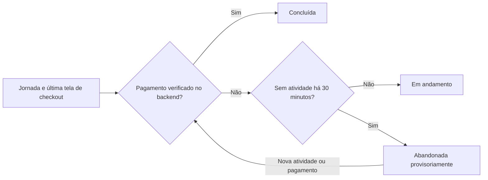

Quando avalio o custo de uma mudança, considero se a implementação entrega o comportamento solicitado pelo negócio. Aqui acompanho uma funcionalidade em cinco sistemas de hotel e comparo o esforço relatado com as lógicas de pagamento e análise produzidas. É assim que examino afirmações sobre manutenção à luz do que o código realmente faz.

Na [Parte I](), comparei cinco sistemas de reservas de hotel criados com IA antes da próxima funcionalidade. A refatoração em Java acrescentou interfaces e handlers; a reescrita em Rust consolidou serviços. As duas mudanças ofereciam possíveis benefícios para a manutenção. Agora podemos examinar o que aconteceu quando cada sistema precisou evoluir.

O pedido ao **GPT-6 Luna, com esforço Max no Codex**, foi:

> Quero que você implemente uma nova funcionalidade que identifique quando um usuário inicia uma reserva, mas a abandona antes de pagar. Queremos acompanhar em qual tela o usuário parou antes de abandonar a reserva.

Os registros dos cinco READMEs apresentam um resultado claro: **Java refatorado relata a menor estimativa de custo de tokens e a menor duração, com uma pequena alteração no frontend existente.** Porém, a inspeção da implementação muda a interpretação: ela confia na confirmação enviada pelo navegador e não consegue concluir uma jornada depois que a rotina de expiração a marca como abandonada. Rust reconstruído oferece evidências mais fortes para ordenação de eventos e classificação baseada em pagamento. Rust greenfield vincula a conclusão analítica à transação local de finalização do pagamento.

A lição prática é que **o custo de manutenção precisa considerar o comportamento entregue**. Uma sessão curta e um diff predominantemente aditivo são evidências úteis de esforço; não demonstram que a nova funcionalidade responde à pergunta de negócio de forma confiável.

## O experimento e seus limites

Os prompts completos dos READMEs também exigem persistência em banco, nenhum frontend administrativo, cobertura acima de 80%, zero problemas totais no SonarQube, documentação do esforço e verificações de desempenho e metadados quando a estrutura do frontend muda. Essas obrigações explicam por que algumas sessões incluem otimização de imagens, separação de bundles, análise estática e edição do README junto com a coleta analítica.

Esta revisão inspecionou os repositórios locais em **1º de outubro de 2026**. Cada comparação parte do snapshot usado na Parte I; os commits da funcionalidade e os snapshots finais abaixo distinguem a implementação da documentação e das melhorias posteriores de desempenho.

| Implementação | Base da Parte I | Commit da funcionalidade | Snapshot final revisado |
| :--- | :--- | :--- | :--- |
| Rust greenfield | `961071e` | [c747869][rust-feature] | [2bc09b8][rust-snapshot] |
| Java arquitetura | `47b0c3b` | [102392d][ddd-feature] | [222ee5b][ddd-snapshot] |
| Java simples | `2945cbb` | [bb44156][simple-feature] | [168f09b][simple-snapshot] |
| Java refatorado | `429f97f` | [14f5262][refactored-feature] | [14f5262][refactored-snapshot] |
| Rust reconstruído | `fba2378` | [64f22ee][rebuilt-feature] | [9c1f8e7][rebuilt-snapshot] |

As evidências têm três níveis:

- **Relatadas:** durações, contadores cumulativos de tokens, resultados dos testes de backend, cobertura, SonarCloud e Lighthouse registrados nos READMEs.
- **Observadas nesta revisão:** diffs do Git, dependências do código, cinco suítes e builds de frontend e verificações controladas no PostgreSQL com o SQL dos repositórios.
- **Inferidas:** possíveis vantagens de manutenção e caminhos de falha não exercitados em uma aplicação implantada por completo.

A Parte I propôs um experimento controlado de manutenção. Os registros disponíveis sustentam uma comparação observacional mais restrita: uma sessão por repositório, produtos iniciais diferentes, interpretações distintas de abandono e escopos desiguais de auditoria. Não auditei logs de geração nem recuperei iterações de prompt, tentativas de correção, tempo de revisão humana ou esforço por subtarefa. Portanto, não podemos atribuir uma diferença de duração exclusivamente à linguagem, ao padrão arquitetural ou à quantidade de serviços.

Este artigo consolida a revisão do Codex com os relatórios do Gemini em inglês e português fornecidos para comparação. As duas revisões usam as mesmas sessões de implementação e métricas dos READMEs; a concordância entre elas não é uma replicação independente. Conferi as afirmações recebidas contra o código nos snapshots fixados e mantive observações sustentadas, qualificando explicações causais e rankings. O [registro de evidências da manutenção][maintenance-data] preserva hashes, métricas, diffs normalizados e observações de SQL; o [registro de conciliação das revisões][maintenance-review] documenta os hashes das fontes e as decisões.

## Esforço relatado: tempo e tokens

| Implementação | Duração relatada | Estimativa de tokens recalculada | Ressalva sobre a duração |
| :--- | ---: | ---: | :--- |
| [Rust greenfield][rust-readme] | 1h 13m 39s | US$ 0,3152 | Inclui uma etapa separada de desempenho do frontend |
| [Java arquitetura][ddd-readme] | 56m 5s | US$ 0,2712 | Sessão de implementação; sem protocolo comum de cronometragem documentado |
| [Java simples][simple-readme] | 1h 6m 58s | US$ 0,3467 | Inclui extração da tela administrativa e imagens responsivas |
| [Java refatorado][refactored-readme] | 34m 40s | US$ 0,1269 | Descrito como tempo ativo fornecido; Lighthouse não executado novamente |
| [Rust reconstruído][rebuilt-readme] | 44m 7s | US$ 0,2304 | Snapshot de tokens anterior ao trabalho final de README e Git |

Essas durações vêm dos READMEs; não foram medidas independentemente com uma definição comum de tempo. A sessão refatorada apresenta o menor valor relatado, mas sua classificação como tempo ativo e a ausência de uma nova auditoria de desempenho impedem um ranking rigoroso de produtividade por tempo decorrido.

Os contadores de tokens são mais explícitos:

| Implementação | Entrada total | Entrada em cache | Entrada sem cache | Saída | Raciocínio, incluído na saída |
| :--- | ---: | ---: | ---: | ---: | ---: |
| Rust greenfield | 20.495.593 | 20.061.184 | 434.409 | 142.242 | 100.798 |
| Java arquitetura | 19.341.292 | 19.002.624 | 338.668 | 94.710 | 65.429 |
| Java simples | 26.171.295 | 25.815.552 | 355.743 | 105.900 | 70.136 |
| Java refatorado | 8.056.578 | 7.867.648 | 188.930 | 58.600 | 39.943 |
| Rust reconstruído | 15.295.531 | 14.891.264 | 404.267 | 82.074 | 60.303 |

**A entrada em cache faz parte da entrada total; o raciocínio faz parte da saída.** Somar todas essas colunas contaria duas vezes esses subconjuntos. Entre 97,36% e 98,64% da entrada é relatada como cache. Milhões de tokens cumulativos podem, portanto, refletir contexto repetido entre turnos, em vez de milhões de tokens distintos de código ou um único prompt gigantesco.

O cálculo usa a hipótese de tarifas registrada nos cinco READMEs: US$ 0,10 por milhão de tokens de entrada sem cache, US$ 0,01 por milhão de entrada em cache e US$ 0,50 por milhão de saída:

```text
estimativa = ((entrada − entrada em cache) × 0,10
              + entrada em cache × 0,01
              + saída × 0,50) / 1.000.000
```

Isso verifica a aritmética dos contadores relatados; não afirma preços atuais nem cobranças de assinatura. Os pontos de captura também diferem: Rust greenfield e Rust reconstruído registram explicitamente o consumo antes do trabalho final de documentação. O registro de evidências preserva essas ressalvas.

Java refatorado usa menos entrada total, entrada sem cache, saída e raciocínio neste caso. Isso sustenta uma vantagem de esforço nesta sessão. Não comprova quais arquivos o modelo leu, se encontrou dificuldade em outra base ou quanto da economia decorreu de uma auditoria não realizada.

## O que mudou, contado de forma consistente

Os totais dos READMEs usam escopos diferentes. Rust greenfield relata **14 arquivos e +740/−177 linhas** para coleta analítica, desempenho e documentação; seu commit de coleta sozinho toca **sete arquivos e +476/−27 linhas**. Java arquitetura relata **26 arquivos e +590/−31**, Java simples **23 e +807/−393**, Java refatorado **18 e +440/−4 sem o README**, e Rust reconstruído **11 e +592/−8**. [Registro greenfield][rust-readme], [arquitetura][ddd-readme], [simples][simple-readme], [refatorado][refactored-readme], [reconstruído][rebuilt-readme].

Na tabela abaixo, recontei cada base da Parte I até o snapshot final revisado e excluí somente o README da raiz. Código, testes, SQL, configuração e arquivos binários continuam incluídos. As contagens de texto incluem linhas em branco e comentários; binários contam como arquivos, sem totais de linhas.

| Implementação | Criados | Modificados | Arquivos excluídos | Total de arquivos | Inserções / exclusões de linhas | Arquivos backend / frontend |
| :--- | ---: | ---: | ---: | ---: | ---: | ---: |
| Rust greenfield | 5 | 8 | 0 | 13 | 667 / 171 | 2 / 11 |
| Java arquitetura | 15 | 10 | 0 | 25 | 533 / 24 | 13 / 10 |
| Java simples | 11 | 11 | 0 | 22 | 777 / 391 | 9 / 13 |
| Java refatorado | 9 | 9 | 0 | 18 | 440 / 4 | 14 / 4 |
| Rust reconstruído | 2 | 8 | 0 | 10 | 536 / 6 | 5 / 4 |

Backend corresponde a caminhos em `services/`; frontend, em `web/` ou `frontend/`. Os dois arquivos restantes de Java arquitetura e o arquivo restante de Rust reconstruído são configuração do repositório. Edições posteriores do README explicam as pequenas diferenças entre os totais relatados e as contagens finais com todos os arquivos, também preservadas no registro de evidências.

Três observações são mais úteis do que tratar exclusões como danos:

1. **A refatoração Java oferece um caminho pequeno de extensão no frontend.** Quatro arquivos mudam, enquanto uma porta de progresso, handler, adaptador JDBC, rotina agendada e testes compõem a maior parte do código novo de backend. A orquestração existente de reservas fica fora do sinal de conclusão.
2. **A maior exclusão de Java simples é movimentação de código.** `App.tsx` perde 382 linhas e um novo `StaffPage.tsx` recebe 378 linhas. Essa extração domina o total de exclusões. Pode aumentar o esforço de revisão, mas não demonstra que 393 linhas de comportamento foram removidas nem que houve regressão. [Diff da funcionalidade][simple-feature].
3. **O patch analítico de Rust greenfield é menor que o diff da sessão inteira.** Pré-renderização e bundles de viagens e administração chegam em um commit posterior de desempenho. Comparar a sessão completa com o patch analítico de outro projeto mudaria o escopo da medição.

O `HotelApp.tsx` herdado também era grande em Java refatorado e Rust reconstruído, mas os dois acrescentaram rastreamento sem uma extração administrativa semelhante. O componente grande, sozinho, não explica o consumo total de tokens de Java simples.

## O que a revisão conjunta estabelece

O Gemini destaca que portas, handlers e gateways de frontend podem oferecer ao agente de programação um caminho estabelecido para estender o sistema. O código sustenta a parte concreta desse argumento: Java refatorado reutiliza essas fronteiras, e Rust reconstruído conserva o gateway do frontend ao implementar a análise num módulo compacto de backend. Interpretar essas fronteiras como orientação para o agente é uma explicação plausível, não uma observação do raciocínio interno do modelo.

As duas revisões também permitem distinguir a criação de arquivos da alteração de comportamentos existentes. Quinze arquivos novos em Java arquitetura introduzem principalmente tipos, adaptadores e testes analíticos; a extração administrativa de Java simples move uma responsabilidade existente da interface. Ambos exigem revisão, mas a contagem de arquivos, sozinha, não mede risco de regressão.

| Interpretação do Gemini | Conclusão consolidada | Limite da evidência |
| :--- | :--- | :--- |
| Java refatorado venceu em manutenção. | Relata o menor esforço e demonstra pontos reutilizáveis de extensão. | A regra de timeout/conclusão exige correção; faltam o custo da refatoração anterior e uma medição comum de tempo total. |
| Java simples pagou uma penalidade por YAGNI. | Sua sessão tem a maior estimativa de tokens e inclui movimentação significativa da interface. | O diff não demonstra sobrecarga de contexto, refatoração inevitável nem regressão resultante. |
| Um backend único melhora a entrega da funcionalidade. | Rust reconstruído correlaciona jornadas e reservas localmente e reutiliza o gateway do frontend. | O número de serviços não foi variado isoladamente; o patch analítico de Rust greenfield altera somente um serviço de backend. |
| Uma view dinâmica simplifica o abandono. | Rust reconstruído deriva a expiração na consulta, dispensando uma rotina agendada para marcar abandono. | A persistência de eventos ainda usa transações e locks; Java simples também não possui essa rotina agendada. |

## O mesmo prompt produziu análises diferentes

Antes de comparar manutenibilidade, precisamos comparar o significado da funcionalidade.

| Implementação | Início do rastreamento | Significado da última tela | Abandono e conclusão |
| :--- | :--- | :--- | :--- |
| Rust greenfield | Abertura do formulário de reserva | `guest_details` ou `payment`, incluindo foco e alteração de campos | View após 30 minutos sem atividade; finalização paga no backend conclui a jornada |
| Java arquitetura | Seleção de um quarto para checkout | Qualquer tela posterior rastreada, incluindo hotel, resultados ou viagens | View após 30 minutos; evento de confirmação do navegador conclui a tentativa |
| Java simples | Abertura dos detalhes do hotel | `DETAILS` ou `CHECKOUT` | Evento explícito de saída/pagehide; conclusão no backend após pagamento |
| Java refatorado | Abertura dos detalhes | `DETAILS` ou `CHECKOUT`, depois confirmação | Expiração agendada de 30 minutos; confirmação do navegador conclui apenas uma sessão ativa |
| Rust reconstruído | Abertura dos detalhes do hotel | Qualquer tela posterior rastreada, incluindo reservas ou administração | View após 30 minutos; estado de reserva/pagamento e eventos de conclusão verificados determinam a conversão |

Os esquemas e fluxos sustentam essas diferenças: [greenfield][rust-migration], [arquitetura][ddd-view], [simples][simple-store], [refatorado][refactored-store], [reconstruído][rebuilt-view]. A regra de 30 minutos é uma escolha de implementação de quatro projetos, e não um limite especificado no pedido.

Abrir detalhes do hotel e entrar no checkout produzem denominadores diferentes para o funil. Registrar a última tela da aplicação e preservar a última tela do checkout responde a perguntas distintas. Os relatórios não estabelecem uma definição comum de medição entre os cinco sistemas.

Um contrato futuro de aceitação poderia tornar o abandono provisório, registrar atividade além da navegação e permitir que um pagamento verificado prevaleça sobre uma expiração anterior:



Esse é um contrato proposto para comparação, não uma afirmação de que ele orientou as sessões originais. Falhas de pagamento também deveriam ser distinguidas da saída voluntária quando os dados servirão para orientar melhorias do produto.

## Cinco caminhos de manutenção

### Rust greenfield: fronteira local de pagamento e trabalho adicional no frontend

A implementação acrescenta uma migração e estende o serviço de reservas. Nenhum serviço de backend novo é introduzido. O navegador registra duas seções do formulário; atividades de foco e alteração dentro da mesma seção são limitadas a uma por minuto. O envio é provocado por atividade, e não por um temporizador que comprova continuamente a presença do usuário. [Rastreamento no frontend][rust-ui].

A fronteira útil de consistência está em `finish_payment`: a transição local para pago e a conclusão da jornada compartilham uma transação. O replay bem-sucedido também tenta concluir a jornada, e a conclusão pode criar uma linha de jornada ausente. Isso permite recuperação quando o evento inicial do navegador foi perdido. [Pagamento e jornadas][rust-service].

Essa transação também coloca a persistência analítica no caminho crítico da reserva. Um erro de banco na conclusão pode reverter a transição local para pago depois que a chamada externa de pagamento retornou. O código estabelece essa dependência; esta revisão não injetou a falha em um fluxo real de pagamento.

As verificações SQL confirmaram que a inatividade gera abandono na seção de pagamento e que uma atividade posterior remove a jornada da view. Porém, as atualizações não possuem números de sequência do cliente: um checkpoint antigo que chegue depois pode substituir a tela atual. O lock serializa as escritas, mas não identifica a ordem original no navegador.

A sessão mais longa inclui pré-renderização, CSS inline e separação de rotas para atender aos objetivos de auditoria do frontend. Cinco deployments de backend e sete projetos de análise podem aumentar a coordenação, mas esta mudança analítica toca somente o backend de reservas. Seu tempo não pode ser explicado apenas pela topologia de microsserviços.

### Java arquitetura: registro isolado de eventos em um produto mais restrito

O novo caso de uso segue um caminho claro: controller web → handler de evento → interface de persistência da aplicação → adaptador JDBC. O handler recebe um `Clock`; seu teste usa tempo fixo e captura o evento em memória. A entrega no frontend é serializada por um registrador que trata falhas. São pontos concretos de substituição e testabilidade. [Handler][ddd-handler], [registrador][ddd-recorder].

Isso segue a direção de dependências descrita no [artigo de Robert C. Martin sobre Clean Architecture][clean-architecture]: a política da aplicação depende de uma abstração, enquanto a persistência a implementa. Os arquivos extras oferecem uma fronteira explícita. Não demonstram menos tentativas de correção, que não foram relatadas.

O produto herdado ainda oferece pagamento no hotel, sem pagamento online. Por isso, o agente substituiu pagamento por confirmação da reserva como conclusão. Isso está documentado com clareza, mas restringe a funcionalidade pedida. Acrescentar camadas não cria um fluxo de pagamento ausente.

O sinal de conclusão também vem do navegador, sem correlação com reserva ou pagamento na view. Na verificação de banco, acrescentar `RESERVATION_CONFIRMED` removeu a tentativa dos abandonos sem criar uma reserva. Inversamente, perder uma confirmação real pode manter uma tentativa convertida elegível a abandono. A navegação depois do checkout pode deixar `hotel` ou `trips` como última tela. [View SQL][ddd-view], [fluxo no navegador][ddd-ui].

O benefício de manutenção está na coleta isolada e nos testes determinísticos. A próxima fronteira de correção fica entre a verdade da reserva/pagamento e o resultado analítico.

### Java simples: código direto, dependência da saída e uma lacuna de conclusão

A implementação acrescenta um módulo pequeno de telemetria no navegador e um repositório JDBC de jornadas. Os eventos usam `sendBeacon`, com fetch keepalive como alternativa. O frontend emite abandono ao sair de detalhes/checkout e em `pagehide`; a tabela armazena o estado atual, sem histórico de eventos. [Telemetria][simple-tracking], [repositório][simple-store].

Na verificação controlada de banco, uma jornada com atividade retrocedida em 31 minutos continuou `STARTED` quando nenhum evento de saída chegou. Não há view de expiração nem rotina de varredura nesta funcionalidade. É uma lacuna prática quando o navegador não consegue informar a saída. A [documentação de Beacon da Mozilla][beacon-lifecycle] explica que `pagehide` pode não ocorrer em encerramentos comuns no celular e recomenda envio baseado em visibilidade. Um timeout no servidor pode complementar esses sinais.

Há uma proteção útil: abandono não sobrescreve conclusão, e a conclusão no backend pode prevalecer sobre um abandono anterior. Os testes SQL confirmaram a proteção da tela terminal e a recuperação pela conclusão.

Porém, `journeys.complete` executa **depois** de `transactions.markPaid`. Se a conclusão lançar uma exceção, a requisição pode falhar depois de a confirmação da reserva ser persistida. Uma nova tentativa retorna imediatamente quando a reserva já está `CONFIRMED`, sem reparar a análise. Esse caminho é inferido do código, e não reproduzido como um cenário HTTP completo. [Serviço de reservas][simple-booking].

O diff maior do frontend inclui extração administrativa, imagens e configuração de desempenho. Demonstra trabalho adicional nesta sessão; não estabelece uma penalidade geral de YAGNI nem uma falha de contexto do modelo.

### Java refatorado: extensão econômica com ciclo de vida incompleto

O agente estende `HotelCommands` e `HttpHotelGateway` com `recordReservationProgress`, acrescenta uma porta de persistência e instala um [agendador][refactored-scheduler] com intervalos configuráveis de inatividade e varredura. Um `Clock` fixo e uma persistência simulada permitem testar a política de tempo sem PostgreSQL. [Handler de progresso][refactored-handler], [integração no frontend][refactored-ui].

Essa é a evidência mais forte de que a refatoração anterior forneceu pontos úteis de extensão: o frontend muda em **50 inserções e quatro exclusões em quatro arquivos**, e a alteração inteira sem README é +440/−4. É compatível com um benefício dos pontos de desacoplamento, embora uma única sessão não isole sua contribuição nem compense comprovadamente o investimento da refatoração inicial.

A fronteira de conclusão explica parte do escopo pequeno. Um evento separado de `CONFIRMATION` enviado pelo navegador determina a conclusão; ele não está correlacionado com um estado autoritativo de pagamento. O comando de reserva não transporta o identificador da sessão de progresso.

Mais seriamente, tanto atualizações de tela quanto conclusão exigem `status = 'IN_PROGRESS'`. A rotina de varredura transforma esse status permanentemente em `ABANDONED`. Na verificação SQL, um checkpoint posterior de checkout e uma confirmação mantiveram a linha como **`ABANDONED:DETAILS`**. O navegador conserva o mesmo ID de progresso até a reserva bem-sucedida; um checkout lento ou retomado pode encontrar esse estado. O comportamento do banco foi observado; o cenário completo com navegador e pagamento não foi executado. [Transições do repositório][refactored-store].

Uma confirmação nova do navegador também pode concluir uma sessão sem consulta de pagamento. Os testes de integração existentes preservam deliberadamente o abandono contra eventos posteriores de tela; não testam recuperação para concluído depois da expiração. [Testes de integração][refactored-tests].

Java refatorado é o caso de menor esforço relatado, com pontos úteis de teste e uma regra de classificação pendente. Seu README também afirma explicitamente que Lighthouse não foi executado novamente. Uma nota anterior não comprova a auditoria da nova revisão.

### Rust reconstruído: eventos com sequência e resultados baseados em pagamento

Rust reconstruído acrescenta o módulo `journeys.rs` e o esquema analítico, atualizando o gateway do frontend herdado. O UUID da jornada também é o ID da reserva. Números de sequência do cliente e uma chave única `(journey_id, sequence)` impedem eventos repetidos ou antigos de avançar o estado atual. [Módulo de jornadas][rebuilt-journeys], [integração no frontend][rebuilt-ui].

A verificação SQL entregou a sequência 3 de checkout antes da sequência 2 de detalhes. A tela persistida continuou sendo checkout. É um benefício concreto em relação a ordenar apenas pela chegada ao servidor.

A view de resultados consulta a tabela de reservas. Relata conclusão quando há um ID de pagamento, mesmo se a atualização analítica separada falhou, e classifica `PAYMENT_FAILED` separadamente. O callback de conclusão registra o erro analítico sem fazer a resposta da reserva paga falhar; um evento de conclusão do cliente também verifica confirmação e pagamento. [View de resultados][rebuilt-view], [integração da reserva][rebuilt-booking].

A view real usa `reservations.bookings`, em vez do join com registros de pagamento ilustrado no relatório do Gemini. Seu ID de pagamento, timestamp explícito de conclusão e ramo de falha no pagamento determinam o resultado:

```sql
CREATE OR REPLACE VIEW reservation_analytics.journey_outcomes AS
SELECT journey.journey_id,
       journey.started_at,
       journey.last_activity_at,
       journey.last_screen,
       CASE
           WHEN journey.completed_at IS NOT NULL OR booking.payment_id IS NOT NULL THEN 'COMPLETED'
           WHEN booking.status = 'PAYMENT_FAILED' THEN 'PAYMENT_FAILED'
           WHEN journey.last_activity_at <= now() - interval '30 minutes' THEN 'ABANDONED'
           ELSE 'IN_PROGRESS'
       END AS status,
       CASE
           WHEN journey.completed_at IS NULL
             AND booking.payment_id IS NULL
             AND booking.status IS DISTINCT FROM 'PAYMENT_FAILED'
             AND journey.last_activity_at <= now() - interval '30 minutes'
           THEN journey.last_activity_at + interval '30 minutes'
           ELSE NULL
       END AS abandoned_at
FROM reservation_analytics.journeys AS journey
LEFT JOIN reservations.bookings AS booking ON booking.id = journey.journey_id;
```

A verificação de banco confirmou que uma reserva paga produziu `COMPLETED` enquanto `completed_at` da jornada permanecia nulo, demonstrando a recuperação pela view. Uma reserva com falha produziu `PAYMENT_FAILED`.

O Gemini identifica corretamente o benefício operacional de calcular abandono na consulta: nenhuma rotina precisa persistir periodicamente o status expirado. A afirmação de que isso elimina contenção de locks vai além da evidência. A ingestão ainda insere eventos e atualiza jornadas em transações. Escritas no PostgreSQL adquirem locks, e locks de linha duram até o fim da transação; não houve benchmark de contenção. [Documentação de locks do PostgreSQL][postgres-locking].

Essa é a combinação observada mais forte de ordenação e classificação baseada em pagamento nesta funcionalidade. Ainda há limites: perder o evento inicial deixa a jornada sem linha, o progresso posterior é rejeitado e a navegação para administração ou reservas pode virar a última tela. Sequências não reconstroem uma jornada que nunca foi persistida.

O Gemini também identifica uma contrapartida real de acoplamento: `journeys.rs` contém tratamento HTTP, validação, transações SQL e mapeamento de erros, recebendo diretamente um `PgPool` em vez de uma interface de persistência. Isso mantém o código relacionado à funcionalidade junto, mas torna testes de política sem banco menos diretos do que nos handlers Java. O crescimento futuro do módulo é uma preocupação de manutenção a acompanhar; esta adição isolada não demonstra que esse crescimento já tornou o código difícil de alterar. [Módulo de jornadas][rebuilt-journeys].

O backend único facilita o join e o callback local. O defeito de cancelamento estabelecido na Parte I continua fora do escopo de correção desta funcionalidade.

## Atrito de verificação e o alcance dos indicadores verdes

Os READMEs relatam suítes de backend aprovadas com **34, 19, 20, 28 e 15 testes**, respectivamente. Java arquitetura e Java refatorado acrescentam testes rápidos de tempo e interfaces de persistência; as transições no banco continuam exigindo integração. Rust greenfield estende um teste existente sem aumentar seu total relatado. Contagens isoladas não mostram novas asserções nem caminhos de falha sem teste.

Os cinco relatam zero problemas ativos no SonarCloud e cobertura acima do limite solicitado em seus respectivos escopos. Esta revisão não executou novas análises nem repetiu as suítes de backend. Cobertura não demonstra que um hóspede que pagou será excluído depois de um timeout.

As evidências de auditoria do frontend são desiguais:

| Implementação | Auditoria relatada no README da sessão |
| :--- | :--- |
| Rust greenfield | 100 em cinco categorias, desktop e celular, após a etapa de desempenho |
| Java arquitetura | 100 em cinco categorias no frontend de produção; a extensão SEO META in 1 Click não pôde ser aberta |
| Java simples | 100 em quatro categorias numa auditoria simulada para celular |
| Java refatorado | Lighthouse não executado novamente nesta revisão |
| Rust reconstruído | 100 em quatro categorias, desktop |

São resultados relatados, não uma auditoria comum de todos os estados do checkout. A auditoria não realizada no refatorado é uma lacuna de entrega e um fator que interfere na comparação de esforço.

Durante a revisão inicial do Codex, antes de consolidar os relatórios do Gemini, `npm test` e `npm run build` passaram nos cinco frontends: **19, 33, 18, 15 e 15 testes**, totalizando **100 testes aprovados**. As verificações SQL usaram um novo contêiner descartável de PostgreSQL 17 e as migrações/esquemas e comandos de persistência dos repositórios. Treze observações esperadas corresponderam aos resultados em cinco grupos de probes; nenhum banco existente da aplicação nem cluster Kind foi alterado.

O [registro de evidências][maintenance-data] inclui os 42 passos SQL, seus arquivos de origem e resultados. Essas verificações estabelecem o comportamento do banco sob as entradas fornecidas. Não executam fluxos HTTP completos, encerramento de navegador móvel, requisições concorrentes de pagamento e telemetria, inicialização de imagens implantadas ou novas auditorias Lighthouse. Não extraio delas taxas de regressão ou afirmações de confiabilidade em produção.

## O que eu manteria a seguir

| Implementação | Benefício de manutenção demonstrado | Próxima fronteira a verificar ou corrigir |
| :--- | :--- | :--- |
| Rust greenfield | Transação local de conclusão, reparo em replay e checkpoints sensíveis à atividade | Falha analítica após pagamento externo e ordenação de checkpoints antigos |
| Java arquitetura | Caso de uso desacoplado de framework, tempo injetado e envio serializado | Pagamento real e correlação de conversão pelo servidor |
| Java simples | Implementação direta e conclusão paga prevalecendo sobre saída | Timeout para saídas perdidas e reparo analítico no replay confirmado |
| Java refatorado | Pequeno patch no frontend e fronteiras explícitas de progresso, persistência e tempo | Retomada após expiração, conclusão baseada em pagamento e auditoria pendente |
| Rust reconstruído | Checkpoints ordenados e recuperação por pagamento num backend único | Recuperação do início perdido, definição da última tela e invariantes preexistentes |

Para a base analítica desta funcionalidade, **Rust reconstruído possui as evidências mais fortes de ordenação e recuperação da conversão pelo pagamento persistido**. **Rust greenfield possui a fronteira local mais forte de conclusão atômica.** **Java refatorado demonstra o menor esforço relatado e um caminho útil de extensão**, mas ainda exige correção do ciclo de vida.

A nova funcionalidade torna os benefícios da refatoração mais concretos do que contagens de pastas na Parte I. Também mostra por que não se escolhe o vencedor da manutenção apenas por tempo, tokens ou exclusões. O processo de aceitação precisa proteger conversão autoritativa, significado útil da tela, eventos perdidos e checkout retomado antes que a implementação de menor esforço possa ser chamada de mais sustentável.

[maintenance-review]: {{ '/assets/studies/hotel-implementations/maintenance-review-reconciliation.json' | relative_url }}
[postgres-locking]: https://www.postgresql.org/docs/17/explicit-locking.html
[refactored-scheduler]: https://github.com/marcelomiyake/hotel-dry-kiss-yagni-refactored-ddd-cleanarch-cqrs/blob/14f526207e66b77cc22b38831d49c86bb92f1f91/services/reservation-service/src/main/java/com/stays/reservation/adapter/in/scheduling/ReservationProgressAbandonmentScheduler.java
[maintenance-data]: {{ '/assets/studies/hotel-implementations/maintenance-results.json' | relative_url }}
[clean-architecture]: https://blog.cleancoder.com/uncle-bob/2012/08/13/the-clean-architecture.html
[beacon-lifecycle]: https://developer.mozilla.org/en-US/docs/Web/API/Navigator/sendBeacon
[rust-readme]: https://github.com/marcelomiyake/hotel-rust/blob/2bc09b8800faa4d7b8b3de4207279e24ad42e858/README.md
[rust-feature]: https://github.com/marcelomiyake/hotel-rust/commit/c747869746c8b321ce23d9180d80599c7447242b
[rust-snapshot]: https://github.com/marcelomiyake/hotel-rust/commit/2bc09b8800faa4d7b8b3de4207279e24ad42e858
[rust-service]: https://github.com/marcelomiyake/hotel-rust/blob/2bc09b8800faa4d7b8b3de4207279e24ad42e858/services/reservation-service/src/lib.rs
[rust-ui]: https://github.com/marcelomiyake/hotel-rust/blob/2bc09b8800faa4d7b8b3de4207279e24ad42e858/web/src/App.tsx
[rust-migration]: https://github.com/marcelomiyake/hotel-rust/blob/2bc09b8800faa4d7b8b3de4207279e24ad42e858/services/reservation-service/migrations/0002_reservation_journey_analytics.sql
[ddd-readme]: https://github.com/marcelomiyake/hotel-ddd-cleanarch-cqrs/blob/222ee5be2e5c09fac34ecb987b24cf3ec37e995b/README.md
[ddd-feature]: https://github.com/marcelomiyake/hotel-ddd-cleanarch-cqrs/commit/102392dd97e75b0896bd24aa78923c0158a292d5
[ddd-snapshot]: https://github.com/marcelomiyake/hotel-ddd-cleanarch-cqrs/commit/222ee5be2e5c09fac34ecb987b24cf3ec37e995b
[ddd-handler]: https://github.com/marcelomiyake/hotel-ddd-cleanarch-cqrs/blob/222ee5be2e5c09fac34ecb987b24cf3ec37e995b/services/reservation-service/src/main/java/com/wayfarer/reservation/application/RecordReservationFunnelEventHandler.java
[ddd-recorder]: https://github.com/marcelomiyake/hotel-ddd-cleanarch-cqrs/blob/222ee5be2e5c09fac34ecb987b24cf3ec37e995b/web/src/application/reservation-funnel-tracking.ts
[ddd-view]: https://github.com/marcelomiyake/hotel-ddd-cleanarch-cqrs/blob/222ee5be2e5c09fac34ecb987b24cf3ec37e995b/services/reservation-service/src/main/resources/db/migration/V2__record_reservation_funnel_events.sql
[ddd-ui]: https://github.com/marcelomiyake/hotel-ddd-cleanarch-cqrs/blob/222ee5be2e5c09fac34ecb987b24cf3ec37e995b/web/src/presentation/App.tsx
[simple-readme]: https://github.com/marcelomiyake/hotel-dry-kiss-yagni/blob/168f09b79cfb359f975ea4b2156c8a38bb125554/README.md
[simple-feature]: https://github.com/marcelomiyake/hotel-dry-kiss-yagni/commit/bb441569663ed9378fe9d0edfd917a43a65e3e0b
[simple-snapshot]: https://github.com/marcelomiyake/hotel-dry-kiss-yagni/commit/168f09b79cfb359f975ea4b2156c8a38bb125554
[simple-tracking]: https://github.com/marcelomiyake/hotel-dry-kiss-yagni/blob/168f09b79cfb359f975ea4b2156c8a38bb125554/frontend/src/journey.ts
[simple-store]: https://github.com/marcelomiyake/hotel-dry-kiss-yagni/blob/168f09b79cfb359f975ea4b2156c8a38bb125554/services/reservation-service/src/main/java/com/stays/reservation/ReservationJourneyRepository.java
[simple-booking]: https://github.com/marcelomiyake/hotel-dry-kiss-yagni/blob/168f09b79cfb359f975ea4b2156c8a38bb125554/services/reservation-service/src/main/java/com/stays/reservation/ReservationService.java
[refactored-readme]: https://github.com/marcelomiyake/hotel-dry-kiss-yagni-refactored-ddd-cleanarch-cqrs/blob/14f526207e66b77cc22b38831d49c86bb92f1f91/README.md
[refactored-feature]: https://github.com/marcelomiyake/hotel-dry-kiss-yagni-refactored-ddd-cleanarch-cqrs/commit/14f526207e66b77cc22b38831d49c86bb92f1f91
[refactored-snapshot]: https://github.com/marcelomiyake/hotel-dry-kiss-yagni-refactored-ddd-cleanarch-cqrs/commit/14f526207e66b77cc22b38831d49c86bb92f1f91
[refactored-handler]: https://github.com/marcelomiyake/hotel-dry-kiss-yagni-refactored-ddd-cleanarch-cqrs/blob/14f526207e66b77cc22b38831d49c86bb92f1f91/services/reservation-service/src/main/java/com/stays/reservation/application/command/ReservationProgressCommandHandler.java
[refactored-ui]: https://github.com/marcelomiyake/hotel-dry-kiss-yagni-refactored-ddd-cleanarch-cqrs/blob/14f526207e66b77cc22b38831d49c86bb92f1f91/frontend/src/presentation/HotelApp.tsx
[refactored-store]: https://github.com/marcelomiyake/hotel-dry-kiss-yagni-refactored-ddd-cleanarch-cqrs/blob/14f526207e66b77cc22b38831d49c86bb92f1f91/services/reservation-service/src/main/java/com/stays/reservation/adapter/out/jdbc/ReservationProgressRepository.java
[refactored-tests]: https://github.com/marcelomiyake/hotel-dry-kiss-yagni-refactored-ddd-cleanarch-cqrs/blob/14f526207e66b77cc22b38831d49c86bb92f1f91/services/reservation-service/src/test/java/com/stays/reservation/ReservationFlowIntegrationTest.java
[rebuilt-readme]: https://github.com/marcelomiyake/hotel-dry-kiss-yagni-refactored-ddd-cleanarch-cqrs-rermade-rust/blob/9c1f8e7a37b9851a592fea34557d59e599c2fa0b/README.md
[rebuilt-feature]: https://github.com/marcelomiyake/hotel-dry-kiss-yagni-refactored-ddd-cleanarch-cqrs-rermade-rust/commit/64f22eeaf142265a7b1c592a25c084bf81d68c79
[rebuilt-snapshot]: https://github.com/marcelomiyake/hotel-dry-kiss-yagni-refactored-ddd-cleanarch-cqrs-rermade-rust/commit/9c1f8e7a37b9851a592fea34557d59e599c2fa0b
[rebuilt-journeys]: https://github.com/marcelomiyake/hotel-dry-kiss-yagni-refactored-ddd-cleanarch-cqrs-rermade-rust/blob/9c1f8e7a37b9851a592fea34557d59e599c2fa0b/services/backend/src/journeys.rs
[rebuilt-ui]: https://github.com/marcelomiyake/hotel-dry-kiss-yagni-refactored-ddd-cleanarch-cqrs-rermade-rust/blob/9c1f8e7a37b9851a592fea34557d59e599c2fa0b/frontend/src/presentation/HotelApp.tsx
[rebuilt-view]: https://github.com/marcelomiyake/hotel-dry-kiss-yagni-refactored-ddd-cleanarch-cqrs-rermade-rust/blob/9c1f8e7a37b9851a592fea34557d59e599c2fa0b/services/backend/schema/05_reservation_analytics.sql
[rebuilt-booking]: https://github.com/marcelomiyake/hotel-dry-kiss-yagni-refactored-ddd-cleanarch-cqrs-rermade-rust/blob/9c1f8e7a37b9851a592fea34557d59e599c2fa0b/services/backend/src/reservations.rs
