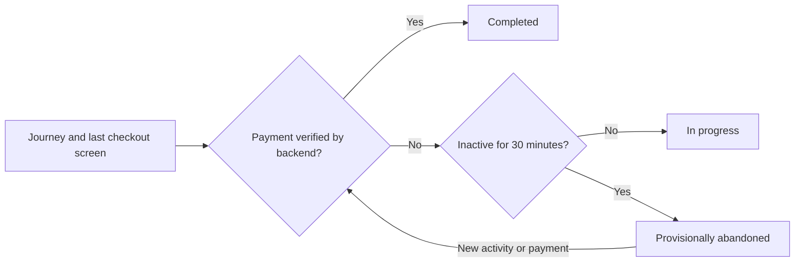

When I assess the cost of a change, I include whether the implementation delivers the requested business behavior. Here I follow one feature across five hotel systems and compare the reported effort with the resulting payment and analytics logic. This is how I examine maintenance claims against what the code actually does.

In [Part I](), I compared five AI-built hotel reservation systems before their next feature. The Java refactor added interfaces and handlers; the Rust rewrite consolidated services. Both offered plausible maintenance benefits. This time, we can examine what happened when each system had to change.

The request to **GPT-6 Luna, with Max effort in Codex**, was:

> I want you to implement a new feature that identifies when a user starts a reservation but abandons it before paying. I want us to track which screen the user stopped at before abandoning the reservation.

The five README records show a clear result: **Java refactored reports the lowest token estimate and shortest duration, with a small change to existing frontend code.** But inspecting the implementation changes the interpretation: it trusts browser confirmation and cannot complete a journey after its inactivity sweeper has marked it abandoned. Rust rebuilt provides stronger evidence for ordered events and payment-backed classification. Rust greenfield connects analytics completion to its local payment-finalization transaction.

The practical lesson is that **maintenance cost must include the behavior delivered**. A short session and a mostly additive diff are useful evidence of effort; they do not establish that the new feature answers the business question reliably.

## The experiment and its limits

The full prompts in the READMEs also require database storage, no administrative frontend, coverage above 80%, zero total SonarQube issues, documentation of effort, and frontend performance and metadata checks when the UI structure changes. Those obligations explain why some sessions include image optimization, code splitting, scanner work, and README editing alongside analytics.

This review inspected the local repositories on **October 1, 2026**. Each comparison starts at the snapshot used in Part I; the feature commits and final snapshots below distinguish implementation from later documentation and performance work.

| Implementation | Part I baseline | Feature commit | Final snapshot reviewed |
| :--- | :--- | :--- | :--- |
| Rust greenfield | `961071e` | [c747869][rust-feature] | [2bc09b8][rust-snapshot] |
| Java architecture | `47b0c3b` | [102392d][ddd-feature] | [222ee5b][ddd-snapshot] |
| Java simple | `2945cbb` | [bb44156][simple-feature] | [168f09b][simple-snapshot] |
| Java refactored | `429f97f` | [14f5262][refactored-feature] | [14f5262][refactored-snapshot] |
| Rust rebuilt | `fba2378` | [64f22ee][rebuilt-feature] | [9c1f8e7][rebuilt-snapshot] |

The evidence has three levels:

- **Reported:** durations, cumulative token counters, backend test results, coverage, SonarCloud, and Lighthouse results from the READMEs.
- **Observed in this review:** Git diffs, source dependencies, five frontend suites and builds, and controlled PostgreSQL checks using the repositories' SQL.
- **Inferred:** likely maintenance advantages and failure paths not exercised through a complete deployed application.

Part I proposed a controlled maintenance experiment. These records support a narrower observational comparison: one feature session per repository, different starting products, different interpretations of abandonment, and unequal audit scope. I did not audit generation logs or recover prompt iterations, repair attempts, human review time, or time spent on each subtask. We therefore cannot attribute a duration difference exclusively to a language, architectural pattern, or service count.

This article consolidates the Codex review with the English and Portuguese Gemini reports supplied for comparison. Both reviews use the same implementation sessions and README measurements; their agreement is not an independent replication. I checked the supplied claims against the pinned source and retained supported observations while qualifying causal explanations and rankings. The [maintenance evidence record][maintenance-data] preserves hashes, measurements, normalized diffs, and SQL observations; the [review reconciliation record][maintenance-review] records the source fingerprints and decisions.

## Reported effort: time and tokens

| Implementation | Reported duration | Recalculated token estimate | Duration qualification |
| :--- | ---: | ---: | :--- |
| [Rust greenfield][rust-readme] | 1h 13m 39s | $0.3152 | Includes a separate web performance pass |
| [Java architecture][ddd-readme] | 56m 5s | $0.2712 | Implementation session; no common timing protocol documented |
| [Java simple][simple-readme] | 1h 6m 58s | $0.3467 | Includes staff-view extraction and responsive images |
| [Java refactored][refactored-readme] | 34m 40s | $0.1269 | Explicitly described as supplied active work time; Lighthouse not re-run |
| [Rust rebuilt][rebuilt-readme] | 44m 7s | $0.2304 | Token snapshot precedes final README and Git work |

These are the README durations, not independently measured times under one clock definition. The refactored session is the lowest reported value, but its active-time label and missing new performance audit prevent a strict wall-clock productivity ranking.

The token counters are more explicit:

| Implementation | Total input | Cached input | Uncached input | Output | Reasoning, included in output |
| :--- | ---: | ---: | ---: | ---: | ---: |
| Rust greenfield | 20,495,593 | 20,061,184 | 434,409 | 142,242 | 100,798 |
| Java architecture | 19,341,292 | 19,002,624 | 338,668 | 94,710 | 65,429 |
| Java simple | 26,171,295 | 25,815,552 | 355,743 | 105,900 | 70,136 |
| Java refactored | 8,056,578 | 7,867,648 | 188,930 | 58,600 | 39,943 |
| Rust rebuilt | 15,295,531 | 14,891,264 | 404,267 | 82,074 | 60,303 |

**Cached input is part of input; reasoning is part of output.** Adding those columns together would double count both. Between 97.36% and 98.64% of input is reported as cached. Millions of cumulative input tokens can therefore reflect repeated context across turns, rather than millions of distinct source tokens or one enormous prompt.

The cost arithmetic uses the rate assumption recorded in all five READMEs: $0.10 per million uncached input tokens, $0.01 per million cached input tokens, and $0.50 per million output tokens:

```text
estimate = ((input − cached input) × 0.10
            + cached input × 0.01
            + output × 0.50) / 1,000,000
```

This verifies the arithmetic against the reported counters; it does not assert current pricing or subscription charges. Counter cutoffs also differ: Rust greenfield and Rust rebuilt explicitly capture usage before final reporting work. The evidence record retains those qualifications.

Java refactored uses the least reported input, uncached input, output, and reasoning in this task. That supports an effort advantage for this session. It does not prove which files the model read, whether it was confused by another codebase, or how much of the saving came from skipping an audit.

## What changed, counted consistently

The README change totals use different scopes. Rust greenfield reports **14 files and +740/−177 lines** for analytics, performance work, and documentation; its analytics commit alone touches **seven files and +476/−27 lines**. Java architecture reports **26 files and +590/−31**, Java simple **23 and +807/−393**, Java refactored **18 and +440/−4 excluding README**, and Rust rebuilt **11 and +592/−8**. [Greenfield record][rust-readme], [architecture record][ddd-readme], [simple record][simple-readme], [refactored record][refactored-readme], [rebuilt record][rebuilt-readme].

For the table below, I recount each Part I baseline to its final reviewed snapshot and exclude only the root README. Source, tests, SQL, configuration, and binary assets remain included. Text counts include blank lines and comments; binary assets count as files without text-line totals.

| Implementation | Created | Modified | Deleted files | Total files | Insertions / deletions | Backend / frontend files |
| :--- | ---: | ---: | ---: | ---: | ---: | ---: |
| Rust greenfield | 5 | 8 | 0 | 13 | 667 / 171 | 2 / 11 |
| Java architecture | 15 | 10 | 0 | 25 | 533 / 24 | 13 / 10 |
| Java simple | 11 | 11 | 0 | 22 | 777 / 391 | 9 / 13 |
| Java refactored | 9 | 9 | 0 | 18 | 440 / 4 | 14 / 4 |
| Rust rebuilt | 2 | 8 | 0 | 10 | 536 / 6 | 5 / 4 |

Backend means paths under `services/`; frontend means `web/` or `frontend/`. The remaining two Java architecture files and one Rust rebuilt file are repository configuration. Later README edits explain the small differences between reported totals and final all-file counts, which are also preserved in the evidence record.

Three observations matter more than treating deletions as damage:

1. **The Java refactor offers a small frontend extension path.** Four frontend files change, while a progress port, handler, JDBC adapter, scheduler, and tests supply most of the new backend code. Existing booking orchestration is left outside the completion signal.
2. **Java simple's largest deletion is code movement.** `App.tsx` loses 382 lines while a new `StaffPage.tsx` contains 378 added lines. This extraction dominates the deletion total. It can increase review effort, but it is not evidence that 393 lines of product behavior were removed or that a regression occurred. [Feature diff][simple-feature].
3. **Rust greenfield's analytics patch is smaller than its complete session diff.** Prerendering and trips/staff chunks arrive in a later performance commit. Comparing its complete session with another project's analytics patch would change the measurement scope.

The inherited `HotelApp.tsx` was also large in both Java refactored and Rust rebuilt, yet both added tracking without a comparable staff extraction. The large component alone cannot explain Java simple's total token use.

## What the combined review establishes

Gemini emphasizes that ports, handlers, and frontend gateways can give a coding agent an established path for extending a system. The source supports the concrete part of that argument: Java refactored reuses those boundaries, and Rust rebuilt retains the frontend gateway while implementing analytics in a compact backend module. Treating those boundaries as guidance for the agent is a plausible explanation, rather than an observation of the model's internal reasoning.

The two reviews also make a useful distinction between creating files and revising existing behavior. Fifteen new files in Java architecture mostly introduce analytics types, adapters, and tests; Java simple's staff extraction moves an existing UI responsibility. Both require review, but a file total alone cannot measure regression risk.

| Gemini's interpretation | Consolidated finding | Evidence limit |
| :--- | :--- | :--- |
| Java refactored is the maintenance winner. | It reports the lowest effort and demonstrates reusable extension points. | Its timeout/completion rule needs repair; prior refactoring cost and common wall-clock timing are unavailable. |
| Java simple paid a YAGNI penalty. | Its session has the highest token estimate and includes substantial UI movement. | The diff cannot establish context overload, unavoidable refactoring, or a resulting regression. |
| One backend improves feature delivery. | Rust rebuilt can correlate journeys and bookings locally and reuses the frontend gateway. | Service count was not varied independently; Rust greenfield's analytics patch changes only one backend service. |
| A dynamic view simplifies abandonment. | Rust rebuilt derives expiry when queried, avoiding a scheduled job to mark abandoned journeys. | Event persistence still uses transactions and locks; Java simple has no such scheduled job either. |

## The same prompt produced different analytics

Before comparing maintainability, we need to compare what the feature means.

| Implementation | Tracking begins | Last screen means | Abandonment and completion |
| :--- | :--- | :--- | :--- |
| Rust greenfield | Reservation form opens | `guest_details` or `payment`, including field focus/change activity | SQL view after 30 minutes inactive; backend paid finalization completes the journey |
| Java architecture | A room is selected for checkout | Any subsequent tracked application screen, including hotel, results, or trips | SQL view after 30 minutes; browser reservation-confirmed event completes the attempt |
| Java simple | Hotel details opens | `DETAILS` or `CHECKOUT` | Explicit departure/pagehide event; backend completion after successful payment |
| Java refactored | Details opens | `DETAILS` or `CHECKOUT`, then confirmation | Scheduled 30-minute expiry; browser confirmation completes only an active session |
| Rust rebuilt | Hotel details opens | Any subsequent tracked application screen, including bookings or staff | SQL view after 30 minutes; backend booking/payment state and checked completion events determine conversion |

The schemas and tracking paths support these distinctions: [greenfield][rust-migration], [architecture][ddd-view], [simple][simple-store], [refactored][refactored-store], [rebuilt][rebuilt-view]. The 30-minute rule is an implementation choice in four projects, rather than a threshold specified by the request.

Opening hotel details and entering checkout create different funnel denominators. Recording the last application screen and preserving the last checkout screen answer different questions. None of the reports establishes one shared measurement definition across all five systems.

A consistent future acceptance contract could make abandonment provisional, record activity rather than only navigation, and allow verified payment to supersede an earlier timeout:



This is a proposed comparison contract, not a claim that it governed the original sessions. Payment failures should also be distinguished from voluntary departure if the data is meant to guide product improvements.

## Five maintenance paths

### Rust greenfield: a local payment boundary and extra frontend work

The implementation adds one migration and extends the reservation service. No new backend service is introduced. The browser records two sections within its reservation form; same-section focus/change activity is throttled to at most once per minute. This is activity-triggered reporting, not a timer that continually proves the user is present. [Frontend tracking][rust-ui].

The useful consistency boundary is in `finish_payment`: the local paid-state transition and journey completion share a transaction. Successful replay also attempts completion again, and completion can create a missing journey row. This provides a recovery path when the browser start event was lost. [Payment and journey implementation][rust-service].

That transaction also puts analytics persistence on a critical booking path. A database error in completion can roll back the local paid-state transition after the external payment call has returned. The source establishes that dependency; this review did not inject that failure into a live payment workflow.

The SQL checks confirmed that inactivity produces a payment-screen abandonment and a later activity write removes it from the view. Screen updates lack client sequence numbers, however: a later-arriving older checkpoint can replace the current screen. Row locking serializes writes but does not identify their original browser order.

The longer reported session includes prerendering, inline CSS, and route splitting to meet frontend audit goals. Five backend deployments and seven scanner projects plausibly add coordination, but this particular analytics change touches only the reservation backend. Its time cannot be explained solely by microservice topology.

### Java architecture: isolated event recording with a narrower product

The new use case follows a clear path: web controller → event handler → application-owned store interface → JDBC adapter. The handler receives a `Clock`; its unit test supplies a fixed time and an in-memory capture of the event. Frontend event delivery is serialized through a recorder that catches failures. These are concrete substitution and testability seams. [Handler][ddd-handler], [recorder][ddd-recorder].

This follows the dependency direction described in [Robert C. Martin's Clean Architecture article][clean-architecture]: application policy depends on an abstraction, while persistence implements it. The additional files buy an explicit boundary. They do not establish fewer repair attempts, which were not reported.

The inherited product still offers pay at the property, without online payment. Consequently, the agent substituted reservation confirmation for payment completion. That is documented honestly, but it narrows the requested feature. Adding layers does not supply a missing payment workflow.

The completion signal is also a browser event without a booking/payment correlation in the view. In the database check, adding `RESERVATION_CONFIRMED` removed an attempt from abandonment without creating a reservation. Conversely, a lost real confirmation event can leave a converted attempt eligible for abandonment. Navigation after checkout can make `hotel` or `trips` the last screen. [SQL view][ddd-view], [browser flow][ddd-ui].

The maintenance benefit is isolated ingestion and deterministic testing. The next correctness boundary belongs between reservation/payment truth and the analytics outcome.

### Java simple: direct code, departure dependence, and a completion gap

The implementation adds a small browser telemetry module and a JDBC journey repository. Events use `sendBeacon`, with a keepalive fetch fallback. The frontend emits abandonment on leaving details/checkout and on `pagehide`; the table stores current state rather than an event history. [Browser telemetry][simple-tracking], [journey repository][simple-store].

In the controlled database check, a journey backdated by 31 minutes remained `STARTED` when no departure event arrived. There is no expiry view or sweep in this feature. That is a practical detection gap when the browser cannot report its exit. Mozilla's [Beacon documentation][beacon-lifecycle] explains that `pagehide` may never fire in common mobile termination scenarios and recommends visibility-based reporting. A server timeout can complement such client signals.

There is a useful safeguard: an abandonment cannot overwrite completed state, and backend completion can supersede an earlier abandonment. The SQL checks confirmed both the terminal screen guard and completion recovery.

However, `journeys.complete` runs **after** `transactions.markPaid`. If completion throws, the request can fail after booking confirmation is stored. A retry returns immediately when the booking is already `CONFIRMED`, skipping the analytics repair. That failure path is inferred from the source, not reproduced as a complete HTTP scenario. [Booking service][simple-booking].

The larger frontend diff includes staff extraction, images, and performance configuration. It demonstrates additional work in this session; it does not establish a general YAGNI penalty or model context failure.

### Java refactored: inexpensive extension with an incomplete lifecycle

The agent extends `HotelCommands` and `HttpHotelGateway` with `recordReservationProgress`, adds a store port, and installs a [scheduler][refactored-scheduler] with configurable inactivity and sweep intervals. A fixed `Clock` and mocked store make the time policy easy to exercise without PostgreSQL. [Progress handler][refactored-handler], [frontend integration][refactored-ui].

This is the strongest evidence that the earlier refactor supplied useful extension points: the frontend delta is **50 insertions and four deletions across four files**, and the whole non-README change is +440/−4. It is consistent with a benefit from the added seams, although one session cannot isolate their contribution or repay the earlier refactoring investment.

The implementation's completion boundary explains part of its limited change scope. A separate browser `CONFIRMATION` event drives completion; it is not correlated with authoritative payment state. The booking command itself does not carry the progress session ID.

More seriously, both screen updates and completion require `status = 'IN_PROGRESS'`. The sweeper changes that status permanently to `ABANDONED`. In the SQL check, a later checkout checkpoint and confirmation both left the row **`ABANDONED:DETAILS`**. The browser retains the same progress ID until successful booking, so a slow or resumed checkout can encounter this state. The database behavior is observed; the full browser/payment scenario remains unexecuted. [Repository transitions][refactored-store].

A fresh browser confirmation can also complete a session without a payment lookup. The existing integration tests deliberately preserve abandonment against later screen writes; they do not test recovery to completed after timeout. [Integration tests][refactored-tests].

Java refactored is the lowest reported effort case, with useful test seams and an unresolved classification rule. Its README also explicitly says Lighthouse was not re-run. An earlier score cannot satisfy the new revision's audit requirement.

### Rust rebuilt: sequence-aware events and payment-backed outcomes

Rust rebuilt adds a `journeys.rs` module and analytics schema, updating the inherited frontend gateway. The journey UUID doubles as the reservation ID. Client sequence numbers and a unique `(journey_id, sequence)` event key prevent repeated or older events from advancing the current state. [Journey module][rebuilt-journeys], [frontend integration][rebuilt-ui].

The SQL check delivered sequence 3 for checkout before sequence 2 for details. The stored screen remained checkout. This is a concrete benefit over simply ordering events by server arrival.

The outcome view joins the booking table. It reports completion when a payment ID exists, even if the separate analytics completion update failed, and classifies `PAYMENT_FAILED` separately. The backend completion callback logs an analytics error instead of failing the paid booking response; a client completion event also verifies confirmed/payment-backed state. [Outcome view][rebuilt-view], [booking integration][rebuilt-booking].

The actual view uses `reservations.bookings`, rather than the payment-record join illustrated in Gemini's report. Its payment ID, explicit completion timestamp, and payment-failure branch determine the outcome:

```sql
CREATE OR REPLACE VIEW reservation_analytics.journey_outcomes AS
SELECT journey.journey_id,
       journey.started_at,
       journey.last_activity_at,
       journey.last_screen,
       CASE
           WHEN journey.completed_at IS NOT NULL OR booking.payment_id IS NOT NULL THEN 'COMPLETED'
           WHEN booking.status = 'PAYMENT_FAILED' THEN 'PAYMENT_FAILED'
           WHEN journey.last_activity_at <= now() - interval '30 minutes' THEN 'ABANDONED'
           ELSE 'IN_PROGRESS'
       END AS status,
       CASE
           WHEN journey.completed_at IS NULL
             AND booking.payment_id IS NULL
             AND booking.status IS DISTINCT FROM 'PAYMENT_FAILED'
             AND journey.last_activity_at <= now() - interval '30 minutes'
           THEN journey.last_activity_at + interval '30 minutes'
           ELSE NULL
       END AS abandoned_at
FROM reservation_analytics.journeys AS journey
LEFT JOIN reservations.bookings AS booking ON booking.id = journey.journey_id;
```

The database check confirmed that a paid booking produced `COMPLETED` while the journey's `completed_at` remained null, demonstrating the view's recovery path. A failed booking produced `PAYMENT_FAILED`.

Gemini correctly identifies the operational benefit of computing abandonment at query time: no worker must periodically persist expired status. Its claim that this eliminates lock contention goes too far. Ingestion still inserts events and updates journeys inside transactions. PostgreSQL writes acquire locks, and row locks persist until transaction end; no contention benchmark was performed. [PostgreSQL locking documentation][postgres-locking].

This is the strongest observed combination of ordering and payment-backed outcome classification in this feature. There are still limits: a lost start event leaves no journey row, subsequent progress is rejected, and navigation to staff or bookings can become the last screen. Sequence numbers cannot reconstruct a journey that was never persisted.

Gemini also identifies a real coupling tradeoff: `journeys.rs` contains HTTP handling, validation, SQL transactions, and error mapping, and receives a `PgPool` directly rather than a store interface. This keeps related feature code together, while making database-free policy tests less direct than in the Java handlers. Future module growth is a maintenance concern to watch; this single addition does not establish that such growth has already made the code difficult to change. [Journey module][rebuilt-journeys].

The single backend makes the join and local callback straightforward. The cancellation defect established in Part I remains outside this feature's repair scope.

## Verification friction and what the green dashboards cover

The READMEs report passing backend suites with **34, 19, 20, 28, and 15 tests**, respectively. Java architecture and Java refactored add fast tests around time and store interfaces; their database transitions still need integration checks. Rust greenfield extends an existing integration test without increasing its reported total test count. Counts alone therefore miss new assertions and untested failure paths.

All five report zero active SonarCloud issues and coverage above the requested threshold within their stated scopes. This review did not perform fresh scanner runs or rerun backend suites. Scanner coverage does not establish that a paid guest will be excluded after a timeout.

The frontend audit evidence is unequal:

| Implementation | Feature-session README audit evidence |
| :--- | :--- |
| Rust greenfield | 100 in five categories, desktop and mobile, after the performance pass |
| Java architecture | 100 in five categories on the production frontend; SEO META in 1 Click extension could not be opened |
| Java simple | 100 in four categories on a mobile simulated audit |
| Java refactored | Lighthouse not re-run for this revision |
| Rust rebuilt | 100 in four categories on desktop |

These are reported results; they are not a shared audit of every checkout state. The refactored session's unperformed audit is a delivery gap as well as a confounder in the effort comparison.

During the initial Codex review, before consolidating the Gemini reports, `npm test` and `npm run build` passed in all five frontends: **19, 33, 18, 15, and 15 tests**, totaling **100 passing tests**. Controlled SQL checks used a new disposable PostgreSQL 17 container and the repositories' own migrations/schema and persistence statements. Thirteen expected observations matched across five probe groups; no existing application database or Kind cluster was changed.

The [evidence record][maintenance-data] includes all 42 SQL steps, their source paths, and observations. These checks establish database behavior under the supplied inputs. They do not execute full HTTP flows, mobile browser termination, concurrent payment/telemetry requests, deployed image startup, or new Lighthouse audits. No regression rate or production reliability claim is derived from them.

## What I would maintain next

| Implementation | Maintenance benefit demonstrated here | Next boundary to verify or repair |
| :--- | :--- | :--- |
| Rust greenfield | Local completion transaction and replay repair; activity-sensitive checkpoints | Analytics failure after external payment and stale checkpoint ordering |
| Java architecture | Framework-independent event use case, injected time, and serialized browser delivery | Real payment scope and server-backed conversion correlation |
| Java simple | Direct implementation and paid completion overriding departure | Missed-exit timeout fallback and completion repair on confirmed replay |
| Java refactored | Small frontend patch and explicit progress/store/time seams | Resume after expiry, payment-backed completion, and the missing performance audit |
| Rust rebuilt | Ordered checkpoints and payment-backed view recovery in one backend | Lost-start recovery, checkout-screen definition, and the pre-existing booking invariants |

For this feature's analytics foundation, **Rust rebuilt has the strongest evidence for sequence handling and recovering conversion from stored payment state**. **Rust greenfield has the stronger local atomic completion boundary.** **Java refactored demonstrates the smallest reported effort and a useful extension path**, while still requiring a lifecycle correction.

The new feature makes the refactor's benefits more concrete than folder counts did in Part I. It also shows why a maintenance winner cannot be selected from time, tokens, or deletions alone. The acceptance process must protect authoritative conversion, useful screen semantics, missed events, and resumed checkout before the lowest-effort implementation can be called the most maintainable.

[maintenance-review]: {{ '/assets/studies/hotel-implementations/maintenance-review-reconciliation.json' | relative_url }}
[postgres-locking]: https://www.postgresql.org/docs/17/explicit-locking.html
[refactored-scheduler]: https://github.com/marcelomiyake/hotel-dry-kiss-yagni-refactored-ddd-cleanarch-cqrs/blob/14f526207e66b77cc22b38831d49c86bb92f1f91/services/reservation-service/src/main/java/com/stays/reservation/adapter/in/scheduling/ReservationProgressAbandonmentScheduler.java
[maintenance-data]: {{ '/assets/studies/hotel-implementations/maintenance-results.json' | relative_url }}
[clean-architecture]: https://blog.cleancoder.com/uncle-bob/2012/08/13/the-clean-architecture.html
[beacon-lifecycle]: https://developer.mozilla.org/en-US/docs/Web/API/Navigator/sendBeacon
[rust-readme]: https://github.com/marcelomiyake/hotel-rust/blob/2bc09b8800faa4d7b8b3de4207279e24ad42e858/README.md
[rust-feature]: https://github.com/marcelomiyake/hotel-rust/commit/c747869746c8b321ce23d9180d80599c7447242b
[rust-snapshot]: https://github.com/marcelomiyake/hotel-rust/commit/2bc09b8800faa4d7b8b3de4207279e24ad42e858
[rust-service]: https://github.com/marcelomiyake/hotel-rust/blob/2bc09b8800faa4d7b8b3de4207279e24ad42e858/services/reservation-service/src/lib.rs
[rust-ui]: https://github.com/marcelomiyake/hotel-rust/blob/2bc09b8800faa4d7b8b3de4207279e24ad42e858/web/src/App.tsx
[rust-migration]: https://github.com/marcelomiyake/hotel-rust/blob/2bc09b8800faa4d7b8b3de4207279e24ad42e858/services/reservation-service/migrations/0002_reservation_journey_analytics.sql
[ddd-readme]: https://github.com/marcelomiyake/hotel-ddd-cleanarch-cqrs/blob/222ee5be2e5c09fac34ecb987b24cf3ec37e995b/README.md
[ddd-feature]: https://github.com/marcelomiyake/hotel-ddd-cleanarch-cqrs/commit/102392dd97e75b0896bd24aa78923c0158a292d5
[ddd-snapshot]: https://github.com/marcelomiyake/hotel-ddd-cleanarch-cqrs/commit/222ee5be2e5c09fac34ecb987b24cf3ec37e995b
[ddd-handler]: https://github.com/marcelomiyake/hotel-ddd-cleanarch-cqrs/blob/222ee5be2e5c09fac34ecb987b24cf3ec37e995b/services/reservation-service/src/main/java/com/wayfarer/reservation/application/RecordReservationFunnelEventHandler.java
[ddd-recorder]: https://github.com/marcelomiyake/hotel-ddd-cleanarch-cqrs/blob/222ee5be2e5c09fac34ecb987b24cf3ec37e995b/web/src/application/reservation-funnel-tracking.ts
[ddd-view]: https://github.com/marcelomiyake/hotel-ddd-cleanarch-cqrs/blob/222ee5be2e5c09fac34ecb987b24cf3ec37e995b/services/reservation-service/src/main/resources/db/migration/V2__record_reservation_funnel_events.sql
[ddd-ui]: https://github.com/marcelomiyake/hotel-ddd-cleanarch-cqrs/blob/222ee5be2e5c09fac34ecb987b24cf3ec37e995b/web/src/presentation/App.tsx
[simple-readme]: https://github.com/marcelomiyake/hotel-dry-kiss-yagni/blob/168f09b79cfb359f975ea4b2156c8a38bb125554/README.md
[simple-feature]: https://github.com/marcelomiyake/hotel-dry-kiss-yagni/commit/bb441569663ed9378fe9d0edfd917a43a65e3e0b
[simple-snapshot]: https://github.com/marcelomiyake/hotel-dry-kiss-yagni/commit/168f09b79cfb359f975ea4b2156c8a38bb125554
[simple-tracking]: https://github.com/marcelomiyake/hotel-dry-kiss-yagni/blob/168f09b79cfb359f975ea4b2156c8a38bb125554/frontend/src/journey.ts
[simple-store]: https://github.com/marcelomiyake/hotel-dry-kiss-yagni/blob/168f09b79cfb359f975ea4b2156c8a38bb125554/services/reservation-service/src/main/java/com/stays/reservation/ReservationJourneyRepository.java
[simple-booking]: https://github.com/marcelomiyake/hotel-dry-kiss-yagni/blob/168f09b79cfb359f975ea4b2156c8a38bb125554/services/reservation-service/src/main/java/com/stays/reservation/ReservationService.java
[refactored-readme]: https://github.com/marcelomiyake/hotel-dry-kiss-yagni-refactored-ddd-cleanarch-cqrs/blob/14f526207e66b77cc22b38831d49c86bb92f1f91/README.md
[refactored-feature]: https://github.com/marcelomiyake/hotel-dry-kiss-yagni-refactored-ddd-cleanarch-cqrs/commit/14f526207e66b77cc22b38831d49c86bb92f1f91
[refactored-snapshot]: https://github.com/marcelomiyake/hotel-dry-kiss-yagni-refactored-ddd-cleanarch-cqrs/commit/14f526207e66b77cc22b38831d49c86bb92f1f91
[refactored-handler]: https://github.com/marcelomiyake/hotel-dry-kiss-yagni-refactored-ddd-cleanarch-cqrs/blob/14f526207e66b77cc22b38831d49c86bb92f1f91/services/reservation-service/src/main/java/com/stays/reservation/application/command/ReservationProgressCommandHandler.java
[refactored-ui]: https://github.com/marcelomiyake/hotel-dry-kiss-yagni-refactored-ddd-cleanarch-cqrs/blob/14f526207e66b77cc22b38831d49c86bb92f1f91/frontend/src/presentation/HotelApp.tsx
[refactored-store]: https://github.com/marcelomiyake/hotel-dry-kiss-yagni-refactored-ddd-cleanarch-cqrs/blob/14f526207e66b77cc22b38831d49c86bb92f1f91/services/reservation-service/src/main/java/com/stays/reservation/adapter/out/jdbc/ReservationProgressRepository.java
[refactored-tests]: https://github.com/marcelomiyake/hotel-dry-kiss-yagni-refactored-ddd-cleanarch-cqrs/blob/14f526207e66b77cc22b38831d49c86bb92f1f91/services/reservation-service/src/test/java/com/stays/reservation/ReservationFlowIntegrationTest.java
[rebuilt-readme]: https://github.com/marcelomiyake/hotel-dry-kiss-yagni-refactored-ddd-cleanarch-cqrs-rermade-rust/blob/9c1f8e7a37b9851a592fea34557d59e599c2fa0b/README.md
[rebuilt-feature]: https://github.com/marcelomiyake/hotel-dry-kiss-yagni-refactored-ddd-cleanarch-cqrs-rermade-rust/commit/64f22eeaf142265a7b1c592a25c084bf81d68c79
[rebuilt-snapshot]: https://github.com/marcelomiyake/hotel-dry-kiss-yagni-refactored-ddd-cleanarch-cqrs-rermade-rust/commit/9c1f8e7a37b9851a592fea34557d59e599c2fa0b
[rebuilt-journeys]: https://github.com/marcelomiyake/hotel-dry-kiss-yagni-refactored-ddd-cleanarch-cqrs-rermade-rust/blob/9c1f8e7a37b9851a592fea34557d59e599c2fa0b/services/backend/src/journeys.rs
[rebuilt-ui]: https://github.com/marcelomiyake/hotel-dry-kiss-yagni-refactored-ddd-cleanarch-cqrs-rermade-rust/blob/9c1f8e7a37b9851a592fea34557d59e599c2fa0b/frontend/src/presentation/HotelApp.tsx
[rebuilt-view]: https://github.com/marcelomiyake/hotel-dry-kiss-yagni-refactored-ddd-cleanarch-cqrs-rermade-rust/blob/9c1f8e7a37b9851a592fea34557d59e599c2fa0b/services/backend/schema/05_reservation_analytics.sql
[rebuilt-booking]: https://github.com/marcelomiyake/hotel-dry-kiss-yagni-refactored-ddd-cleanarch-cqrs-rermade-rust/blob/9c1f8e7a37b9851a592fea34557d59e599c2fa0b/services/backend/src/reservations.rs
